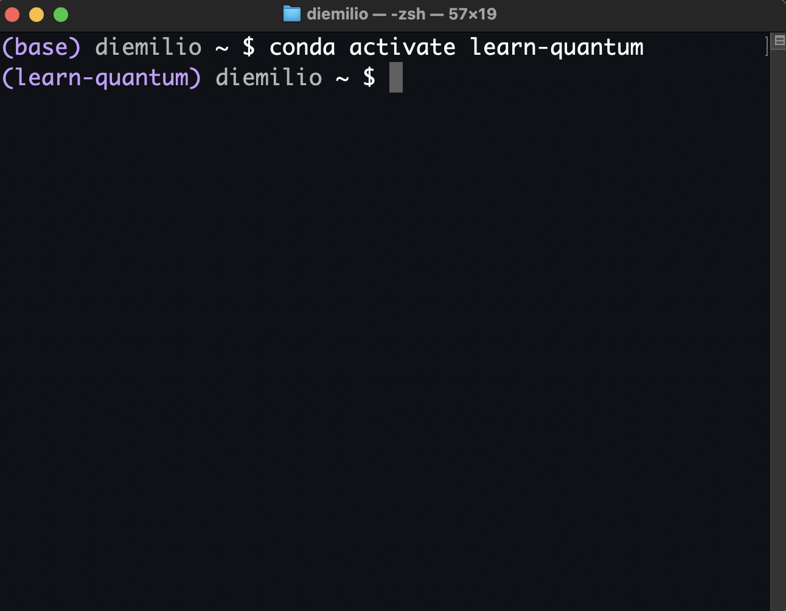
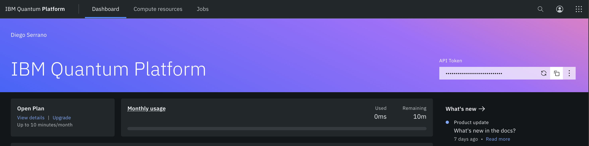

# 00 · Getting started

[Tiếng Việt](README.md) · **English** · [简体中文](README.zh-CN.md)

Set up a Python environment to run the book's notebooks, configure Qiskit so your figures look like the ones in the book,
and (optionally) link an IBM Quantum account to run on a real quantum computer.

> Source: [About](https://learnquantum.io/chapters/00_getting_started/00_00_welcome.html) ·
> [Setting your environment](https://learnquantum.io/chapters/00_getting_started/00_01_setting_env.html) ·
> [Configuring Qiskit](https://learnquantum.io/chapters/00_getting_started/00_02_qiskit_config.html)
> — Diego Emilio Serrano, learnquantum.io, MIT License.

## Contents

| Lesson | Notebook | Web | Key idea |
|---|---|---|---|
| 00_00 · About | [00_00_welcome.ipynb](00_00_welcome.ipynb) | [link](https://learnquantum.io/chapters/00_getting_started/00_00_welcome.html) | How to use the book, where to ask questions, how to cite it |
| 00_01 · Setting your environment | [00_01_setting_env.ipynb](00_01_setting_env.ipynb) | [link](https://learnquantum.io/chapters/00_getting_started/00_01_setting_env.html) | Install Python, Jupyter, Qiskit, Aer, IBM Runtime; run the check code |
| 00_02 · Configuring Qiskit | [00_02_qiskit_config.ipynb](00_02_qiskit_config.ipynb) | [link](https://learnquantum.io/chapters/00_getting_started/00_02_qiskit_config.html) | Save the IBM Quantum token; the `settings.conf` file for how figures are displayed |

## 00_00 · About the textbook

There are two ways to use the book: read it on the web and copy the code into your own environment, or download the notebooks
from the repo [learn-quantum/lqc-textbook](https://github.com/learn-quantum/lqc-textbook).
This repo takes the second way: the notebooks live in `chapters/`.

- Questions and answers: the [Discussions](https://github.com/learn-quantum/lqc-textbook/discussions) section of the upstream repo.
- Reporting typos and bugs: the [Issues](https://github.com/learn-quantum/lqc-textbook/issues) section.
- Citation: Serrano, D.E. (2024). *Learn Quantum Computing using Python*. https://learnquantum.io.

## 00_01 · Setting up your environment

**Goal:** have a separate Python environment with enough libraries installed to run every notebook.

### Packages to install and what they do

| Package | Role |
|---|---|
| `notebook` (Jupyter) | Opens and runs the chapters, which are written as notebooks |
| `qiskit[visualization]` | The main library: build, simulate and run quantum circuits; it also pulls in NumPy, SymPy and Matplotlib |
| `qiskit-aer` | High-performance simulator, including a noisy simulator |
| `qiskit-ibm-runtime` | Connects to IBM's real QPUs (quantum processing units); it also provides `Estimator`, which works with simulators |

### Installation

The book uses `conda`. This repo uses `venv`; the result is equivalent:

```bash
# conda (as in the book)
conda create --name learn-quantum python=3
conda activate learn-quantum
pip install "qiskit[visualization]" qiskit-aer qiskit-ibm-runtime notebook

# or venv (as in this repo), run from the repo root
python -m venv .venv
# Windows (PowerShell): .venv\Scripts\Activate.ps1   |   Windows (cmd): .venv\Scripts\activate.bat
# macOS/Linux:          source .venv/bin/activate
pip install -r requirements.txt
```

Once the environment is activated, its name appears at the start of the command line: `(learn-quantum)` with conda, `(.venv)` with venv.
Check this before you run `pip install`.

<p align="center"></p>

*Figure: before activation, the command line starts with `(base)`; after `conda activate learn-quantum` it changes to `(learn-quantum)`.*

> Note: on macOS (zsh) you must put `qiskit[visualization]` in quotes, because zsh treats `[...]`
> as a filename pattern. On Windows and bash you don't need to.

### Environment check code

This code uses `display(...)`, so it must run in **a notebook cell** (Jupyter or VS Code), not
with `python file_name.py`.

```python
import numpy as np
from qiskit import QuantumCircuit, transpile
from qiskit.quantum_info import Statevector
from qiskit.visualization import plot_distribution
from qiskit_aer import AerSimulator

simulator = AerSimulator()

qc = QuantumCircuit(2,2)
qc.rx(np.pi/2,1)
qc.cx(1,0)
print("Statevector:")
display(Statevector(qc).draw('latex'))

qc.measure([1,0],[1,0])

print("Circuit:")
display(qc.draw('mpl'))

qc_t = transpile(qc, simulator)
counts = simulator.run(qc, shots=2**10).result().get_counts()

print("Probability Distribution:")
plot_distribution(counts)
```

This snippet uses many components you will meet throughout the book. **You don't need to understand them yet**: for now it is enough
to get it running, and each concept is explained properly in Parts 01–02. The table below is there for when you get curious.

| Line | Meaning |
|---|---|
| `QuantumCircuit(2,2)` | A circuit with 2 qubits and 2 classical bits to store the measurement results |
| `qc.rx(np.pi/2,1)` | Rotates qubit 1 about the X axis by an angle of π/2, creating a superposition |
| `qc.cx(1,0)` | CNOT: qubit 1 is the control, qubit 0 is the target; this creates entanglement |
| `Statevector(qc).draw('latex')` | Computes the exact statevector and displays it in ket form |
| `qc.measure([1,0],[1,0])` | Measures qubit 1 → bit 1, qubit 0 → bit 0 |
| `transpile(qc, simulator)` | Translates the circuit into the set of gates the backend supports |
| `simulator.run(qc, shots=2**10)` | Runs 1024 times; `get_counts()` returns how many times each outcome occurred |
| `plot_distribution(counts)` | Plots the probability distribution |

**Expected result:** the state has the form $\tfrac{1}{\sqrt{2}}(|00\rangle - i|11\rangle)$ (the letter $i$ is the imaginary unit,
which you will learn in 02_03; the factor $-i$ is only a phase and does not change the probabilities of this measurement), so you can only measure `00` and `11`,
each about 50%. The output saved in the notebook gives `00` ≈ 0.493 and `11` ≈ 0.507; your run will differ slightly.
If the code runs without errors, the environment is ready. The one exception is `qiskit-ibm-runtime`, which this snippet does not test
(the notebook says so too); that package is used in 00_02 and when calling `Estimator`.

> Note: the code creates `qc_t = transpile(...)` but then runs `simulator.run(qc, ...)` rather than
> `qc_t`. This still works with AerSimulator, because Aer supports these gates natively; on real hardware you need to
> run the transpiled circuit.

## 00_02 · Configuring Qiskit

Both steps are **optional**.

### 1. Link your IBM Quantum account (only needed to run on real hardware)

1. Create an account at https://quantum.ibm.com/, log in and copy the API token in the top-right corner of the home page.

   <p align="center"></p>

   *Figure: the API Token box on the IBM Quantum Platform home page (the old interface, at the time the book was written); the copy button sits next to the token box.*

2. Run this once:

   ```python
   from qiskit_ibm_runtime import QiskitRuntimeService
   QiskitRuntimeService.save_account('your-token-here')
   ```

The token is stored in `C:\Users\<username>\.qiskit\qiskit-ibm.json` (Windows) or `~/.qiskit/qiskit-ibm.json`
(macOS/Linux). **Never commit your token to GitHub.**

> Note (possibly outdated): these instructions follow the original textbook, which points to `quantum.ibm.com` and calls `save_account` with only a token.
> The current `qiskit-ibm-runtime` library (0.50.0) describes `token` as an *IBM Cloud API key*, accepts the channels `ibm_cloud` or
> `ibm_quantum_platform`, and has an extra `instance` parameter. The IBM Quantum platform has also moved to
> `quantum.cloud.ibm.com`. If you want to run on real hardware, follow the current documentation at
> [quantum.cloud.ibm.com/docs](https://quantum.cloud.ibm.com/docs) instead of the steps above. All the notebooks in this repo run on a
> simulator, so no token is needed.

### 2. The `settings.conf` configuration file (so figures look exactly like the book's)

Create the file `C:\Users\<username>\.qiskit\settings.conf` (Windows) or `~/.qiskit/settings.conf`
(macOS/Linux). The upstream repo uses the content below (the `settings.conf` file in the root of the upstream repo); a ready-made copy is at
[qiskit_settings.conf](../../qiskit_settings.conf). The listing printed in notebook 00_02 differs slightly: it uses `iqp-dark`
and has no `circuit_idle_wires` line.

```ini
[default]
circuit_drawer = mpl
circuit_mpl_style = iqp
circuit_reverse_bits = True
circuit_idle_wires = False
state_drawer = latex
```

| Option | Effect |
|---|---|
| `circuit_drawer = mpl` | Draws circuits with matplotlib (color figures) instead of text characters |
| `circuit_mpl_style = iqp` | The IBM Quantum color palette; the notebook suggests `iqp-dark` for dark backgrounds |
| `circuit_reverse_bits = True` | Reverses the qubit order when drawing: the qubit with the highest index is at the top |
| `circuit_idle_wires = False` | Hides qubit wires that have no gates on them |
| `state_drawer = latex` | Shows the statevector in ket form with LaTeX instead of as a NumPy array |

> **Important: qubit order.** Qiskit uses the little-endian convention: qubit 0 is the **rightmost** bit
> in the result string, for example `'01'` means $q_1 = 0,\ q_0 = 1$. Many other texts do it the other way round.
> `circuit_reverse_bits = True` only changes **how the circuit is drawn**, not what is computed. If you don't create
> this file, the circuits you draw will look upside down compared with the figures in the book, but the numbers will still be correct.

## Quick recap

- You only need 4 packages: `qiskit[visualization]`, `qiskit-aer`, `qiskit-ibm-runtime`, `notebook`.
- If the check code runs (giving `00`/`11` at about 50/50), the environment is fine (this snippet does not try `qiskit-ibm-runtime`).
- The IBM token is only needed for real hardware; never put a token in code you commit.
- To make figures look like the book's: copy [qiskit_settings.conf](../../qiskit_settings.conf) to `~/.qiskit/settings.conf`.
- Qiskit's result strings read from right to left: the last character is qubit 0.

> The code snippets in this README are **quoted verbatim** from the notebooks. They don't need variables from other cells, but
> the environment check code must run in a notebook because it uses `display(...)`.

---

<!-- nav -->
[← Learning path](../../docs/learning-path.en.md) · [Contents](../../README.en.md#contents) · [01 · Classical computing →](../01_classical_computing/README.en.md)
