# 01 · Classical computing（经典计算）

[Tiếng Việt](README.md) · [English](README.en.md) · **简体中文**

复习比特（bit）、布尔逻辑和数字电路，然后沿着量子计算机所需要的方向逐步“升级”它们：**可逆**（reversible）门、把比特看作**向量**、把门看作**矩阵**，最后是**概率比特**（p-bit）。第 02 部分反复用到的数学工具，如 ket、克罗内克积（Kronecker product）和电路的矩阵，都在这里搭建起来。

> 来源：[01_01](https://learnquantum.io/chapters/01_classical_computing/01_01_bits_and_circuits.html) · [01_02](https://learnquantum.io/chapters/01_classical_computing/01_02_reversible_computing.html) · [01_03](https://learnquantum.io/chapters/01_classical_computing/01_03_bits_to_vectors.html) · [01_04](https://learnquantum.io/chapters/01_classical_computing/01_04_probabilistic_circuits.html) — Diego Emilio Serrano, learnquantum.io, MIT License.

## 目录

| 课 | Notebook | 网页 | 要点 |
|---|---|---|---|
| 01_01 · Bits and digital circuits | [01_01_bits_and_circuits.ipynb](01_01_bits_and_circuits.ipynb) | [链接](https://learnquantum.io/chapters/01_classical_computing/01_01_bits_and_circuits.html) | Python 中的二进制数，AND/OR/NOT/XOR，加法电路，CMOS 晶体管 |
| 01_02 · Reversible computing | [01_02_reversible_computing.ipynb](01_02_reversible_computing.ipynb) | [链接](https://learnquantum.io/chapters/01_classical_computing/01_02_reversible_computing.html) | X、CX、CCX（Toffoli）；可逆的 AND/OR/COPY/全加器 |
| 01_03 · Linear algebra for reversible circuits | [01_03_bits_to_vectors.ipynb](01_03_bits_to_vectors.ipynb) | [链接](https://learnquantum.io/chapters/01_classical_computing/01_03_bits_to_vectors.html) | 比特是向量 $\vert 0\rangle,\vert 1\rangle$；门是矩阵；克罗内克积 |
| 01_04 · Probabilistic computing | [01_04_probabilistic_circuits.ipynb](01_04_probabilistic_circuits.ipynb) | [链接](https://learnquantum.io/chapters/01_classical_computing/01_04_probabilistic_circuits.html) | p-bit、概率向量、随机矩阵（stochastic） |

本部分只用到**纯 Python、NumPy、SymPy 和 Matplotlib**，还没有用到 Qiskit。

> 本 README 中的代码是从 notebook 中**摘录**的（保留了原有的英文注释），并且用到了前面单元格中定义的变量。要运行它们，请从头到尾运行整个 notebook。

---

## 01_01 · Bits and digital circuits（比特与数字电路）

**目标**：能够在 Python 中处理二进制数，并理解逻辑电路是如何由基本门搭建起来的。

### 核心知识

**二进制数**。$n$ 个比特 $b = b_{n-1}\dots b_1 b_0$ 可以表示 $2^n$ 个值。$b_0$（最右边）是最低有效位（LSB），$b_{n-1}$ 是最高有效位（MSB）。转换为十进制：

$$x = \sum_{i=0}^{n-1} 2^i\, b_i \qquad\text{例如 } 1101 = 8 + 4 + 0 + 1 = 13$$

反过来，第 $i$ 位是 $b_i = \lfloor x / 2^i \rfloor \bmod 2$。要表示 $x > 0$，至少需要 $n \ge \lfloor \log_2 x + 1 \rfloor$ 个比特（例如 13 需要 4 个比特）。

**布尔逻辑**。三种基本运算：NOT（$\bar a$）、OR（$a \lor b$）、AND（$a \land b$）；任何逻辑命题都可以由这三种运算组合而成。全书用得非常多的一种运算是 **XOR**（异或，exclusive OR）：

| $a$ | $b$ | $a \oplus b$ |
|:-:|:-:|:-:|
| 0 | 0 | 0 |
| 0 | 1 | 1 |
| 1 | 0 | 1 |
| 1 | 1 | 0 |

$$a \oplus b = (a \land \bar b) \lor (\bar a \land b) = (a + b) \bmod 2$$

对于多位数，这些运算是**逐位**（bitwise）进行的。

**数字电路**。逻辑门（logic gate）就是布尔运算的图形符号。

<p align="center">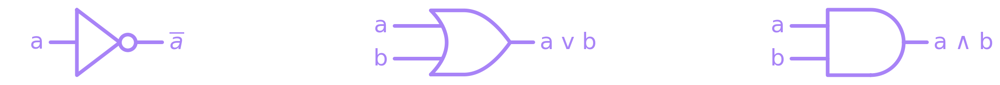</p>

*图：NOT、OR、AND 门的符号（从左到右）。*

NAND/NOR/XNOR 就是在输出端加上 NOT 的 AND/OR/XOR，画图时简写为一个小圆圈：

<p align="center">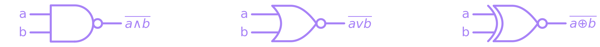</p>

*图：NAND、NOR、XNOR；输出端的小圆圈代替了一个 NOT 门。*

例如，**全加器**（full adder）把 $a$、$b$ 和进位 $c_{in}$ 相加：

$$s = a \oplus b \oplus c_{in}, \qquad c_{out} = \big((a \oplus b) \land c_{in}\big) \lor (a \land b)$$

<p align="center">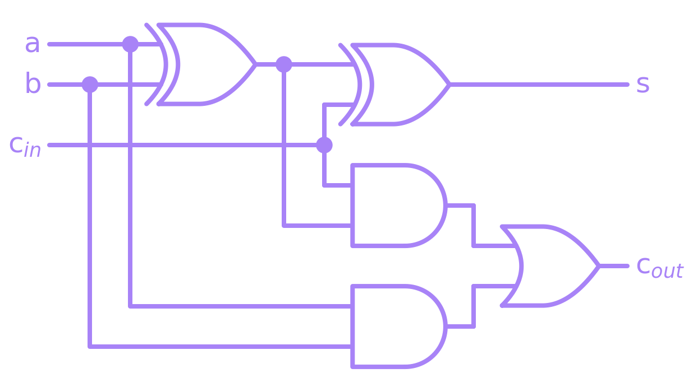</p>

*图：全加器：两个 XOR 得到 $s$；两个 AND 和一个 OR 得到 $c_{out}$。每个圆点表示一根导线在此一分为二（扇出，fan-out）。*

**COPY / FAN-OUT** 就是把一根导线分成两根。在经典电路中这再平常不过，但**量子电路（quantum circuit）中没有对应的 COPY 操作**，这一点会在第 02 部分再次遇到（不可克隆定理，no-cloning）。

**晶体管**（transistor）。在物理层面，0 和 1 只是两个电压电平 $-v$ 和 $+v$。CMOS 技术把一对互补的 NMOS/PMOS 晶体管当作开关使用：能让其中一种导通（ON）的电压，会让另一种截止（OFF）。NOT 门需要 2 个晶体管：

<p align="center">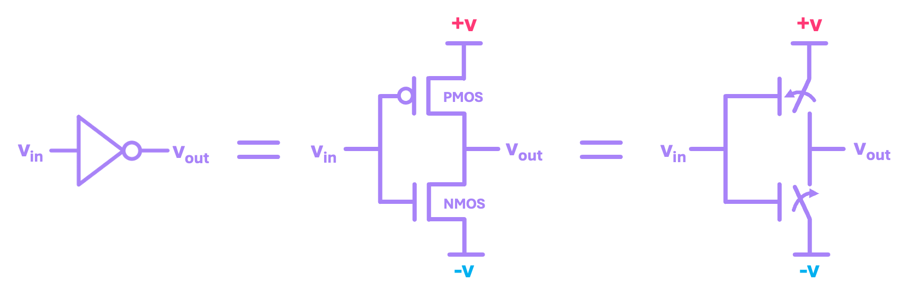</p>

*图：NOT 门（左）= 一个接到 $+v$ 的 PMOS 加一个接到 $-v$ 的 NMOS（中）= 两个开关（右）。*

当 $v_{in} = +v$（1）时，NMOS 导通、PMOS 截止，所以输出接到 $-v$（0）；当 $v_{in} = -v$ 时则相反。NAND 需要 4 个晶体管：

<p align="center">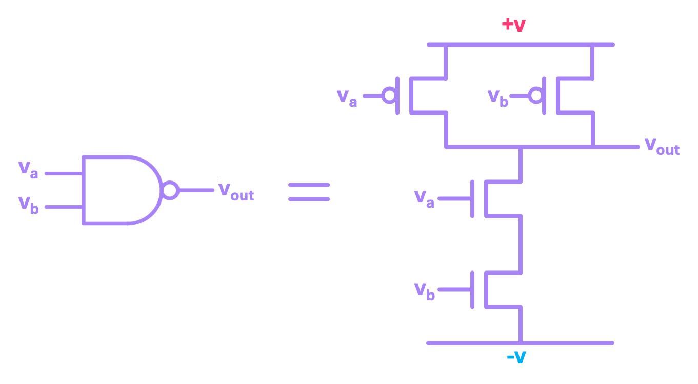</p>

*图：用 4 个晶体管构成的 NAND：两个 PMOS 并联接到 $+v$，两个 NMOS 串联接到 $-v$。*

AND = NAND 后面串接一个 NOT，也就是 6 个晶体管。

### 核心代码

```python
x = 0b1101
print(x)
```
前缀 `0b` 用来书写二进制数，但 Python 把它存为 `int`（打印出 `13`），所以可以正常做加减运算。

```python
b = bin(11) + bin(9)  # in decimal: 11 + 9 = 20
print(f'The result in b: {b} is not the correct representation for the number 20: {bin(20)}')
```
`bin()` 返回的是**字符串**（`str`），所以 `+` 是字符串拼接，而不是加法。要做运算，必须先用 `int(b, 2)` 转换回数字。

```python
n = 4  # number of bits to use
for i in range(2**3):
    b = bin(i)[2:].zfill(n)
    print(f'{i}: {b}')
```
`[2:]` 去掉前缀 `0b`；`zfill(n)` 在左边补 0，直到凑满 $n$ 位。更简洁的等价写法是：`np.binary_repr(13, 5)` 返回 `'01101'`。

```python
a = 0b11010
b = 0b10110

c_and = np.binary_repr(a & b, 5)  # Bitwise AND: 11010 & 10110 = 10010
c_or = np.binary_repr(a | b, 5)   # Bitwise OR:  11010 | 10110 = 11110
c_xor = np.binary_repr(a ^ b, 5)  # Bitwise XOR: 11010 ^ 10110 = 01100
```
Python 的按位运算符：`&`（AND）、`|`（OR）、`^`（XOR）。

> 注意：Python 的 `and`/`or` 是**逻辑**运算符，用在多位数上时并不等同于 `&`/`|`。notebook 误写成了“`&` 和 `^`”；与 `or` 对应的应该是 `|`。

### 运行结果

| 代码 | 输出 |
|---|---|
| `0b1011 + 0b1001` | `20` |
| `bin(13)` | `0b1101`（`str` 类型） |
| `bin(11) + bin(9)` | `0b10110b1001`，结果错误，而 `bin(20)` 是 `0b10100` |
| `int('1101', 2)` | `13` |
| `np.binary_repr(13, 5)` | `01101` |
| `11010`、`10110` 的 AND / OR / XOR | `10010` / `11110` / `01100` |

### 速记要点

- $n$ 个比特可以表示 $2^n$ 个值；最右边的位是 $b_0$。
- `bin()` 得到字符串，`int(s, 2)` 转回数字，`np.binary_repr(x, n)` 得到补足 $n$ 位的字符串。
- XOR = 模 2 加法，全书用得非常多。
- Python 中的按位运算：`&`、`|`、`^`，不要与 `and`、`or` 混淆。
- 经典电路可以随意复制导线；量子电路则不行。

---

## 01_02 · Reversible computing（可逆计算）

**目标**：理解 AND/OR 为什么会丢失信息，以及如何用 X、CX、CCX 构造任何门的可逆版本。

### 核心知识

**为什么需要可逆**。看到 AND 的输出是 0，我们无法知道输入是 00、01 还是 10：信息丢失了。Landauer（1961）指出，信息丢失与能量耗散相关联；可逆计算模型由此诞生（Bennett 1973、Toffoli 1980、Fredkin 1981）。量子力学在原理上是可逆的，所以量子计算模型也必须是可逆的。

一个门是**可逆的**，是指每个输入都对应**恰好一个**独有的输出，因此总能反推出输入。

从本课开始，NOT 门按照量子电路的记法画成并称为 **X** 门：

<p align="center">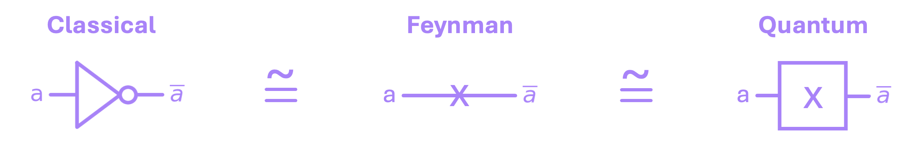</p>

*图：同一个 NOT 门的三种画法：经典符号、Feynman 符号（导线上的字母 X），以及量子电路中使用的 X 方框。*

| 门 | 规则 | 说明 |
|---|---|---|
| **X**（NOT） | $a' = \bar a$ | 自身就是自己的逆：X·X = I |
| **CX**（受控非门，controlled-X / CNOT） | $a' = a,\ b' = a \oplus b$ | 可逆的 XOR；当 $b = 0$ 时就成了 **COPY**（$b' = a$） |
| **CCX**（托佛利门，Toffoli） | $a' = a,\ b' = b,\ c' = c \oplus (a \land b)$ | 当 $c = 0$ 时得到 **AND**；当 $c = 1$ 时得到 **NAND** |

在图中，实心圆点位于控制线（control）上，X 方框位于目标线（target）上：

<p align="center">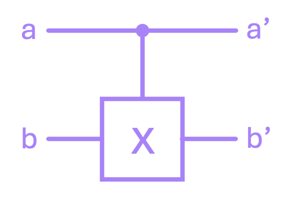</p>

*图：CX 门：上方的导线 $a$ 是控制线，下方的导线 $b$ 是目标线。*

<p align="center">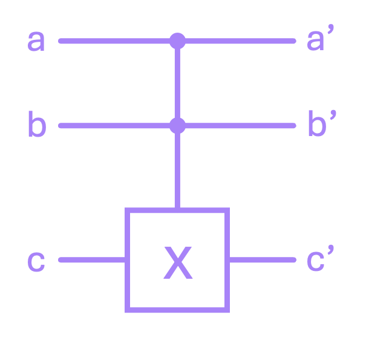</p>

*图：CCX（Toffoli）门：两条控制线 $a$、$b$ 和目标线 $c$。*

**可逆 OR** 利用德摩根定律（De Morgan）$a \lor b = \overline{\bar a \land \bar b}$：在两个输入上都加上 X，然后使用 $c = 1$ 的 CCX（即 NAND）。

<p align="center">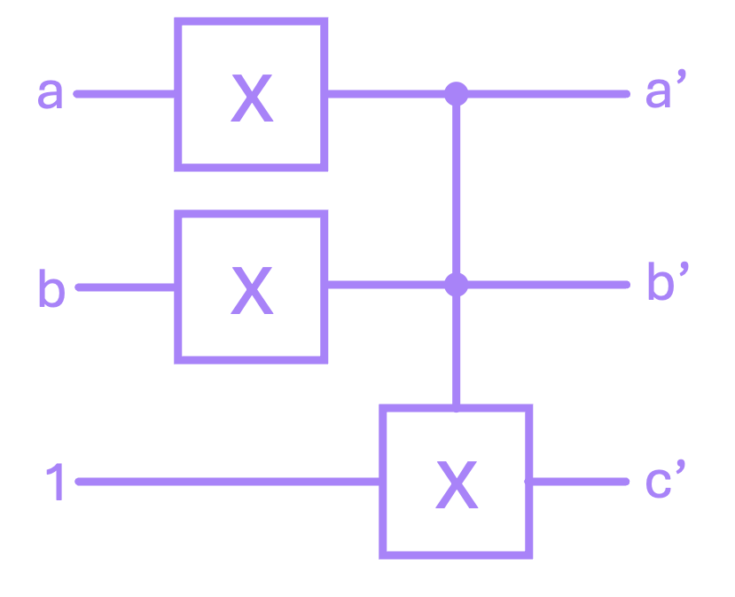</p>

*图：可逆 OR：在 $a$ 和 $b$ 上加 X，然后对初始化为 1 的第三条导线作用 CCX；$c' = a \lor b$。*

> 注意：notebook 写的是“用两个 CCX 来翻转输入”，但代码和图中用的都是两个 **X** 门。

**逆转一个电路**（uncompute）= **按相反的顺序逐个**作用各个门。对于 X、CX、CCX，再作用一次就够了，因为每个门都是自己的逆；但对于组合起来的电路，就必须把顺序反过来。到了量子电路，对复数还有额外的要求，以后会学到。

<p align="center">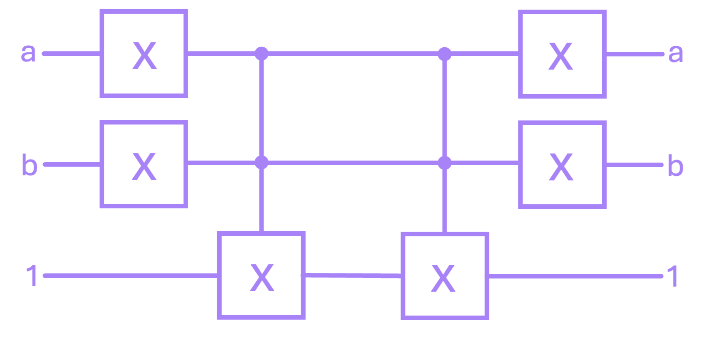</p>

*图：OR 电路（左半部分），后面接着按相反顺序排列的同一组门（右半部分）：先 CCX，后两个 X；输出回到 $a$、$b$、$1$。*

> 注意：notebook 说在这种情况下把整个 OR 电路作用两次“碰巧也能得到正确结果”。这并不对：当 $a = b$ 时，作用两次会让 $c$ 从 1 变成 0，例如 $(0,0,1) \to (1,1,0) \to (0,0,0)$。只有按相反顺序作用各个门（如上图和 notebook 中的代码所示），才能对所有输入都回到 $(a, b, 1)$。

**可逆全加器**由经典版本一对一替换而来，需要额外添加一些初始化为固定值的**辅助线**（auxiliary/ancilla）。这是可逆电路和量子电路中非常常见的特点。

<p align="center">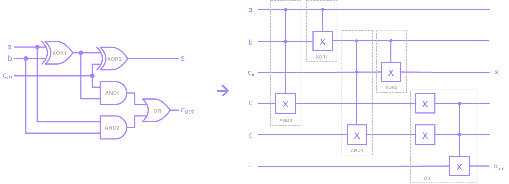</p>

*图：经典全加器（左）与可逆版本（右）：两个 CCX（AND）写入两条初始化为 0 的辅助线，两个 CX（XOR）把 $s$ 输出到 $c_{in}$ 线上，OR 模块把 $c_{out}$ 写入初始化为 1 的辅助线。*

### 核心代码

```python
# define x gate as a function:
def x(a_in):
    a_out = a_in ^ 1   # Remember ^ performs the XOR operation. a^1 = a̅
    return a_out
```
X 门其实就是与 1 做 XOR。

```python
# define cx gate as a function:
def cx(a_in, b_in):
    
    # a' is always equal to a.
    a_out = a_in
    
    # if control is one (i.e., a == 1): negate target (b' = b̅), 
    # else: leave b alone (b' = b).
    if a_in == 1:                
        b_out = x(b_in)
    else:
        b_out = b_in

    return (a_out, b_out)
```
CX：控制线保持不变，当控制线为 1 时目标线被翻转。函数 `ccx(a_in, b_in, c_in)` 的写法类似，只在 `a_in == 1 and b_in == 1` 时翻转 $c$。

```python
for a, b, c in inputs:
    a1, b1, d1 = ccx(a, b, 0)      # AND1
    a2, b2 = cx(a1, b1)            # XOR1
    a3, c3, e3 = ccx(b2, c, 0)     # AND2
    b4, s = cx(b2, c3)             # XOR2
    
    d5 = x(d1)                     # OR ...
    e5 = x(e3)                     # 
    d6, e6, cout = ccx(d5, e5, 1)  #
```
全加器只由 X、CX、CCX 组成。为了计算 $c_{out}$，额外添加了三条辅助线（两条初始化为 0，用于 AND；一条初始化为 1，用于 OR）。

> 注意：代码注释和图中标签对两个 AND 的命名正好相反：代码把 `ccx(a, b, 0)` 叫作 AND1，而图中把 $a \land b$ 模块叫作 AND2（把 $(a \oplus b) \land c_{in}$ 模块叫作 AND1）。电路本身是一样的。

### 运行结果

- CX 的真值表符合 $b' = a \oplus b$；作用两次 CX 恰好回到 $(a, b)$。
- $c = 0$ 时，CCX 给出 $c' = a \land b$；作用两次后回到 $c = 0$。
- 可逆 OR 给出 $c' = a \lor b$（`0, 1, 1, 1`），而 $a' = \bar a$、$b' = \bar b$，因为两个 X 门仍在电路中；按相反顺序作用各个门则回到 $(a, b, 1)$。
- 可逆全加器给出的 $s$、$c_{out}$ 真值表与第 01_01 课完全一致：

| a | b | cin | s | cout |
|:-:|:-:|:-:|:-:|:-:|
| 0 | 0 | 0 | 0 | 0 |
| 0 | 1 | 1 | 0 | 1 |
| 1 | 1 | 0 | 0 | 1 |
| 1 | 1 | 1 | 1 | 1 |

（摘录 8 行中的 4 行）

### 速记要点

- 可逆 = 每个输入对应一个独有的输出，总能反推回去。
- CX = 可逆的 XOR；目标线为 0 的 CX = COPY。
- CCX 的目标线为 0 时 = AND，为 1 时 = NAND。
- OR = 两个输入上的 X + NAND。
- 逆转电路：按**相反的顺序**作用各个门。
- 可逆电路通常需要辅助线（ancilla）。

---

## 01_03 · Linear algebra for reversible circuits（可逆电路的线性代数）

**目标**：用向量表示比特，用矩阵表示门乃至整个电路，这样“运行电路”就只是做矩阵乘法。这是第 01 部分最重要的一课。

### 核心知识

**比特是向量，用 Dirac 符号（bra-ket）表示**：

$$|0\rangle = \begin{bmatrix}1\\0\end{bmatrix}, \qquad |1\rangle = \begin{bmatrix}0\\1\end{bmatrix}$$

<p align="center">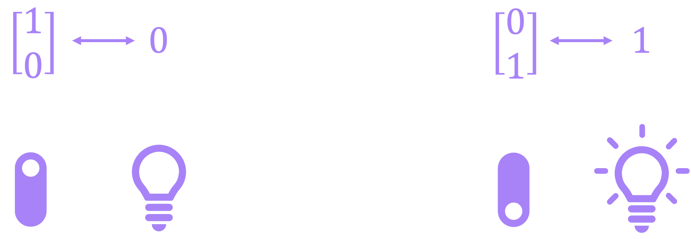</p>

*图：记忆技巧：1 在上面（开关拨上，灯灭）是比特 0；1 在下面（开关拨下，灯亮）是比特 1。*

合法的比特向量，其元素属于 $\{0,1\}$，且长度 $\|b\| = 1$，因此可以排除 $[0,0]^\top$（长度为 0）和 $[1,1]^\top$（长度为 $\sqrt 2$）。

**Bra** $\langle b|$ 是行向量（目前只把它看作 ket 的转置）。**bra-ket** 积 $\langle a|b\rangle$ 就是内积：$\langle b|b\rangle = 1$，$\langle 0|1\rangle = 0$，也就是说 $|0\rangle$ 与 $|1\rangle$ 正交。

**门是矩阵**：

$$\text{X} = \begin{bmatrix}0&1\\1&0\end{bmatrix}, \qquad \text{X}|0\rangle = |1\rangle, \qquad \text{X}^{-1} = \text{X}$$

严格来说，逆转一个门就是乘以它的**逆矩阵**。X“恰好”是它自己的逆，所以再作用一次就够了。

**多个比特：克罗内克积** $\otimes$。

$$|10\rangle = |1\rangle \otimes |0\rangle = \begin{bmatrix}0\\1\end{bmatrix} \otimes \begin{bmatrix}1\\0\end{bmatrix} = \begin{bmatrix}0\\0\\1\\0\end{bmatrix}$$

需要记住的规则：二进制数 $b$ 对应的向量**只有一个 1，它所在的位置等于 $b$ 的十进制值**（从 0 开始、从上往下数），其余都是 0。$n$ 个比特对应 $2^n$ 维向量。这些向量两两正交，构成一组**基**（basis）；之后的量子态就是它们的线性组合。

> 注意：notebook 说 $\vec x \otimes \vec y$ 的维数是两者维数的“和”；正确的说法是**乘积**（$2 \times 2 = 4$，$n$ 个比特对应 $2^n$ 维）。

**多比特门的矩阵**可以通过写出“输入 → 输出”的映射得到。对于 CX，上面的比特 $b_1$ 是控制位，下面的比特 $b_0$ 是目标位：$00 \to 00$，$01 \to 01$，$10 \to 11$，$11 \to 10$。

<p align="center">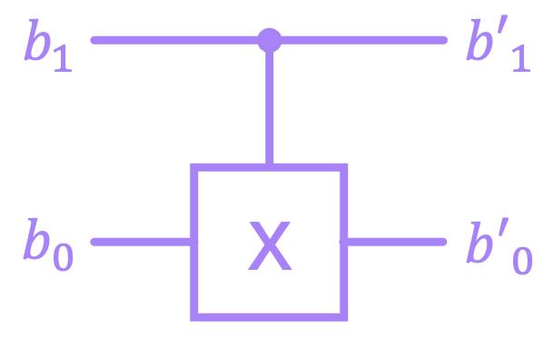</p>

*图：CX，控制位 $b_1$（上），目标位 $b_0$（下）。*

$$\text{CX} = \begin{bmatrix}1&0&0&0\\0&1&0&0\\0&0&0&1\\0&0&1&0\end{bmatrix}$$

矩阵的第 $j$ 列（从 0 开始数）正是输入为 $|j\rangle$ 时的输出向量，因为矩阵乘以 $|j\rangle$ 恰好只取出这一列。

> 注意：notebook 说 CX 乘以 $|00\rangle$ 得到的是第一**行** $(c_{00}, c_{01}, c_{02}, c_{03})$。正确的是第一**列** $(c_{00}, c_{10}, c_{20}, c_{30})$。最终的 CX 矩阵仍然正确，因为它是对称的。

CCX 就是把最后两行互换后的 $8\times 8$ 单位矩阵。

**整个电路的矩阵**：
- 位于**同一层**的门（并行）：取克罗内克积，例如下面的比特上有 X、上面的比特空着，就是 $I \otimes \text{X}$。

<p align="center">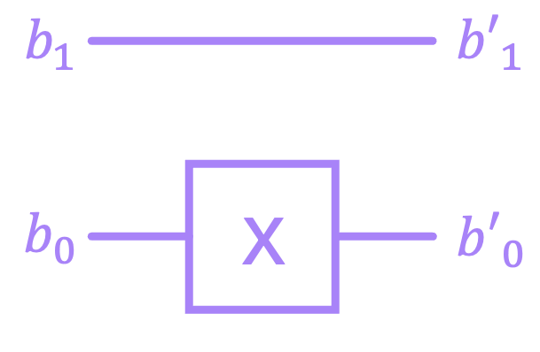</p>

*图：上面的比特 $b_1$ 空着，下面的比特 $b_0$ 经过 X 门；矩阵为 $I \otimes \text{X}$。*

- **串联**的各层：矩阵**从右往左**相乘，因为先作用的层必须先与向量相乘：

$$|b\rangle_{out} = Q_2\, Q_1\, |b\rangle_{in}$$

<p align="center">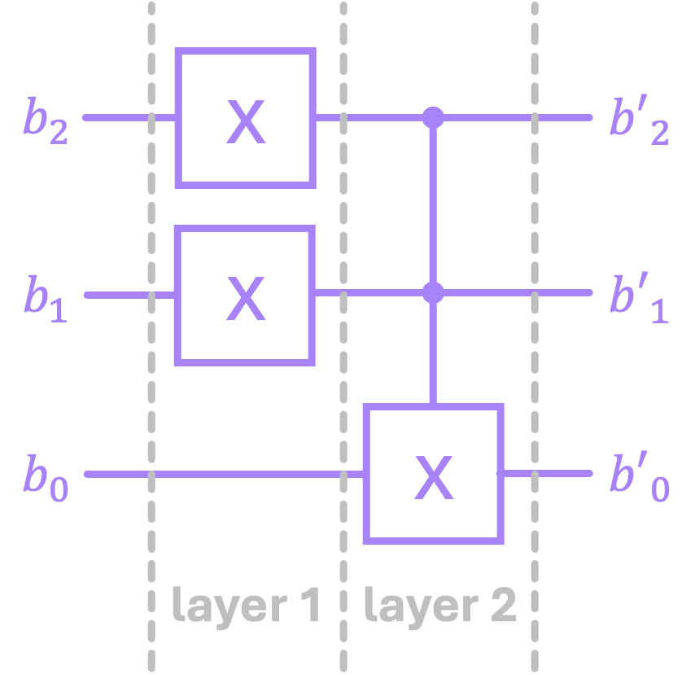</p>

*图：分为两层的 3 比特电路：第 1 层是 $Q_1 = \text{X} \otimes \text{X} \otimes I$，第 2 层是 $Q_2 = \text{CCX}$。*

- 如何分层不影响结果。

<p align="center">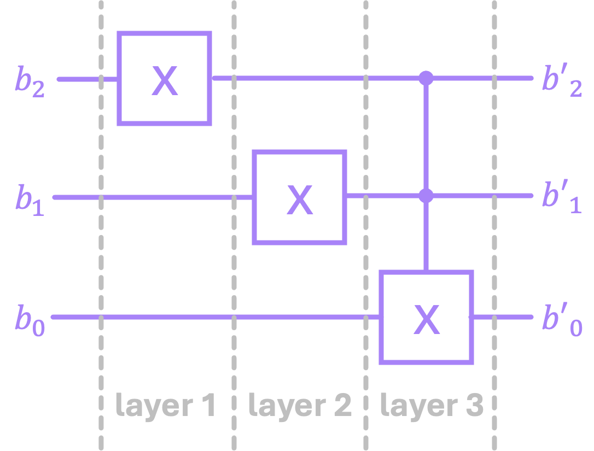</p>

*图：同一个电路分成三层：$Q = \text{CCX}\,(I \otimes \text{X} \otimes I)\,(\text{X} \otimes I \otimes I)$，得到的矩阵相同。*

**特殊情况**：如果 CX 连接的两个比特不相邻，中间隔着一个空闲比特（idle bit），就无法写成 $I \otimes \text{CX}$ 或 $\text{CX} \otimes I$ 的形式。

<p align="center">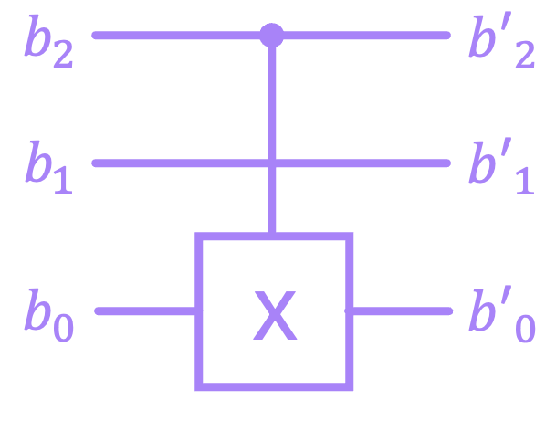</p>

*图：CX，控制位 $b_2$（上），目标位 $b_0$（下）；中间的比特 $b_1$ 空着。*

解决办法是借助两个投影 $\Pi_0 = |0\rangle\langle 0|$ 和 $\Pi_1 = |1\rangle\langle 1|$，把 CX 拆成若干克罗内克积的**和**：

$$\text{CX} = \Pi_0 \otimes I + \Pi_1 \otimes \text{X} \quad\Rightarrow\quad Q = \Pi_0 \otimes I \otimes I + \Pi_1 \otimes I \otimes \text{X}$$

**可逆电路矩阵的三个性质**：是方阵（$2^n \times 2^n$）、可逆、保持向量长度不变。在本部分中，所有元素都还是 0 或 1；第 01_04 课将打破这一点。实际上，每个这样的矩阵都是一个**置换矩阵**（permutation matrix）：每行、每列都恰好有一个 1，所以它只是交换向量中各元素的位置。

### 核心代码

```python
# Define |0⟩
ket_0 = np.array([[1],
                  [0]])
print(ket_0)
```
ket 是**列**形式的 NumPy 数组（shape 为 `(2, 1)`）。`sp.Matrix(ket_0)` 可以用 LaTeX 漂亮地显示出来。

```python
# Multiply |0⟩ by X to get |1⟩:
ket_1 = X @ ket_0
sp.Matrix(ket_1)
```
矩阵乘法用 `@`（或 `np.matmul`）。

> 注意：在 NumPy 中，`*` 表示**逐元素**相乘（即哈达玛积，与第 02 部分的哈达玛门无关），而不是矩阵乘法。做矩阵乘法时请始终使用 `@`。

```python
def bin_to_vec(b):
    # define |0⟩ and |1⟩ within the function:
    ket_0 = np.array([[1],[0]])
    ket_1 = np.array([[0],[1]])
    
    b_inv = b[::-1] # Reverse order of b. Like matrix mult,
                    # Kronecker prod is performed from right to left.
    
    # iterate over bits
    for i, bit in enumerate(b_inv):
        if bit == '0':
            b_i = ket_0
        else:
            b_i = ket_1

        # for first bit, we don't perform the product
        if i == 0:
            ket_b = b_i
        else:
            ket_b = np.kron(b_i,ket_b)
            
    return ket_b
```
用 `np.kron` 把二进制字符串转换为向量，从最右边的比特开始向左逐个拼接。

```python
# Compute circuit matrix
Q_1 = np.kron(X, np.kron(X, I))
Q_2 = CCX

Q = Q_2 @ Q_1
```
两层电路：第 1 层是 $\text{X} \otimes \text{X} \otimes I$，第 2 层是 CCX。整个电路的矩阵是 $Q_2 Q_1$。

```python
# Compute Q for our circuit
Q = np.kron(Π0,np.kron(I,I)) + np.kron(Π1,np.kron(I,X))
```
作用在最上面和最下面两个比特之间的 CX，跳过中间的比特。

### 运行结果

| 检查项 | 输出 |
|---|---|
| $\vert 0\rangle$、$\vert 1\rangle$ 的长度 | `1.0`、`1.0` |
| $[0,0]^\top$、$[1,1]^\top$ 的长度 | `0.0`、`1.414…`（不合法） |
| `np.vdot`：$\langle 0\vert 0\rangle$、$\langle 0\vert 1\rangle$、$\langle 1\vert 0\rangle$、$\langle 1\vert 1\rangle$ | `1, 0, 0, 1` |
| `np.linalg.inv(X)` | 等于 X（元素以浮点数 `1.0` 的形式打印） |
| `bin_to_vec('10110')` | 32 维向量，1 位于位置 22 |
| $Q_2 Q_1$ 和 $Q_3 Q_2 Q_1$（两种分层方式） | 同一个矩阵 |
| CX 跳过中间比特时的 $Q\,\vert 100\rangle$ | $\vert 101\rangle$（1 位于位置 5） |

### 速记要点

- $|0\rangle = [1, 0]^\top$，$|1\rangle = [0, 1]^\top$；$|b\rangle$ 中的 1 所在位置等于 $b$ 的值。
- 并行 → `np.kron`；串联 → `@`，**从右往左**写。
- `@` 是矩阵乘法，`*` 只是逐元素相乘。
- 逆转门 = 乘以逆矩阵。
- 跨过中间比特的受控门：$\Pi_0 \otimes I \otimes \dots + \Pi_1 \otimes \dots \otimes \text{X}$。
- 可逆电路的矩阵：方阵、可逆、保持长度（是**置换矩阵**）。

---

## 01_04 · Probabilistic computing（概率计算）

**目标**：用 p-bit 把随机性引入经典电路，并看清它与第 02 部分将要学习的量子比特（qubit）有何不同。

### 核心知识

**p-bit**（概率比特，probability bit）是一个概率向量：

$$\vec p = \begin{bmatrix}\varrho_0\\ \varrho_1\end{bmatrix}, \qquad \varrho_j \in [0,1], \qquad \varrho_0 + \varrho_1 = 1$$

$\varrho_j$ 是**测量**（measurement）得到值 $j$ 的概率。测量多次时，频率 $n_j / n$ 会趋近于 $\varrho_j$。例如：一个有噪声的 NOT 门，输入 0 时输出为 $[1/4, 3/4]^\top$。

<p align="center">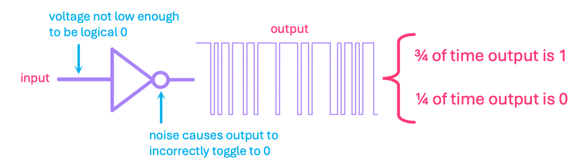</p>

*图：有噪声的 NOT 门：输入电压不够低，噪声使输出偶尔翻转为 0；输出在 3/4 的时间里为 1，在 1/4 的时间里为 0。*

**与量子比特的区别**：p-bit 各元素的**和**为 1，所以它的欧几里得长度会变化（例如 $\|[1/4, 3/4]^\top\| \approx 0.79$）。量子比特各元素的**模的平方和**为 1，所以长度始终为 1（第 02 部分会解释为什么量子比特的元素可以是复数）。

<p align="center">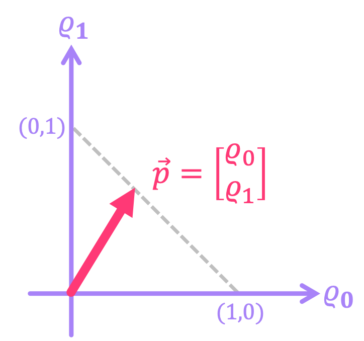</p>

*图：概率向量 $\vec p$ 的末端始终位于虚线段 $\varrho_0 + \varrho_1 = 1$ 上，所以它的长度会变化。*

<p align="center">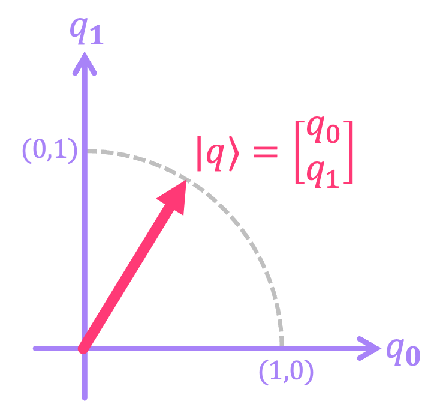</p>

*图：当 $q_0, q_1 \in [0,1]$ 时，量子比特向量 $\vert q\rangle$ 的末端位于半径为 1 的虚线圆弧上，所以长度始终为 1。*

**带噪声（非确定性）的概率门在物理上是不可逆的**，尽管它的矩阵在数学上可能存在逆矩阵。上面那个有噪声的 NOT 门的矩阵是

$$P = \begin{bmatrix}\tfrac14 & 1\\ \tfrac34 & 0\end{bmatrix}, \qquad P^{-1} = \begin{bmatrix}0 & \tfrac43\\ 1 & -\tfrac13\end{bmatrix}$$

$P^{-1}$ 含有负元素（以及元素 $\tfrac43 > 1$），所以它不是概率矩阵：噪声**无法被另一个概率门“抵消”**。相反，量子电路的矩阵总是可逆的。

**确定性门同样适用于 p-bit**。X 会交换概率的顺序：$\text{X}[\varrho_0, \varrho_1]^\top = [\varrho_1, \varrho_0]^\top$。

<p align="center">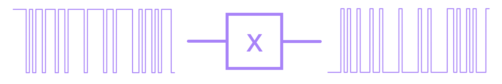</p>

*图：一串随机值经过 X 门后变成逐个取反的序列，因此 0 和 1 的概率互换。*

**多个 p-bit**。多个**统计独立**的 p-bit 的向量仍然是克罗内克积；分别作用在各个 p-bit 上的门，其矩阵也是克罗内克积：

$$\begin{bmatrix}\tfrac23\\ \tfrac13\end{bmatrix} \otimes \begin{bmatrix}\tfrac14\\ \tfrac34\end{bmatrix} = \begin{bmatrix}\tfrac16\\ \tfrac12\\ \tfrac1{12}\\ \tfrac14\end{bmatrix} \quad\text{(} 00, 01, 10, 11\text{ 的概率)}$$

当一个 p-bit 上的结果取决于另一个 p-bit 的状态时，矩阵就**无法分解**为克罗内克积。例如：若 $\vec p_1 = 0$，则保持 $\vec p_0$ 不变；若 $\vec p_1 = 1$，则把 $\vec p_0$ 随机化：

$$P = \begin{bmatrix}1&0&0&0\\0&1&0&0\\0&0&\tfrac12&\tfrac12\\0&0&\tfrac12&\tfrac12\end{bmatrix}$$

> 注意：notebook 专门把这种无法分解的矩阵称为**随机矩阵**（stochastic matrix）。实际上，随机矩阵是指所有元素非负、且每列之和为 1 的任意矩阵（按原书使用列向量的写法），也就是能把概率向量变成概率向量的矩阵。上面有噪声的 NOT 矩阵、X，以及“核心代码”中的 $R \otimes \text{X}$ 都是随机矩阵。能否分解为克罗内克积是另一个性质。

**确定性的可逆电路是置换矩阵**：它只交换各个概率的位置，所以再乘以 $Q^{-1}$ 就能把它们放回原来的位置。例如 notebook 中的电路 $Q = (\text{X} \otimes I)\,\text{CX}$：

<p align="center">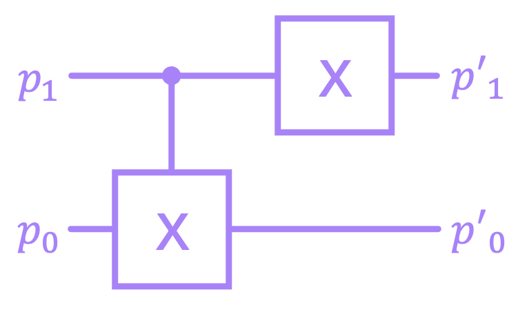</p>

*图：CX（$\vec p_1$ 为控制位，$\vec p_0$ 为目标位），然后在 $\vec p_1$ 上作用 X；矩阵为 $Q = (\text{X} \otimes I)\,\text{CX}$。*

### 核心代码

```python
n_samps = 200                   # number of samples
vals = [0, 1]                   # Possible outcomes: 0 or 1
probs = (vec_p).reshape(-1)     # Flatten to 1D array with probabilities for 0 and 1

# sample 0 or 1 a 100 times using probabilities from p̅
samples = np.random.choice(vals, size=n_samps, p=probs)
print(samples)
```
用 `np.random.choice` 模拟对 p-bit 的测量，概率取自向量。

> 注意：代码没有设置随机种子（seed），所以每次运行得到的样本和频率都会与保存的输出不同。注释写的是“100 times”，但 `n_samps = 200`。

```python
X = np.array([[0,1],
              [1,0]])
R = np.array([[1/2,1/2],
              [1/2,1/2]])

P = np.kron(R, X)
```
两个独立的 p-bit：$\vec p_0$ 上是 X（确定性），$\vec p_1$ 上是 R（总是以 1/2 的概率给出 0 或 1）。

```python
# define general input probability vector
ϱ0, ϱ1, ϱ2, ϱ3 = sp.symbols('ϱ0, ϱ1, ϱ2, ϱ3')
p_in = sp.Matrix([ϱ0, ϱ1, ϱ2, ϱ3])
```
用 SymPy 的符号变量来观察电路 $Q = (\text{X} \otimes I)\,\text{CX}$ 如何置换各个概率。然后 `Q.inv() @ p_int` 把它们放回原位。

### 运行结果

| 检查项 | 输出 |
|---|---|
| 从 $[1/4, 3/4]$ 中抽取 200 个样本 | 0 的频率为 `0.27`，1 的频率为 `0.73` |
| $P = R \otimes \text{X}$ 作用于 $\vert 00\rangle$ | $[0, 0.5, 0, 0.5]$：$\vec p_0$ 总是 1，$\vec p_1$ 为 0 和 1 的概率各为 1/2 |
| $P$ 作用于 $\vec p_1 \otimes \vec p_0$，其中 $\vec p_0 = [2/3, 1/3]$，$\vec p_1 = [1/10, 9/10]$ | $[0.1667, 0.3333, 0.1667, 0.3333]$ |
| 上面那个无法分解的 $4 \times 4$ 矩阵作用于 $\vert 10\rangle$ | $[0, 0, 0.5, 0.5]$ |
| $Q\,[\varrho_0, \varrho_1, \varrho_2, \varrho_3]^\top$ | $[\varrho_3, \varrho_2, \varrho_0, \varrho_1]^\top$；再乘以 $Q^{-1}$ 就回到原来的顺序 |

### 速记要点

- p-bit：元素属于 $[0,1]$，**和**为 1。量子比特：**模的平方和**为 1。
- 噪声无法逆转：$P^{-1}$ 含有负元素。
- 独立的 p-bit → 克罗内克积；让一个 p-bit 依赖于另一个 p-bit 的门 → 无法分解的矩阵。
- 凡是把概率向量变成概率向量的矩阵都是随机矩阵（stochastic），不论能否分解。
- 确定性的可逆电路 = 置换矩阵，对 p-bit 同样成立。

---

## 本部分用到的 API 汇总

| API / 函数 | 用途 | 课 |
|---|---|---|
| `0b1101`、`bin(x)`、`int(s, 2)` | 书写二进制数，数字 ↔ 二进制字符串互相转换 | 01_01 |
| `str.zfill(n)`、`np.binary_repr(x, n)` | 补足 $n$ 位的二进制字符串 | 01_01 |
| `&`、`\|`、`^` | 按位 AND、OR、XOR | 01_01、01_02 |
| `np.array([[1],[0]])` | 列向量（ket） | 01_03、01_04 |
| `@`、`np.matmul` | 矩阵乘法 | 01_03、01_04 |
| `np.kron` | 克罗内克积（拼接比特、组合并行的门） | 01_03、01_04 |
| `np.vdot` | 内积 | 01_03 |
| `np.linalg.inv` | 逆矩阵 | 01_03 |
| `np.eye(n)` | 单位矩阵 | 01_03 |
| `np.where(v == 1)` | 查找向量中 1 的位置 | 01_03 |
| `np.random.choice(vals, size, p)` | 按概率抽样 | 01_04 |
| `sp.Matrix`、`.evalf(n)`、`.inv()` | 用 SymPy 显示/计算矩阵 | 01_03、01_04 |
| `sp.symbols` | 符号变量 | 01_04 |
| `plt.hist` | 绘制测量结果的直方图 | 01_04 |

## 运行方法

在 VS Code 或 Jupyter 中打开 notebook，选择本仓库的 `.venv` 内核（kernel），从上到下依次运行。所需的库列在 [requirements.txt](../../requirements.txt) 中；本部分只用到 NumPy、SymPy、Matplotlib。

- 各个 notebook 相互独立，但在同一个 notebook 中，后面的单元格会用到前面单元格的变量（例如 01_03 中的 `X`、`I`、`bin_to_vec`），所以必须按顺序运行。
- 01_04 的随机抽样没有设置种子，所以抽样得到的数据会与保存的输出不同。矩阵乘法则总是给出相同的结果。

---

<!-- nav -->
[← 00 · Getting started](../00_getting_started/README.zh-CN.md) · [目录](../../README.zh-CN.md#目录) · [02 · Quantum computing →](../02_quantum_computing/README.zh-CN.md)
