# 02 · Quantum computing (Tính toán lượng tử)

Từ thí nghiệm Stern–Gerlach với spin electron, phần này dựng lên khái niệm **qubit**, rồi đi qua chồng chập
(superposition), vướng víu (entanglement), Bloch sphere, các cổng lượng tử, phép đo, và cuối cùng là các
**khối dựng** (building blocks) như trạng thái Bell/GHZ/W, biến đổi Hadamard, phase kickback và oracle.
Đây là nền tảng trực tiếp cho phần 03 (giao thức) và phần 04 (thuật toán).

> Nguồn: [02_01](https://learnquantum.io/chapters/02_quantum_computing/02_01_bits_to_qubits.html) ·
> [02_02](https://learnquantum.io/chapters/02_quantum_computing/02_02_entanglement.html) ·
> [02_03](https://learnquantum.io/chapters/02_quantum_computing/02_03_single_qb_sys.html) ·
> [02_04](https://learnquantum.io/chapters/02_quantum_computing/02_04_multi_qb_sys.html) ·
> [02_05](https://learnquantum.io/chapters/02_quantum_computing/02_05_quantum_blocks.html)
> — Diego Emilio Serrano, learnquantum.io, MIT License.

## Mục lục

| Bài | Notebook | Web | Ý chính |
|---|---|---|---|
| 02_01 · Qubits and quantum circuits | [02_01_bits_to_qubits.ipynb](02_01_bits_to_qubits.ipynb) | [link](https://learnquantum.io/chapters/02_quantum_computing/02_01_bits_to_qubits.html) | Spin electron → biên độ xác suất → qubit; cổng X, H; mạch đầu tiên trong Qiskit |
| 02_02 · Quantum entanglement | [02_02_entanglement.ipynb](02_02_entanglement.ipynb) | [link](https://learnquantum.io/chapters/02_quantum_computing/02_02_entanglement.html) | Trạng thái tách được và vướng víu; H + CX tạo vướng víu |
| 02_03 · Single-qubit systems | [02_03_single_qb_sys.ipynb](02_03_single_qb_sys.ipynb) | [link](https://learnquantum.io/chapters/02_quantum_computing/02_03_single_qb_sys.html) | Biên độ phức, Bloch sphere, pha; Pauli, P/S/T, RX/RY/RZ; phép đo, observable |
| 02_04 · Multi-qubit systems | [02_04_multi_qb_sys.ipynb](02_04_multi_qb_sys.ipynb) | [link](https://learnquantum.io/chapters/02_quantum_computing/02_04_multi_qb_sys.html) | Trạng thái n qubit; cổng điều khiển, SWAP; no-cloning; bộ cổng phổ quát; đo một phần |
| 02_05 · Quantum building blocks | [02_05_quantum_blocks.ipynb](02_05_quantum_blocks.ipynb) | [link](https://learnquantum.io/chapters/02_quantum_computing/02_05_quantum_blocks.html) | Bell, GHZ, W; biến đổi Hadamard; phase kickback; oracle |

> Các đoạn code trong README này là **trích** từ notebook (giữ comment gốc tiếng Anh) và dùng biến đã định nghĩa ở các cell trước. Muốn chạy được, hãy chạy cả notebook từ trên xuống.

---

## 02_01 · Qubits and quantum circuits (Qubit và mạch lượng tử)

**Mục tiêu:** hiểu vì sao cần **biên độ xác suất** (probability amplitude) thay cho xác suất, và dựng mạch lượng tử đầu tiên.

### Kiến thức chính

> Nếu vật lý bên dưới còn lạ, đừng lo. Bạn chỉ cần mang theo một ý: **xác suất = bình phương của biên độ**, và biên độ
> có thể âm. Thí nghiệm chỉ là cách sách dẫn bạn tới ý đó.

**Thí nghiệm Stern–Gerlach.** Electron có spin (một thuộc tính nội tại, làm nó hành xử như một nam châm rất nhỏ).
Cho đi qua từ trường không đều theo trục $z$:
- spin $+z$ luôn lệch lên, spin $-z$ luôn lệch xuống;
- spin $\pm x$ **không** đi thẳng như nam châm cổ điển, mà lệch lên hoặc xuống, mỗi bên 50%, và **không bao giờ** ở giữa.

(Sách dùng electron cho dễ hình dung. Thí nghiệm thật dùng nguyên tử bạc trung hoà điện, vì với electron mang điện,
lực Lorentz sẽ lấn át hiệu ứng của spin.)

<p align="center">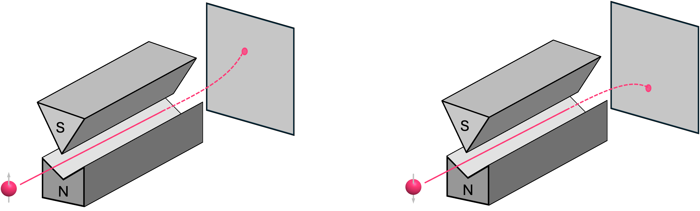</p>

*Hình: Electron có spin $+z$ luôn lệch lên (trái), spin $-z$ luôn lệch xuống (phải).*

<p align="center">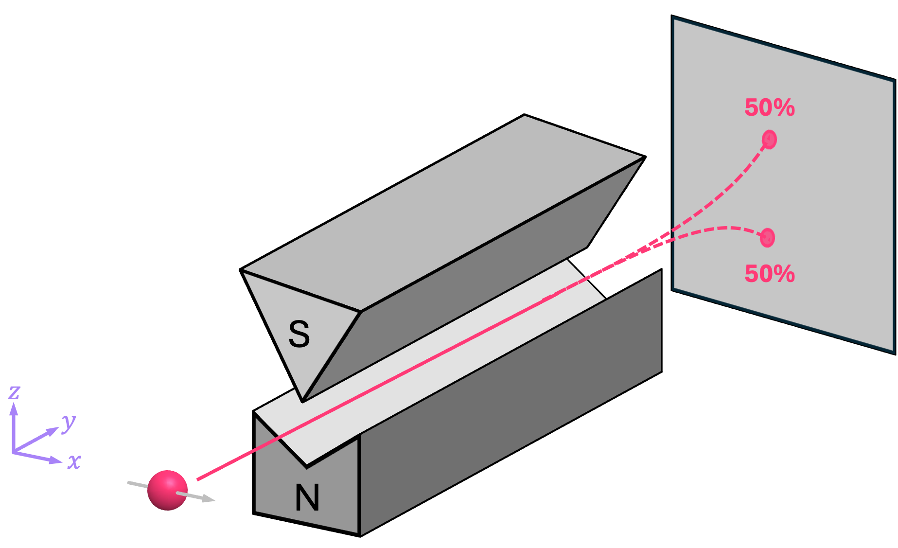</p>

*Hình: Electron có spin $+x$ không đi thẳng mà lệch lên hoặc xuống, mỗi bên 50%.*

**Vector xác suất không đủ.** Thử mô tả spin bằng vector xác suất (như ở 01_04). Khi đo theo trục $z$, cả $+x$ và $-x$
đều cho 50% lên, 50% xuống, nên cả hai cùng là $[\tfrac12, \tfrac12]^\top$. Nhưng chúng là hai trạng thái *khác nhau*:
xoay máy đo sang trục $x$ thì phân biệt được (một cái luôn cho $+x$, cái kia luôn cho $-x$). Vector xác suất đã làm
mất thông tin.

<p align="center">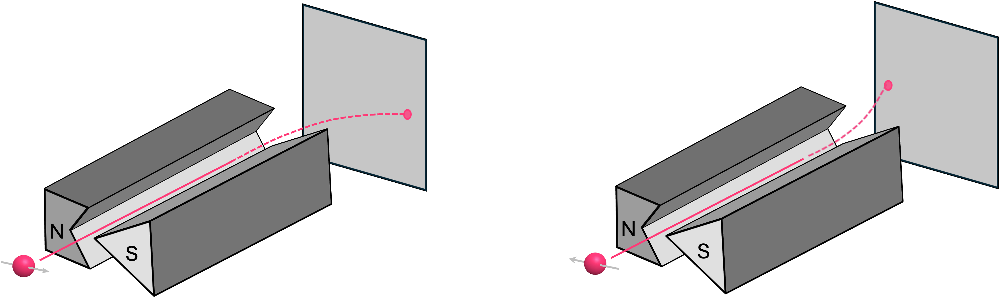</p>

*Hình: Xoay máy đo cho từ trường theo trục $x$: spin $+x$ (trái) và spin $-x$ (phải) lệch về hai phía ngược nhau.*

Tệ hơn, spin $+z$ đi qua máy đo đặt theo trục $x$ cũng lệch sang hai bên, mỗi bên 50%. Vậy spin $+z$ có thể xem là
sự kết hợp, mỗi phần một nửa, của $+x$ và $-x$.

<p align="center">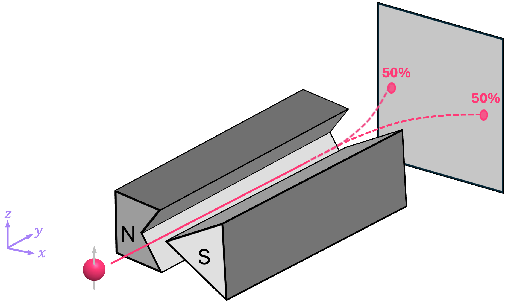</p>

*Hình: Electron spin $+z$ đi qua máy đo đặt theo trục $x$: lệch sang hai bên, mỗi bên 50%.*

Nhưng lấy một nửa của mỗi vector rồi cộng lại, $\tfrac12[\tfrac12, \tfrac12]^\top + \tfrac12[\tfrac12, \tfrac12]^\top$,
chỉ cho lại $[\tfrac12, \tfrac12]^\top$, chứ không ra $[1, 0]^\top$: thành phần "xuống" phải **triệt tiêu**, mà xác suất không
bao giờ âm nên không triệt tiêu được. Vì vậy cần cho phép phần tử **âm**, và xác suất là **bình phương** biên độ
(quy tắc Born):

$$|s\rangle = \begin{bmatrix}s_0\\ s_1\end{bmatrix}, \qquad \mathbb{P}_{+z} = s_0^2, \quad \mathbb{P}_{-z} = s_1^2$$

**Qubit.** Đổi tên: spin lên là $|0\rangle$, spin xuống là $|1\rangle$, và

$$|+\rangle = \tfrac{1}{\sqrt2}\big(|0\rangle + |1\rangle\big), \qquad |-\rangle = \tfrac{1}{\sqrt2}\big(|0\rangle - |1\rangle\big)$$

> Lưu ý: ở phần tóm tắt cuối mục 1.2, notebook ghi nhãn $|s_{-x}\rangle$ cho cả hai vector; vector
> $[\tfrac{1}{\sqrt2}, \tfrac{1}{\sqrt2}]^\top$ phải là $|s_{+x}\rangle$. Ngay trước đó, câu "find what $s_0$ and $s_1$
> for the vector $|s_{-z}\rangle$ should be" cũng phải là $|s_{-x}\rangle$.

Định nghĩa tổng quát:

$$|q\rangle = \begin{bmatrix}\alpha_0\\ \alpha_1\end{bmatrix}, \quad \alpha_j \in \mathbb{C}, \quad |\alpha_0|^2 + |\alpha_1|^2 = 1$$

(Ký hiệu $\mathbb{C}$ là tập số phức, chưa cần hiểu ngay; sẽ học ở 02_03. Lúc này cứ coi biên độ là số thực, có thể âm.)

So sánh: bit có phần tử thuộc $\{0,1\}$; p-bit có phần tử thuộc $[0,1]$ và **tổng** bằng 1; qubit có phần tử **phức**
và **tổng bình phương môđun** bằng 1.

> Chồng chập **không** có nghĩa là "vừa 0 vừa 1" hay "ở hai trạng thái cùng lúc". $|+\rangle$ là **một trạng thái
> hoàn toàn xác định**; chỉ là khi chọn trục $z$ để mô tả thì nó được viết thành tổ hợp của $|0\rangle$ và
> $|1\rangle$ với biên độ bằng nhau.

**Mạch lượng tử gồm 3 bước:**
1. **Chuẩn bị trạng thái** (state preparation), gần như luôn là $|0\rangle$.
2. **Biến đổi trạng thái** bằng các cổng.
3. **Đo** (measurement): chiếu trạng thái lượng tử về bit cổ điển, mang tính xác suất.

<p align="center">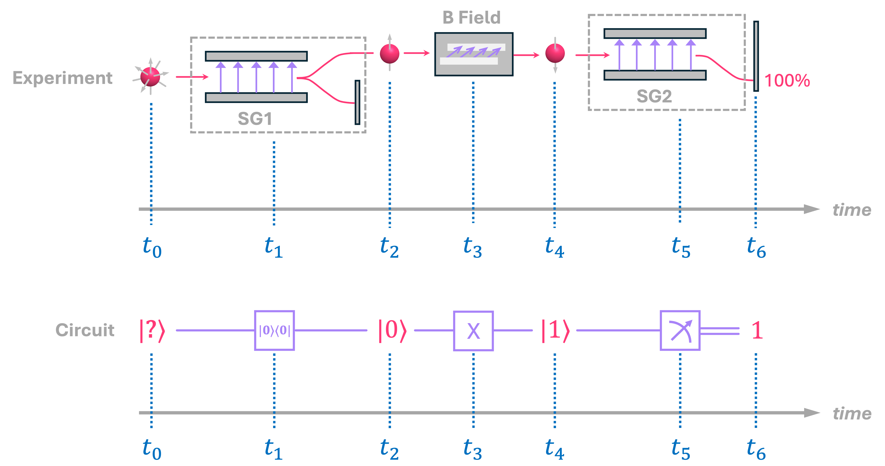</p>

*Hình: Thí nghiệm (trên) và mạch tương ứng (dưới). SG1 cùng màn chắn chỉ để electron spin lên đi tiếp (chuẩn bị $|0\rangle$), từ trường B lật spin (cổng $X$), SG2 đo và luôn ra 1.*

**Hai cổng đầu tiên:**

$$X = \begin{bmatrix}0&1\\1&0\end{bmatrix}\ (|0\rangle \leftrightarrow |1\rangle), \qquad
H = \tfrac{1}{\sqrt2}\begin{bmatrix}1&1\\1&-1\end{bmatrix}\ (|0\rangle \leftrightarrow |+\rangle,\ |1\rangle \leftrightarrow |-\rangle)$$

<p align="center">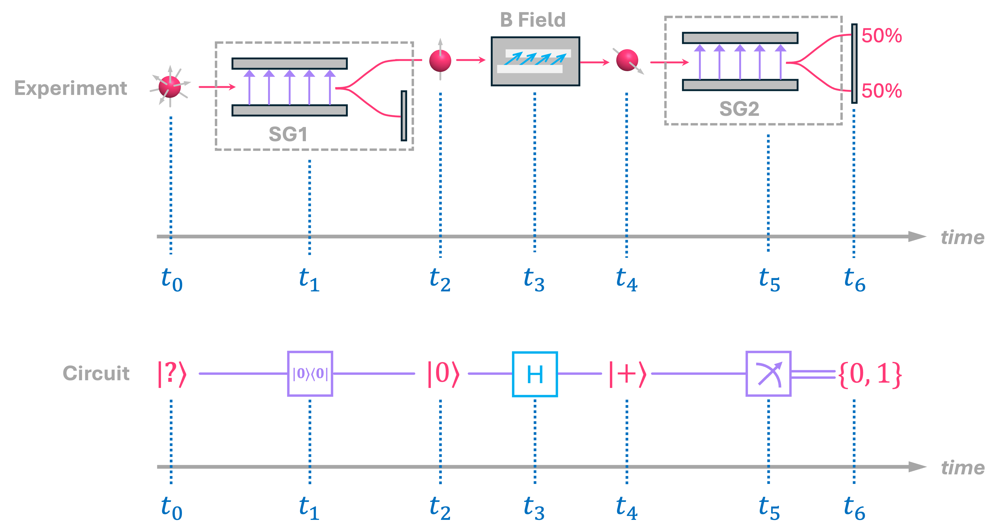</p>

*Hình: Cùng thí nghiệm, nhưng từ trường B xoay spin từ $+z$ sang $+x$ (cổng $H$ đưa $|0\rangle$ thành $|+\rangle$); SG2 cho 0 hoặc 1, mỗi kết quả 50%.*

> Lưu ý: dạng thập phân của $H$ trong notebook ghi phần tử góc dưới bên phải là $-\frac{\sqrt2}{\sqrt2}$; đúng là
> $-\frac{\sqrt2}{2}$. Cell cho $|0\rangle$, $|1\rangle$ đi qua `qc_h` in nhầm nhãn "over an X gate"; output là của cổng
> $H$ và đúng.

### Code chính

```python
zero = Statevector.from_label('0')
one = Statevector.from_label('1')
plus = Statevector.from_label('+')
minus = Statevector.from_label('-')
```
Tạo trạng thái bằng nhãn. Cũng có thể truyền danh sách biên độ, ví dụ `Statevector([np.sqrt(1/2), -np.sqrt(1/2)])`.

> Lưu ý: cell trước đó viết `one = Statevector([1, 0])`, sai, vì đó là $|0\rangle$. Cell này ghi đè lại bằng
> `from_label('1')` nên output phía sau vẫn đúng.

```python
display(plus.draw('latex', prefix='|+ \\rangle = '))                       # display ket representation of |+⟩
display(minus.draw('latex', prefix='|- \\rangle = ', convention='vector')) # display vector representation of |-⟩
```
`draw('latex')` hiển thị dạng ket; `convention='vector'` hiển thị dạng vector. Qiskit in vector cột thành **hàng**
cho gọn, nhưng đó vẫn là cùng một trạng thái.

```python
qc = QuantumCircuit(1,1)  # Create circuit object with 1 qubit and 1 classical bit
qc.reset(0)               # Add state preparation gate (reset) to qubit 0
qc.x(0)                   # Add X gate to circuit to qubit 0
qc.measure(0,0)           # Add measurement gate between qubit 0 and bit 0
qc.draw()
```
Mạch 3 bước: reset → X → đo. Trong Qiskit mọi qubit mặc định bắt đầu ở $|0\rangle$, nên `reset` thường thừa.

```python
X = Operator(qc_x)
X.draw('latex', prefix='X =')
```
`Operator(circuit)` lấy ma trận unitary của mạch. `state.evolve(circuit)` cho trạng thái đi qua mạch.
`Statevector(circuit)` luôn bắt đầu từ $|0\dots0\rangle$.

```python
plus_counts = plus.sample_counts(100)
```
Giả lập phép đo trực tiếp trên `Statevector`; `sample_memory(100)` trả về từng kết quả theo thứ tự.

```python
simulator = BasicSimulator()           # define simulator object
job = simulator.run(qc_hm, shots=100)  # use run method to execute our circuit some number of shots
result = job.result()                  # extract our results
counts = result.get_counts()           # get the counts from the experiment
```
Chạy mạch có phép đo trên simulator, giống quy trình trên phần cứng thật. `plot_histogram(counts)` vẽ kết quả.

### Kết quả

| Kiểm tra | Output |
|---|---|
| `Operator` của mạch X | $\begin{bmatrix}0&1\\1&0\end{bmatrix}$ |
| $\vert 0\rangle$, $\vert 1\rangle$ qua H | $\tfrac{\sqrt2}{2}(\vert 0\rangle \pm \vert 1\rangle)$ |
| Mạch X rồi H từ $\vert 0\rangle$ | $\vert -\rangle$; ma trận $H\cdot X = \tfrac{\sqrt2}{2}\begin{bmatrix}1&1\\-1&1\end{bmatrix}$ |
| `plus.sample_counts(100)` | `{'0': 51, '1': 49}` |
| `zero.sample_counts(100)` | `{'0': 100}` |
| Mạch H + đo, 100 shot, `BasicSimulator` | `{'0': 41, '1': 59}` |

### Ghi nhớ nhanh

- Xác suất = bình phương (môđun) biên độ; biên độ có thể âm, và tổng quát là số phức.
- $|+\rangle$, $|-\rangle$ cho cùng xác suất khi đo theo $z$ nhưng là hai trạng thái khác nhau.
- $X$ đổi $|0\rangle \leftrightarrow |1\rangle$; $H$ đổi $|0\rangle \leftrightarrow |+\rangle$, $|1\rangle \leftrightarrow |-\rangle$.
- `Statevector` = tính chính xác; `simulator.run(qc, shots=N)` = đo N lần.
- `Operator(qc)` = ma trận của mạch.

---

## 02_02 · Quantum entanglement (Vướng víu lượng tử)

**Mục tiêu:** phân biệt trạng thái **tách được** (separable) và **vướng víu** (entangled), và tạo vướng víu bằng mạch.

### Kiến thức chính

**Hai qubit** ghép bằng tích Kronecker, quy ước $q_0$ ở bên phải: $|q\rangle = |q_1\rangle \otimes |q_0\rangle = |q_1 q_0\rangle$.

$$|+\rangle \otimes |+\rangle = \tfrac12\big(|00\rangle + |01\rangle + |10\rangle + |11\rangle\big)$$

Mỗi kết quả có xác suất $(1/2)^2 = 1/4$, khớp thí nghiệm hai electron độc lập.

<p align="center">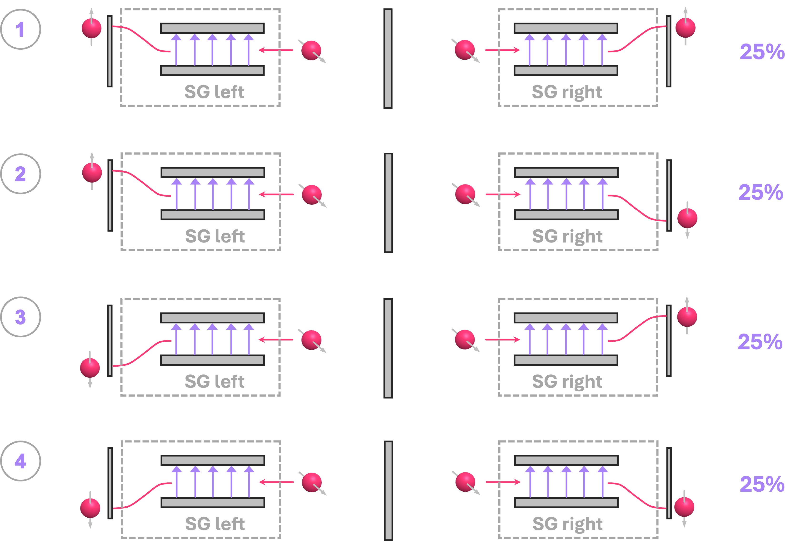</p>

*Hình: Hai electron độc lập, cùng spin $+x$, đo ở hai máy riêng: 4 tổ hợp lên/xuống, mỗi tổ hợp 25%.*

**Tách được** = viết được thành **một** tích của các trạng thái từng qubit. Ví dụ
$\tfrac12(|00\rangle - |01\rangle + |10\rangle - |11\rangle) = |+\rangle \otimes |-\rangle$.

**Vướng víu.** Một hạt spin 0 phân rã thành hai hạt (như electron) có spin ngược nhau. Đo theo trục $z$: luôn một lên
một xuống, mỗi trường hợp 50%.

<p align="center">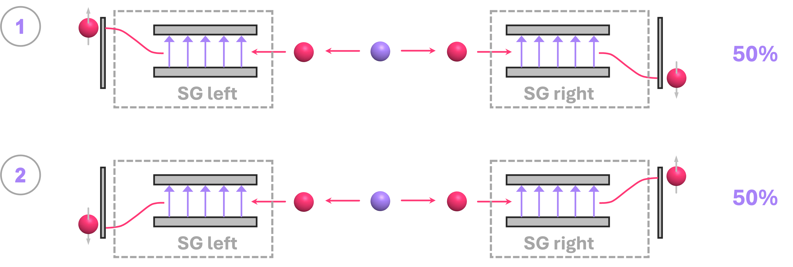</p>

*Hình: Một hạt (màu tím) phân rã thành hai electron bay về hai máy đo theo $z$: luôn một lên một xuống, mỗi trường hợp 50%.*

Có thể đoán cặp hạt luôn sinh ra với spin nằm sẵn theo $z$. Nếu vậy, xoay cả hai máy đo sang trục $x$ thì kết quả hai
bên phải độc lập: 4 tổ hợp, mỗi cái 25%.

<p align="center">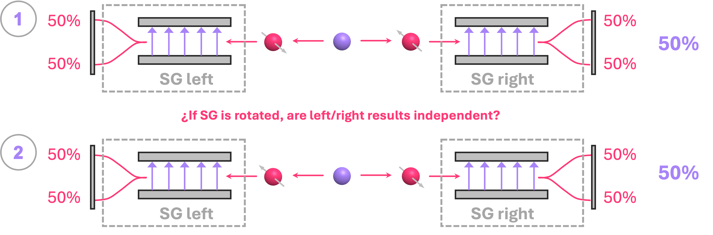</p>

*Hình: Giả thuyết cần kiểm tra: nếu spin của cặp hạt nằm sẵn theo $z$, xoay máy đo thì mỗi bên ra 50/50, độc lập với bên kia. Thí nghiệm bác bỏ giả thuyết này.*

Thí nghiệm cho thấy **không phải vậy**: đặt cả hai máy đo theo cùng một trục bất kỳ thì vẫn luôn một lên một xuống. Nếu chỉ
dựa vào phép đo theo $z$ (`01` và `10`, mỗi cái 1/2) thì cả hai trạng thái sau đều khớp:

$$\tfrac{1}{\sqrt2}\big(|01\rangle + |10\rangle\big) \quad\text{hoặc}\quad \tfrac{1}{\sqrt2}\big(|01\rangle - |10\rangle\big)$$

Cả hai đều **không thể** tách thành tích của hai trạng thái riêng. Với hệ cổ điển, biết đầy đủ trạng thái của cả hệ thì
cũng biết đầy đủ trạng thái từng phần; ở đây thì không. Trong hai trạng thái trên, chỉ
$\tfrac{1}{\sqrt2}(|01\rangle - |10\rangle)$ cho kết quả ngược nhau theo **mọi** trục, nên đó mới là trạng thái của cặp
hạt sinh ra từ hạt spin 0. Với $\tfrac{1}{\sqrt2}(|01\rangle + |10\rangle)$, đo cả hai theo trục $x$ lại luôn ra **cùng** hướng.

> Lưu ý: notebook gọi $\tfrac{1}{\sqrt2}(|01\rangle + |10\rangle)$ là "lựa chọn hợp lý" chỉ dựa trên thống kê theo trục $z$,
> rồi nói trạng thái dấu trừ "cũng cho cùng quan sát". Điều đó chỉ đúng khi đo theo $z$; với quan sát "trục nào cũng
> ngược nhau" ở trên thì chỉ trạng thái dấu trừ khớp.

> Đừng suy diễn quá: (1) mỗi bên vẫn thấy kết quả ngẫu nhiên 50/50, nên tương quan này **không** dùng để truyền tin được;
> (2) riêng việc "cùng trục thì luôn ngược nhau" vẫn bắt chước được bằng một mô hình cổ điển (mỗi cặp mang sẵn một hướng
> ngẫu nhiên). Điều mà không mô hình "quy định sẵn" nào làm được chỉ lộ ra khi hai máy đo đặt **lệch trục** nhau, qua bất
> đẳng thức Bell (chưa có trong sách; xem [bảng thuật ngữ](../../docs/glossary.md)).

**Tạo vướng víu bằng mạch** (H rồi CX):

$$|00\rangle \xrightarrow{H \otimes I} \tfrac{1}{\sqrt2}\big(|00\rangle + |10\rangle\big) \xrightarrow{CX} \tfrac{1}{\sqrt2}\big(|00\rangle + |11\rangle\big)$$

<p align="center">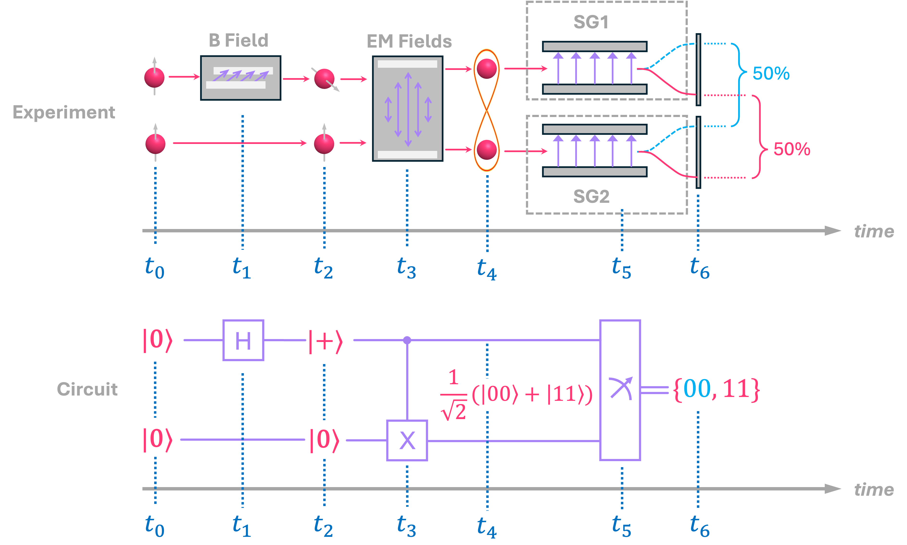</p>

*Hình: Từ trường B đưa electron trên về $+x$ (cổng $H$), trường điện từ cho hai electron tương tác (cổng $CX$), tạo $\tfrac{1}{\sqrt2}(|00\rangle + |11\rangle)$; đo ra `00` hoặc `11`, mỗi kết quả 50%.*

### Code chính

```python
state_00 = state_0.tensor(state_0)    # compose state |0⟩⊗|0⟩
state_01 = state_0.tensor(state_1)    # compose state |0⟩⊗|1⟩
```
`a.tensor(b)` là $a \otimes b$; `b` là qubit bên phải (qubit 0).

```python
H = Operator.from_label('H')
I = Operator.from_label('I')
HI = H.tensor(I)
q = q.evolve(HI)
```
Làm từng bước bằng ma trận: $H \otimes I$ tác động H lên $q_1$ và giữ nguyên $q_0$. Sau đó `q.evolve(CX)`
với `CX = Operator([[1,0,0,0],[0,1,0,0],[0,0,0,1],[0,0,1,0]])`.

```python
qc_ent = QuantumCircuit(2)    # define quantum circuit
qc_ent.h(1)                   # apply H gate to qubit 1
qc_ent.cx(1,0)                # apply CX with control on q1 and target on q0
```
Cách làm bằng mạch cho cùng kết quả. `qc.measure_all()` thêm phép đo cho mọi qubit.

### Kết quả

| Kiểm tra | Output |
|---|---|
| $\vert +-\rangle$, $\vert -+\rangle$, $\vert --\rangle$ | các dấu $\pm\tfrac12$ đúng như tích Kronecker |
| Mạch tách được $\vert +\rangle\vert -\rangle$, 1000 shot | `{'01': 270, '10': 229, '11': 225, '00': 276}`, mỗi kết quả khoảng 25% |
| Mạch H + CX | $\tfrac{\sqrt2}{2}\vert 00\rangle + \tfrac{\sqrt2}{2}\vert 11\rangle$ |
| Mạch H + CX, 1000 shot | `{'11': 508, '00': 492}`, không bao giờ ra `01`, `10` |

### Ghi nhớ nhanh

- $|q_1 q_0\rangle = |q_1\rangle \otimes |q_0\rangle$: qubit 0 ở **bên phải**.
- Tách được = một tích Kronecker; vướng víu = không tách được.
- Từ $|00\rangle$: H trên control + CX = cách chuẩn để tạo vướng víu.
- Đo $\tfrac{1}{\sqrt2}(|00\rangle + |11\rangle)$ theo $z$: hai kết quả luôn giống nhau, nhưng từng kết quả riêng vẫn ngẫu
  nhiên 50/50, nên không truyền được tin.

---

## 02_03 · Single-qubit systems (Hệ một qubit)

**Mục tiêu:** có định nghĩa đầy đủ của qubit, biểu diễn nó trên Bloch sphere, nắm các cổng một qubit và hình thức hoá phép đo.

### Kiến thức chính

**Góc θ bất kỳ.** Spin lệch góc $\theta$ so với $+z$ cho $\mathbb{P}_0 = \cos^2\tfrac\theta2$ và $\mathbb{P}_1 = \sin^2\tfrac\theta2$, nên

$$|q\rangle = \cos\tfrac\theta2\,|0\rangle + \sin\tfrac\theta2\,|1\rangle$$

<p align="center">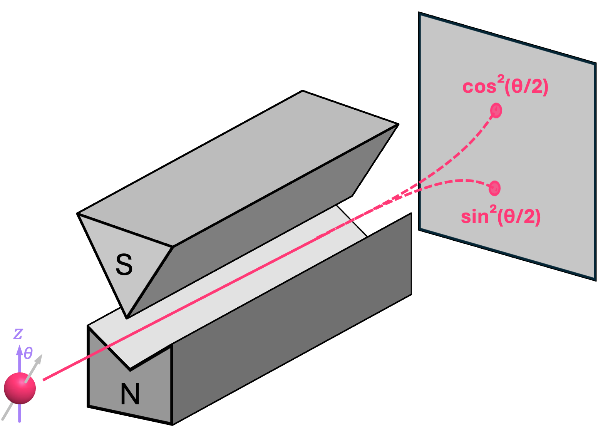</p>

*Hình: Spin lệch góc $\theta$ so với $+z$: lệch lên với xác suất $\cos^2(\theta/2)$, lệch xuống với xác suất $\sin^2(\theta/2)$.*

> Lưu ý: bảng ở mục 1.1 của notebook ghi $|-\rangle$ ứng với $\theta = \frac{3\pi}{2}$ và $\cos\frac\theta2 = \frac{1}{\sqrt2}$,
> $\sin\frac\theta2 = -\frac{1}{\sqrt2}$. Với $\theta = \frac{3\pi}{2}$ thì thực ra $\cos\frac{3\pi}{4} = -\frac{1}{\sqrt2}$ và
> $\sin\frac{3\pi}{4} = \frac{1}{\sqrt2}$, cho $-|-\rangle$ (cùng trạng thái, chỉ khác pha toàn cục, xem dưới). Các giá trị
> trong bảng ứng với $\theta = -\frac{\pi}{2}$.

**Cần số phức.** Spin trong mặt phẳng $xy$ luôn cho 50/50 khi đo theo $z$.

<p align="center">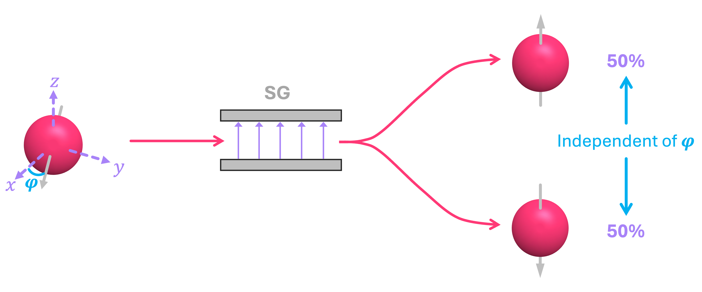</p>

*Hình: Spin nằm trong mặt phẳng $xy$, ở góc $\varphi$ bất kỳ so với trục $x$: đo theo $z$ luôn ra 50/50, không phụ thuộc $\varphi$.*

Với $\pm y$, cần biên độ vừa cho xác suất 1/2 vừa ghép lại được $|0\rangle$, $|1\rangle$. Các số **thực** duy nhất làm
được vậy là $\pm\tfrac{1}{\sqrt2}$, nhưng chúng đã dùng cho $|\pm\rangle$ (trục $x$); nên phải dùng $\pm i$:

$$|r\rangle = \tfrac{1}{\sqrt2}\big(|0\rangle + i|1\rangle\big), \qquad |l\rangle = \tfrac{1}{\sqrt2}\big(|0\rangle - i|1\rangle\big)$$

<p align="center">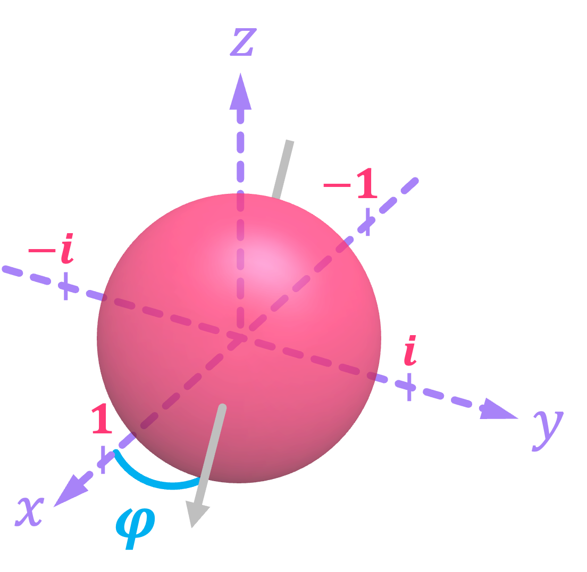</p>

*Hình: Đặt mặt phẳng phức trùng mặt phẳng $xy$: các số $1, i, -1, -i$ nằm trên các trục $+x, +y, -x, -y$; spin ở góc $\varphi$ ứng với số $e^{i\varphi}$.*

Quy tắc Born chính xác là lấy **bình phương môđun**: $|c|^2 = c\,c^* = a^2 + b^2$. Tổng quát cho mặt phẳng $xy$ là
$\tfrac{1}{\sqrt2}(|0\rangle + e^{i\varphi}|1\rangle)$.

> Lưu ý: notebook viết góc của số phức $c = a + bi$ là $\varphi = \text{atan2}(a, b)$; theo quy ước thông dụng
> (`numpy.arctan2(y, x)`) phải là $\text{atan2}(b, a)$, phần ảo đứng trước. Cũng ở mục 1.2, vế trái của "tổ hợp trừ" ghi
> $\frac{1}{\sqrt2}|r\rangle - \frac{i}{\sqrt2}|l\rangle$, nhưng phép tính bên dưới (ra $i|1\rangle$) dùng
> $\frac{1}{\sqrt2}|r\rangle - \frac{1}{\sqrt2}|l\rangle$.

**Bloch sphere.** Ghép hai kết quả trên:

$$|q\rangle = \cos\tfrac\theta2\,|0\rangle + e^{i\varphi}\sin\tfrac\theta2\,|1\rangle$$

$\theta \in [0, \pi]$ là góc so với trục $+z$; $\varphi \in [0, 2\pi)$ là góc của hình chiếu xuống mặt phẳng $xy$, đo từ
trục $+x$. Mọi trạng thái của một qubit (bỏ qua pha toàn cục, xem ngay dưới) là một điểm trên mặt cầu đơn vị.

<p align="center">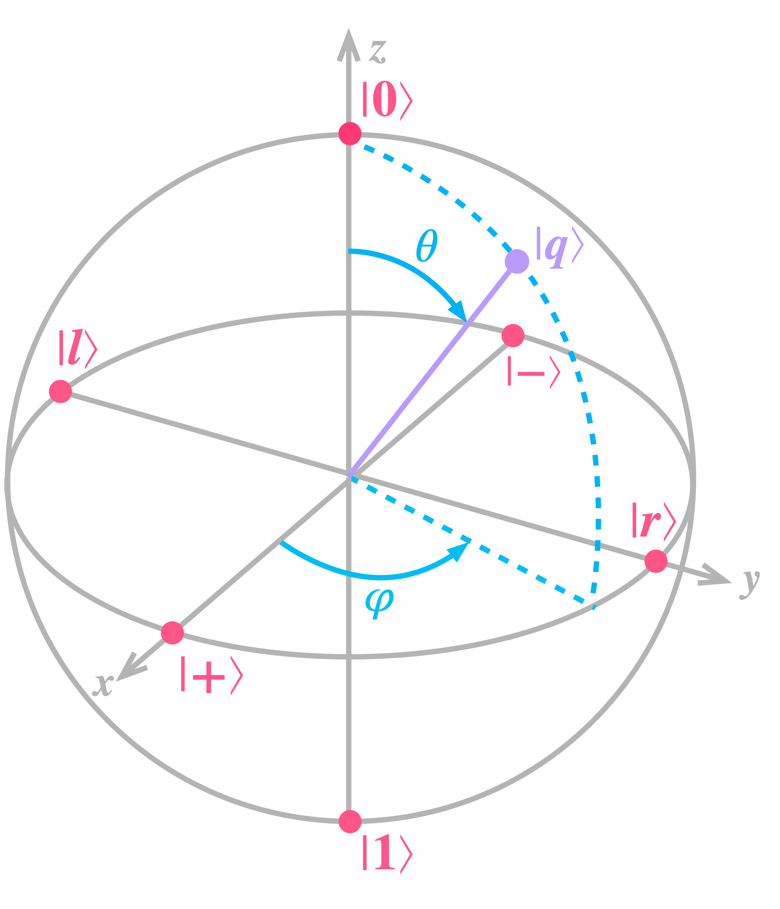</p>

*Hình: Bloch sphere. $|0\rangle$, $|1\rangle$ ở hai cực; $|\pm\rangle$ trên trục $x$; $|r\rangle$, $|l\rangle$ trên trục $y$.*

**Pha toàn cục và pha tương đối.** Với $\alpha_0, \alpha_1$ phức bất kỳ:

$$|q\rangle = e^{i\gamma}\Big[\cos\tfrac\theta2\,|0\rangle + e^{i\varphi}\sin\tfrac\theta2\,|1\rangle\Big]$$

- $\gamma$ là **pha toàn cục** (global phase): không đo được, vì $|e^{i\gamma}|^2 = 1$. Ví dụ $i|1\rangle$ tương đương $|1\rangle$.
- $\varphi$ là **pha tương đối** (relative phase): đo được, vì nó quyết định vị trí trên Bloch sphere. Đo theo $z$ thì
  không thấy nó (như $|+\rangle$ và $|-\rangle$), nhưng đo theo $x$ hay $y$ thì kết quả thay đổi.

**Bra, tích trong, cơ sở.** Bra là **chuyển vị liên hợp**: $\langle q| = [\alpha_0^*, \alpha_1^*]$. Tích trong
$\langle y|x\rangle = \langle x|y\rangle^*$; chuẩn $\|q\| = \sqrt{\langle q|q\rangle}$. Ba cơ sở trực chuẩn quan trọng:

| Cơ sở | Trạng thái | Trục Bloch |
|---|---|---|
| Computational (bit) | $\vert 0\rangle, \vert 1\rangle$ | $\pm z$ |
| Hadamard (sign) | $\vert +\rangle, \vert -\rangle$ | $\pm x$ |
| Y (hand) | $\vert r\rangle, \vert l\rangle$ | $\pm y$ |

> Lưu ý: ở ví dụ đổi $\sqrt{2/3}\,|0\rangle - \sqrt{1/3}\,|1\rangle$ sang cơ sở sign, notebook ghi cả hai hệ số là
> $\frac{2\sqrt3 - \sqrt6}{6}$. Hệ số của $|-\rangle$ đúng ra là $\frac{2\sqrt3 + \sqrt6}{6} \approx 0.986$; giá trị số trong
> notebook thì đúng.

Tích ngoài $|x\rangle\langle y|$ là một ma trận; hai phép chiếu $\Pi_0 = |0\rangle\langle 0|$ và $\Pi_1 = |1\rangle\langle 1|$ dùng cho phép đo.

**Cổng là ma trận unitary**: $UU^\dagger = U^\dagger U = I$. Vì thế mọi cổng có cổng đảo $U^\dagger$ (tính toán lượng tử
khả nghịch), và unitary giữ nguyên chuẩn của vector.

| Nhóm | Ma trận | Tác dụng trên Bloch sphere |
|---|---|---|
| Pauli $X$ | $\begin{bmatrix}0&1\\1&0\end{bmatrix}$ | Xoay π quanh trục $x$ |
| Pauli $Y$ | $\begin{bmatrix}0&-i\\i&0\end{bmatrix}$ | Xoay π quanh trục $y$ |
| Pauli $Z$ | $\begin{bmatrix}1&0\\0&-1\end{bmatrix}$ | Xoay π quanh trục $z$: $Z\vert +\rangle = \vert -\rangle$, $Z\vert 1\rangle = -\vert 1\rangle$ |
| Phase $P(\varphi)$ | $\begin{bmatrix}1&0\\0&e^{i\varphi}\end{bmatrix}$ | Xoay $\varphi$ quanh $z$; $Z = P(\pi)$, $S = P(\pi/2)$, $T = P(\pi/4)$ |
| $S^\dagger$, $T^\dagger$ | $e^{-i\varphi}$ ở góc dưới | Xoay ngược chiều |
| $RX(\theta)$ | $\begin{bmatrix}\cos\frac\theta2 & -i\sin\frac\theta2\\ -i\sin\frac\theta2 & \cos\frac\theta2\end{bmatrix}$ | Xoay θ quanh $x$ |
| $RY(\theta)$ | $\begin{bmatrix}\cos\frac\theta2 & -\sin\frac\theta2\\ \sin\frac\theta2 & \cos\frac\theta2\end{bmatrix}$ | Xoay θ quanh $y$ |
| $RZ(\varphi)$ | $\begin{bmatrix}e^{-i\varphi/2}&0\\0&e^{i\varphi/2}\end{bmatrix}$ | Xoay φ quanh $z$; $RZ(\varphi) = e^{-i\varphi/2}P(\varphi)$ |

> Lưu ý: notebook viết rằng $S$ cùng $H$ và $CX$ đủ để xấp xỉ mọi cổng. Thực ra $\{H, S, CX\}$ chỉ sinh ra nhóm Clifford,
> và nhóm này mô phỏng được hiệu quả trên máy cổ điển (định lý Gottesman–Knill). Cần thêm cổng **$T$** (bộ Clifford+T)
> mới phổ quát. Chính bài 02_04 của sách cũng nói đúng như vậy. Định lý Solovay–Kitaev mà notebook dẫn cũng không nói bộ
> nào là phổ quát; nó nói rằng khi đã có một bộ cổng phổ quát thì xấp xỉ một cổng tới sai số $\varepsilon$ chỉ cần số cổng
> cỡ lũy thừa của $\log(1/\varepsilon)$, tức xấp xỉ được **hiệu quả**.

**Đo phá huỷ và không phá huỷ.** Nếu electron đập vào màn thì nó bị hấp thụ: đó là phép đo **phá huỷ** (destructive
measurement), sau đo không còn spin nào để bàn tới.

<p align="center">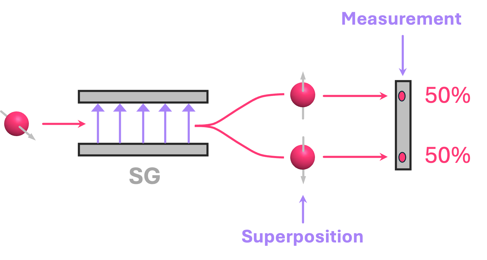</p>

*Hình: Đo phá huỷ: electron bị màn hấp thụ, chỉ để lại vết ở trên hoặc ở dưới (mỗi bên 50%).*

Nếu khoét hai lỗ trên màn cho electron bay qua thì ta biết nó đi lối nào mà electron vẫn còn: đó là phép đo **không phá
huỷ** (non-destructive). Sau đo, spin nằm đúng ở trạng thái ứng với kết quả. Sách gọi việc này là trạng thái bị **chiếu**
(projection) hay **rút gọn** (reduction), và tránh chữ "sụp đổ" (collapse) vì chữ này hay gắn với một cách diễn giải cơ
học lượng tử cụ thể.

<p align="center">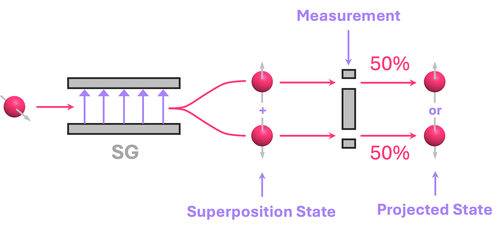</p>

*Hình: Đo không phá huỷ: electron bay qua lỗ trên hoặc lỗ dưới (mỗi bên 50%) và tiếp tục tồn tại ở trạng thái spin lên hoặc xuống tương ứng.*

Vậy một phép đo cho ra ba thứ: kết quả cổ điển $j$, xác suất $\mathbb{P}_j$ của nó, và trạng thái lượng tử $|j\rangle$ sau đo.

<p align="center">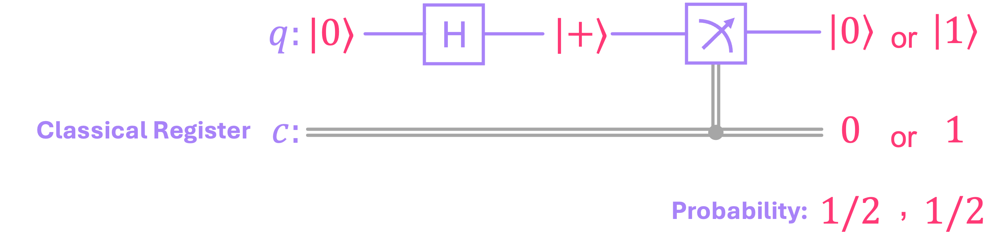</p>

*Hình: Đo $|+\rangle$: kết quả cổ điển (0 hoặc 1) ghi vào thanh ghi cổ điển $c$ (dây đôi), mỗi kết quả có xác suất 1/2, và qubit sau đo là $|0\rangle$ hoặc $|1\rangle$ tương ứng.*

**Phép đo chiếu (projective measurement, PVM).** Với tập phép chiếu $\{\Pi_j\}$:
1. Mỗi $\Pi_j$ ứng với kết quả cổ điển $j$.
2. Xác suất: $\mathbb{P}_j = \langle q|\Pi_j|q\rangle$.
3. Trạng thái sau đo: $|q'\rangle = \Pi_j|q\rangle / \sqrt{\mathbb{P}_j}$.

Cách viết này nghe thừa với 1 qubit, nhưng rất cần khi chỉ đo một phần của hệ nhiều qubit (bài 02_04).

> Lưu ý (lỗi đánh máy nhỏ trong notebook): mục 3.1 viết $\langle 1|(\alpha_1|0\rangle + \alpha_1|1\rangle)$, đúng là
> $\alpha_0|0\rangle + \alpha_1|1\rangle$; và hai lần viết $\sqrt{\mathbb{P}_i}$, đúng là $\sqrt{\mathbb{P}_j}$. Mục 2.3 liệt kê
> "RX, RY, RX", đúng là $RX, RY, RZ$.

**Post-selection và reset.** Post-selection là đo rồi chỉ giữ kết quả mong muốn. Reset là đo rồi áp $X$ nếu kết quả là 1,
nên luôn ra $|0\rangle$.

**Observable** là đại lượng đo được, viết bằng ma trận Hermitian $\mathcal{O} = \sum_j \lambda_j \Pi_j$, với $\lambda_j$ là
giá trị đo. Gán $|0\rangle \to +1$ và $|1\rangle \to -1$ ra đúng ma trận $Z = \Pi_0 - \Pi_1$ (tương tự cho $X$, $Y$).
Giá trị kỳ vọng là

$$\langle \mathcal{O}\rangle_q = \langle q|\mathcal{O}|q\rangle$$

Ví dụ $|q\rangle = \sqrt{1/3}\,|0\rangle + \sqrt{2/3}\,|1\rangle$ cho $\langle X\rangle = 2\sqrt{2/9} \approx 0.943$.

### Code chính

```python
θ = np.pi/3                # Spin angle wrt to +z axis
α0 = np.cos(θ/2)           # Probability amplitude associated with |0⟩
α1 = np.sin(θ/2)           # Probability amplitude associated with |1⟩

q = Statevector([α0, α1])  # Construct statevector |q⟩ = α0|0⟩ + α1|1⟩ = [α0 α1]ᵀ

probs = q.probabilities() # Extract expected probs array [P₀, P₁]
```
`probabilities()` cho xác suất chính xác; `sample_counts(shots=1000)` cho kết quả lấy mẫu.

```python
θ = np.pi/3
φ = 2*np.pi/5

α0 = np.cos(θ/2)
α1 = np.sin(θ/2) * np.exp(1j*φ)

sv = Statevector([α0, α1])
sv.draw('bloch')
```
Vẽ qubit bất kỳ trên Bloch sphere; đổi θ, φ để thấy vector di chuyển.

```python
qc_p = QuantumCircuit(3)
qc_p.h(range(3)) # prepare |+⟩ state in all three qubits
qc_p.z(2)
qc_p.s(1)
qc_p.t(0)
```
Ba cổng pha trên ba qubit, rồi `Statevector(qc_p).draw('bloch', reverse_bits=True)` để so sánh. Bản ngược chiều dùng `sdg`, `tdg`.

```python
qc = QuantumCircuit(1,1)
qc.h(0)                           # Initialize in superposition
qc.save_statevector('q_pre')     # Save statevector before reset
qc.measure(0,0)                   # Measure state (should give 50/50 `0` or `1`)
with qc.if_test((0,1)): qc.x(0)   # Apply X gate if classical result is `1`
qc.save_statevector('q_pst')      # Save statevector after reset
```
Reset thủ công: `if_test((clbit, value))` là lệnh điều khiển theo kết quả đo (classical feed-forward).
`save_statevector` là lệnh của Aer, lưu trạng thái giữa mạch.

```python
O = Operator.from_label('X')
O_expval = q.expectation_value(O)
```
Giá trị kỳ vọng chính xác từ `Statevector`.

```python
Obs = SparsePauliOp.from_operator(O)
estimator = Estimator(mode=AerSimulator())
result = estimator.run([(qc_o, Obs)]).result()
O_expval = result[0].data.evs
```
Giá trị kỳ vọng ước lượng bằng lấy mẫu, qua primitive `Estimator` (của `qiskit_ibm_runtime`) chạy trên AerSimulator.
Không cần tài khoản IBM.

### Kết quả

| Kiểm tra | Output |
|---|---|
| θ = π/3: `probabilities()` | `[0.75 0.25]` |
| θ = π/3: `sample_counts(1000)` | `{'0': 763, '1': 237}` |
| Reset: trước / sau | $\tfrac{\sqrt2}{2}(\vert 0\rangle + \vert 1\rangle)$ / $\vert 0\rangle$ |
| $\langle X\rangle$ chính xác (`expectation_value`) | `0.9428` |
| $\langle X\rangle$ bằng `Estimator` | `0.936` (có sai số lấy mẫu) |

### Ghi nhớ nhanh

- Qubit = điểm trên Bloch sphere: $\cos\frac\theta2|0\rangle + e^{i\varphi}\sin\frac\theta2|1\rangle$.
- Pha toàn cục không đo được; pha tương đối thì đo được.
- Xác suất = $|\alpha|^2 = \alpha\alpha^*$; bra là **chuyển vị liên hợp**.
- Cổng = unitary = phép xoay trên Bloch sphere; $S = P(\pi/2)$, $T = P(\pi/4)$, $Z = P(\pi)$.
- Đo: $\mathbb{P}_j = \langle q|\Pi_j|q\rangle$, sau đo $\Pi_j|q\rangle/\sqrt{\mathbb{P}_j}$.
- Kỳ vọng: $\langle q|\mathcal{O}|q\rangle$; chính xác bằng `expectation_value`, lấy mẫu bằng `Estimator`.

---

## 02_04 · Multi-qubit systems (Hệ nhiều qubit)

**Mục tiêu:** mở rộng mọi thứ lên $n$ qubit: trạng thái, cổng nhiều qubit, định lý no-cloning, bộ cổng phổ quát và đo một phần.

### Kiến thức chính

**Trạng thái $n$ qubit** là tổ hợp của $N = 2^n$ trạng thái cơ sở:

$$|q\rangle = \sum_{j=0}^{N-1} \alpha_j |j\rangle, \qquad \sum_j |\alpha_j|^2 = 1, \qquad \langle i|j\rangle = \delta_{ij}$$

$|j\rangle$ là cách viết tắt của số nhị phân tương ứng, ví dụ $|5\rangle \sim |101\rangle$.

> Lưu ý: notebook viết $j$ (và $i$) chạy "từ 0 đến $2^{N-1}$"; đúng là từ 0 đến $N - 1 = 2^n - 1$, như chỉ số của tổng.

**Cổng một qubit trên nhiều qubit:** $U = U_{n-1} \otimes \dots \otimes U_0$, ví dụ X trên $q_0$, H trên $q_1$, Z trên $q_2$
là $Z \otimes H \otimes X$. Các cổng dạng tích này **không tạo được vướng víu**; cần **cổng vướng víu** (entangling gate).

**Cổng điều khiển viết bằng phép chiếu:**

$$CU = \Pi_0 \otimes I + \Pi_1 \otimes U$$

| Cổng | Công thức / ghi chú |
|---|---|
| $CX$ | $\Pi_0 \otimes I + \Pi_1 \otimes X$ |
| $CZ$ | $\Pi_0 \otimes I + \Pi_1 \otimes Z$ = diag(1, 1, 1, −1); **đối xứng**: đổi control và target vẫn cùng ma trận |
| $CP(\varphi)$ | $\Pi_0 \otimes I + \Pi_1 \otimes P(\varphi)$ |
| $\overline{C}X$ (kích hoạt khi control là 0) | $\Pi_1 \otimes I + \Pi_0 \otimes X$ = X, rồi CX, rồi X trên control |
| $CCX$ (Toffoli) | $(\Pi_{00} + \Pi_{01} + \Pi_{10}) \otimes I + \Pi_{11} \otimes X$ |
| Control không kề target | Chèn $I$ vào giữa: $CZ_{20} = \Pi_0 \otimes I \otimes I + \Pi_1 \otimes I \otimes Z$ |
| SWAP | Đổi trạng thái hai qubit; bằng 3 cổng CX (giống mẹo XOR swap) |
| CSWAP (Fredkin) | SWAP có điều khiển |

> Lưu ý: notebook gọi SWAP là một "entangling gate". SWAP đúng là không viết được thành tích tensor của các cổng một
> qubit, nhưng nó biến mọi trạng thái tách được $|a\rangle|b\rangle$ thành $|b\rangle|a\rangle$, vẫn tách được. Vì vậy một
> mình SWAP **không** tạo được vướng víu.

**Định lý no-cloning.** CX sao chép được $|0\rangle$ và $|1\rangle$.

<p align="center">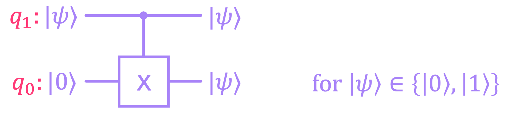</p>

*Hình: CX chép trạng thái $|\psi\rangle$ của qubit 1 sang qubit 0 (khởi tạo $|0\rangle$), nhưng chỉ khi $|\psi\rangle$ là $|0\rangle$ hoặc $|1\rangle$.*

Giả sử có cổng $\Theta$ sao chép trạng thái bất kỳ:
$(\alpha_0|0\rangle + \alpha_1|1\rangle)|0\rangle \to (\alpha_0|0\rangle + \alpha_1|1\rangle)^{\otimes 2}$.

<p align="center">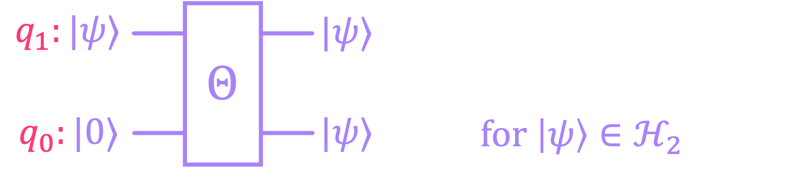</p>

*Hình: Cổng sao chép giả định $\Theta$, áp dụng cho mọi $|\psi\rangle$. Định lý no-cloning nói cổng như vậy không tồn tại.*

Vì unitary tuyến tính, đầu ra phải là
$\alpha_0|00\rangle + \alpha_1|11\rangle$, trong khi bản sao thật là
$\alpha_0^2|00\rangle + \alpha_0\alpha_1|01\rangle + \alpha_1\alpha_0|10\rangle + \alpha_1^2|11\rangle$.
Hai biểu thức chỉ bằng nhau khi trạng thái là $|0\rangle$ hoặc $|1\rangle$. **Không thể sao chép một trạng thái lượng tử tuỳ ý.**

> Lưu ý: notebook ghi trường hợp thứ hai là $(\alpha_1 = 0, \alpha_1 = 1)$; đúng là $(\alpha_0 = 0, \alpha_1 = 1)$.

**Bộ cổng phổ quát** (universal gate set) xấp xỉ được mọi unitary với độ chính xác tuỳ ý.
- Phần cứng hiện nay: bộ cổng gốc có tham số liên tục, ví dụ $\{CX, SX, RZ(\theta)\}$; `transpile` dịch mạch sang bộ này.
- Margolus ($RCCX$) giống CCX, chỉ khác pha: $|101\rangle \to -|101\rangle$, $|110\rangle \to i|111\rangle$,
  $|111\rangle \to -i|110\rangle$ (sách gọn lại là thêm pha $-1, i, -i$ cho ba đầu vào này). Khi các pha này không ảnh
  hưởng tới kết quả, nó tốn ít cổng hơn nhiều.
- Máy chịu lỗi (fault-tolerant) dùng **Clifford+T**: mạch chỉ gồm Clifford $\{H, S, CX\}$ mô phỏng hiệu quả được trên máy
  cổ điển (Gottesman–Knill); thêm $T$ mới đủ sức mạnh lượng tử. Trong đa số kiến trúc sửa lỗi, cổng $T$ tốn kém nhất, nên
  phải tối thiểu hoá **T-depth** (số lớp cổng T/T†).

> Lưu ý: notebook viết rằng lý do thêm $T$ thì đủ sức mạnh lượng tử "được giải thích bởi định lý Solovay–Kitaev". Không
> phải vậy: tính phổ quát của Clifford+T đến từ việc $H$ và $T$ sinh ra một tập trù mật các phép xoay một qubit;
> Solovay–Kitaev chỉ cho biết việc xấp xỉ đó **hiệu quả** (số cổng cỡ lũy thừa của $\log(1/\varepsilon)$).

**Đo toàn bộ:** $\mathbb{P}_j = |\alpha_j|^2$, sau đo về $|j\rangle$.

**Đo một phần.** Tách hệ thành phần đo $A$ và phần không đo $B$. Với $m$ qubit đầu ($q_0, \dots, q_{m-1}$, nằm ở **bên
phải** tích tensor):

$$\Pi_k^A = I^{\otimes(n-m)} \otimes \Pi_k, \qquad \mathbb{P}_k^A = \langle q|\Pi_k^A|q\rangle, \qquad |q'\rangle = \frac{\Pi_k^A|q\rangle}{\sqrt{\mathbb{P}_k^A}}$$

Ví dụ $|w\rangle = \tfrac{1}{\sqrt3}(|001\rangle + i|010\rangle - |100\rangle)$, chỉ đo $q_0$: $\mathbb{P}_0 = 2/3$, $\mathbb{P}_1 = 1/3$.
Nếu ra 0 thì trạng thái còn lại là $\tfrac{i}{\sqrt2}|010\rangle - \tfrac{1}{\sqrt2}|100\rangle$; nếu ra 1 thì là $|001\rangle$.

### Code chính

```python
Π0 = Operator.from_label('0')
Π1 = Operator.from_label('1')
I = Operator.from_label('I')
X = Operator.from_label('X')

CX = Π0.tensor(I) + Π1.tensor(X)
```
Dựng CX từ phép chiếu; `Operator.from_label('0')` chính là $|0\rangle\langle 0|$.

```python
qc = QuantumCircuit(2)
qc.cx(1,0,ctrl_state='0')
```
`ctrl_state` đổi điều kiện kích hoạt. Với nhiều control: `qc.ccx(1,2,0,ctrl_state='10')`. Chuỗi đọc theo kiểu
little-endian: ký tự **bên phải** ứng với control **đầu tiên** trong danh sách ($q_1$), nên `'10'` nghĩa là $q_2 = 1$,
$q_1 = 0$ (output: chỉ $|100\rangle \leftrightarrow |101\rangle$ đổi chỗ).

```python
qc_t = transpile(qc, basis_gates=['cx', 'sx', 'rz']) # Converts arbitrary circuit to a given basis gate-set
```
Dịch CCX (hoặc `rccx`) sang bộ cổng gốc của phần cứng.

```python
T_depth = qc.depth(lambda instr: instr.operation.name in ['t', 'tdg'])
```
Đếm T-depth: `depth()` với bộ lọc chỉ tính các cổng `t`, `tdg`.

```python
# Create 3-qubit |w⟩ state:
w = np.sqrt(1/3)*(Statevector.from_int(1,8) + 1j*Statevector.from_int(2,8) - Statevector.from_int(4,8))
probs = w.probabilities([0])
c_result, q_result = w.measure([0])
```
`from_int(k, dim)` tạo $|k\rangle$; `probabilities([0])` và `measure([0])` chỉ đo qubit 0 (bỏ `[0]` là đo toàn bộ).

```python
qc = QuantumCircuit(3)

# prepare |w⟩
qc.x(2)
qc.cry(2*np.arccos(np.sqrt(1/3)),2,1)
qc.cx(1,2)
qc.cry(2*np.arccos(np.sqrt(1/2)),1,0)
qc.cx(0,1)
qc.barrier()
qc.z(2)
qc.s(1)
qc.id(0)
```
Mạch chuẩn bị $|w\rangle$ bằng `cry` (RY có điều khiển), rồi thêm pha bằng Z, S. Sau đó đo và `save_statevector()`
để xem trạng thái sau đo.

### Kết quả

| Kiểm tra | Output |
|---|---|
| `Z.tensor(H.tensor(X))` và `Operator(qc)` của mạch X/H/Z | cùng một ma trận 8×8 |
| `Π0⊗I + Π1⊗X` | trùng ma trận của `qc.cx(1,0)` |
| H⊗H rồi CZ | $\tfrac12(\vert 00\rangle + \vert 01\rangle + \vert 10\rangle - \vert 11\rangle)$ |
| 3 CX | ra đúng ma trận SWAP |
| Mạch Clifford+T dựng CCX | đúng ma trận CCX, T-depth = `4` |
| `w.probabilities()` | `[0, 1/3, 1/3, 0, 1/3, 0, 0, 0]` |
| `w.probabilities([0])` | `[2/3, 1/3]` |
| Đo riêng $q_0$ ra 0 | $\tfrac{\sqrt2 i}{2}\vert 010\rangle - \tfrac{\sqrt2}{2}\vert 100\rangle$ |

### Ghi nhớ nhanh

- $n$ qubit → $2^n$ biên độ.
- Cổng điều khiển: $\Pi_0 \otimes I + \Pi_1 \otimes U$; muốn cách qubit thì chèn $I$.
- CZ đối xứng; SWAP = 3 CX; Fredkin = CSWAP.
- **No-cloning:** không sao chép được trạng thái tuỳ ý (CX chỉ copy được $|0\rangle$, $|1\rangle$).
- Clifford+T phổ quát; trên máy chịu lỗi T thường đắt nhất, nên tối thiểu T-depth.
- Đo một phần: $\Pi_k^A = I \otimes \dots \otimes \Pi_k$, rồi chuẩn hoá lại.

---

## 02_05 · Quantum building blocks (Các khối dựng lượng tử)

**Mục tiêu:** nắm các mạch con dùng lại trong mọi giao thức và thuật toán phía sau.

### Kiến thức chính

**Bốn trạng thái Bell** (cơ sở Bell):

$$|\Phi^\pm\rangle = \tfrac{1}{\sqrt2}\big(|00\rangle \pm |11\rangle\big), \qquad |\Psi^\pm\rangle = \tfrac{1}{\sqrt2}\big(|01\rangle \pm |10\rangle\big)$$

Mạch H($q_1$) + CX($q_1 \to q_0$) biến $|00\rangle, |01\rangle, |10\rangle, |11\rangle$ lần lượt thành
$|\Phi^+\rangle, |\Psi^+\rangle, |\Phi^-\rangle, |\Psi^-\rangle$. Hoặc giữ đầu vào $|00\rangle$ và thêm cổng sau CX: Z → $\Phi^-$, X → $\Psi^+$, X và Z → $\Psi^-$.

**GHZ** tổng quát hoá $|\Phi^+\rangle$: $|\Omega_n\rangle = \tfrac{1}{\sqrt2}(|0\rangle^{\otimes n} + |1\rangle^{\otimes n})$. Có ba cách dựng mạch:

| Cách | Ý tưởng | Ưu / nhược điểm |
|---|---|---|
| `ghz_cir_a` | H lên qubit cao nhất, CX từ nó tới mọi qubit khác | Cần kết nối tới mọi qubit; phần cứng chỉ nối láng giềng thì phải thêm SWAP |
| `ghz_cir_b` | CX nối tiếp giữa các cặp kề nhau | Chỉ cần nối láng giềng, nhưng các CX chạy nối tiếp: độ sâu $n$, qubit chờ lâu dễ lỗi |
| `ghz_cir_c` | H ở qubit giữa, lan ra hai phía song song | Vẫn chỉ nối láng giềng, độ sâu giảm còn $\lceil n/2\rceil + 1$ |

> Lưu ý: notebook ghi độ sâu của `ghz_cir_b` là $n+1$ và của `ghz_cir_c` là $n/2 + 2$. Đếm bằng `qc.depth()` ra $n$ và
> $\lceil n/2\rceil + 1$ (ví dụ $n = 7$: 7 và 5). Kết luận "giảm khoảng một nửa" vẫn đúng.

**W** tổng quát hoá $|\Psi^+\rangle$: mỗi thành phần chỉ có đúng một bit 1 (one-hot):
$|W_n\rangle = \tfrac{1}{\sqrt n}\sum_{j=0}^{n-1}|2^j\rangle$. Mạch dùng RY/CRY để phân phối biên độ, rồi CX để sắp xếp lại.

**Biến đổi Hadamard lượng tử** $\text{QHT}_n = H^{\otimes n}$, phần tử ma trận $h_{i,j} = (-1)^{i\cdot j}/\sqrt N$, với $i \cdot j$ là
**tích vô hướng nhị phân** (AND từng bit rồi XOR lại). Công thức quan trọng nhất cho phần 04:

$$H^{\otimes n}|j\rangle = \frac{1}{\sqrt N}\sum_{i=0}^{N-1}(-1)^{i\cdot j}|i\rangle, \qquad H^{\otimes n}|0\dots0\rangle = \frac{1}{\sqrt N}\sum_i |i\rangle$$

**Trị riêng, vector riêng.** $U|u\rangle = \lambda|u\rangle$. Với unitary, $|\lambda| = 1$ nên $\lambda = e^{i\varphi}$: áp $U$ lên vector
riêng chỉ thêm **pha toàn cục**, không đo được. Ví dụ $X$ có $(1, |+\rangle)$ và $(-1, |-\rangle)$; $S$ có $(1, |0\rangle)$ và $(i, |1\rangle)$.

**Phase kickback.** Đặt control ở chồng chập và target ở vector riêng của $U$; pha $e^{i\varphi}$ bị "đá ngược" lên **control**
và trở thành **pha tương đối**, tức đo được:

$$\tfrac{1}{\sqrt2}\big(|0\rangle + |1\rangle\big)|u\rangle \xrightarrow{CU} \tfrac{1}{\sqrt2}\big(|0\rangle + e^{i\varphi}|1\rangle\big)|u\rangle$$

Ví dụ với CX và target $|-\rangle$: $|+\rangle|-\rangle \to |-\rangle|-\rangle$, và kẹp giữa hai lớp H thì $|01\rangle \to |11\rangle$,
tức **target làm lật control**. Với nhiều control, chỉ trạng thái $|k\rangle$ kích hoạt $U$ mới nhận pha, như
"đánh dấu" một trạng thái. Đây là một bước then chốt của thuật toán Grover (phần 04).

> Lưu ý: notebook viết phase kickback giữ vai trò lớn trong các thuật toán "có tăng tốc đã được chứng minh" như Shor và
> Grover. Với Grover, tăng tốc bậc hai được chứng minh trong mô hình truy vấn (oracle). Với Shor, tăng tốc hàm mũ chỉ là
> so với thuật toán cổ điển **tốt nhất đã biết**; chưa ai chứng minh được không có thuật toán cổ điển nhanh cho bài toán
> phân tích thừa số.

**Tính hàm Boolean bằng mạch.** Mọi $f:\{0,1\}^n \to \{0,1\}$ thành unitary khả nghịch nhờ một qubit phụ $y$:

$$U_f: |x\rangle|y\rangle \to |x\rangle|y \oplus f(x)\rangle$$

<p align="center">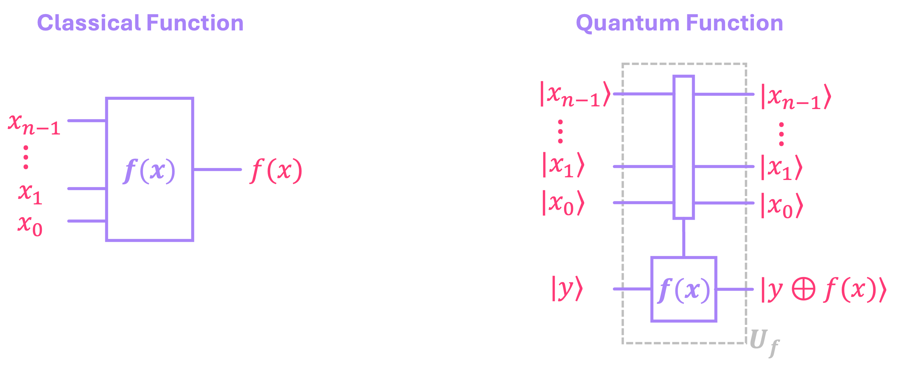</p>

*Hình: Trái: hàm cổ điển $f(x)$, nhiều bit vào một bit ra, không khả nghịch. Phải: unitary $U_f$ giữ nguyên các qubit đầu vào và cộng XOR $f(x)$ vào qubit phụ $y$.*

Với $y = 0$ ra $f(x)$; với $y = 1$ ra $\overline{f(x)}$ (ví dụ AND 3 bit bằng `mcx` cho AND/NAND).

**Kickback theo hàm.** Đặt $y = |-\rangle$:

$$|x\rangle|-\rangle \xrightarrow{U_f} (-1)^{f(x)}|x\rangle|-\rangle$$

**Hai loại oracle** (hộp đen, black box):

| Oracle | Tác dụng |
|---|---|
| Bit oracle $U_f$ | $\vert x\rangle\vert y\rangle \to \vert x\rangle\vert y \oplus f(x)\rangle$ |
| Phase oracle $Z_f$ | $\vert x\rangle \to (-1)^{f(x)}\vert x\rangle$; = bit oracle với $y = \vert -\rangle$ rồi bỏ qubit $y$, hoặc dựng trực tiếp bằng MCZ không cần qubit phụ |

<p align="center">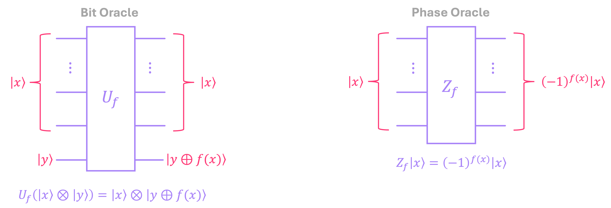</p>

*Hình: Bit oracle $U_f$ (trái) ghi $f(x)$ vào qubit $y$; phase oracle $Z_f$ (phải) ghi $f(x)$ vào dấu $(-1)^{f(x)}$.*

<p align="center">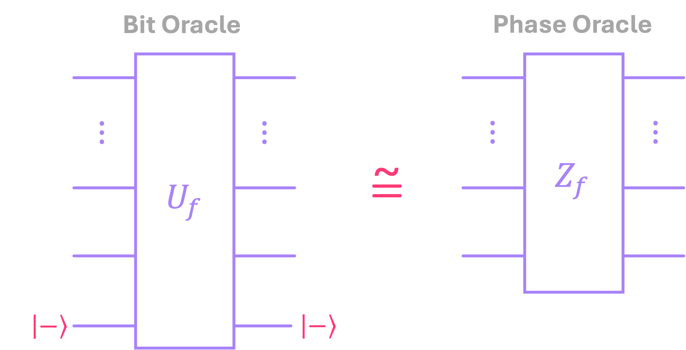</p>

*Hình: Bit oracle có qubit phụ ở $|-\rangle$ (qubit này ra vẫn là $|-\rangle$) tương đương một phase oracle.*

### Code chính

```python
def ghz_cir_c(n):
    # create quantum circuit with n qubits
    qb_mid = n//2
    qc_ghz = QuantumCircuit(n)
    
    # place most significant qubit in equal superposition
    qc_ghz.h(qb_mid)
    
    # apply cx gates between successive pairs of qubits
    for i in reversed(range(qb_mid)):
        qc_ghz.cx(i+1,i)
    
    for i in range(qb_mid,n-1):
        qc_ghz.cx(i,i+1)
    
    return qc_ghz
```
GHZ độ sâu thấp, chỉ dùng CX giữa các qubit kề nhau.

> Lưu ý: comment "place most significant qubit in equal superposition" được chép từ `ghz_cir_a`; ở đây H đặt lên qubit
> giữa `qb_mid`, không phải qubit cao nhất.

```python
def w_cir(n):
    
    prob_amp = np.sqrt(1/n)          # probability amplitude
    rot_ang = 2*np.arccos(prob_amp)  # initial rotation angle
    
    # create quantum circuit with n qubits
    qc_w = QuantumCircuit(n) 
    
    # probability redistribution
    qc_w.ry(rot_ang,n-1)
    for i in range(n-1,1,-1):
        comp_amp = np.sqrt(i/n)
        rot_ang = 2*np.arccos(prob_amp/(comp_amp))
        qc_w.cry(rot_ang,i,i-1)
    
    # state reshuffling
    for i in range(1, n):
        qc_w.cx(i,i-1)
    
    qc_w.x(n-1)
    
    return qc_w
```
Mạch W state; tác giả giải thích chi tiết trong [bài viết riêng](https://nbviewer.org/github/diemilio/quantum-playground/blob/main/w-states/w-states.ipynb).

```python
QHT = Operator.from_label('H'*n)
W = Statevector(w_cir(n))
y = W.evolve(QHT)
```
QHT bằng Qiskit; notebook còn tự viết `qht_func(sv)` theo công thức $\beta_i$ để đối chiếu, và ra cùng kết quả.

```python
qc = QuantumCircuit(2)
qc.x(0)
qc.barrier()
ψ_in = Statevector(qc)
qc.h([0,1])
qc.cx(1,0)
qc.h([0,1])
ψ_out = Statevector(qc)
```
Phase kickback: H–CX–H biến $|01\rangle$ thành $|11\rangle$, tức target đã lật control.

```python
# create controlled S gate activated by state |01⟩
CC̄S = SGate().control(2, ctrl_state='01')
```
`Gate().control(k, ctrl_state=...)` tạo cổng có $k$ control từ một cổng bất kỳ; `qc.append(gate, qubits)` để gắn vào mạch.

> Lưu ý: trong cell này notebook gán `qψ_in = Statevector(qc)` (thừa chữ `q`) nhưng lại hiển thị `ψ_in` của cell trước,
> nên output "input" ghi $|01\rangle$ là **sai**. Output "output" thì đúng.

> Lưu ý: phần chữ mục 3.3 (và comment "activated by state |01⟩" ở trên) nói cổng kích hoạt khi control
> $|q_2 q_1\rangle = |01\rangle$ và dự đoán $|01\rangle|1\rangle$ nhận pha $i$. Nhưng `ctrl_state` đọc theo little-endian:
> với `qc.append(CC̄S, [2,1,0])`, ký tự bên phải `'1'` ứng với control
> đầu tiên ($q_2$). Vậy cổng kích hoạt khi $q_2 = 1$, $q_1 = 0$, và output (đúng theo code) cho $|101\rangle$ nhận pha $i$.
> Cũng ở mục này, $k$ chạy từ 0 đến $2^m - 1$, không phải tới $2^m$.

```python
qc_f = QuantumCircuit(qr_y, qr_x)

# Prepare |x⟩ in equal superposition
qc_f.h(qr_x)
qc_f.barrier()

# Initialize |y⟩ in state |-⟩
qc_f.x(qr_y)
qc_f.h(qr_y)
qc_f.barrier()

# Apply 3-qubit AND gate
qc_f.mcx(qr_x, qr_y)
qc_f.barrier()

# Take |y⟩ back to state |0⟩
qc_f.h(qr_y)
qc_f.x(qr_y)
```
Kickback theo hàm với AND 3 bit: chỉ $|111\rangle$ nhận dấu $-$. `QuantumRegister(n, name='x')` đặt tên cho nhóm qubit.

```python
qc.ccz(0,2,1, ctrl_state='01')             # Apply Zf 
```
Phase oracle dựng trực tiếp bằng CCZ, không cần qubit phụ: đánh dấu $x = 011$.

> Lưu ý: phần chữ của mục 4.3 lúc nói $x = 010$, lúc nói trạng thái $|10\rangle$, nhưng code và output đều đánh dấu **$x = 011$**. Theo code là đúng.

### Kết quả

| Kiểm tra | Output |
|---|---|
| H+CX trên 4 trạng thái cơ sở | $\vert \Phi^+\rangle, \vert \Psi^+\rangle, \vert \Phi^-\rangle, \vert \Psi^-\rangle$ |
| `ghz_cir_a(5)`, `ghz_cir_b(5)`, `ghz_cir_c(7)` | $\tfrac{\sqrt2}{2}(\vert 0\dots0\rangle + \vert 1\dots1\rangle)$ |
| `w_cir(5)` | $\tfrac{\sqrt5}{5}$ trên 5 trạng thái one-hot |
| QHT của $\vert W_3\rangle$ (Qiskit và `qht_func`) | cùng kết quả, $\tfrac{\sqrt6}{4}\vert 000\rangle + \dots - \tfrac{\sqrt6}{4}\vert 111\rangle$ |
| $\vert 1\rangle\vert -\rangle$ qua CX | $-\vert 1\rangle\vert -\rangle$ (chỉ pha toàn cục) |
| H–CX–H trên $\vert 01\rangle$ | $\vert 11\rangle$ |
| $C\bar C S$ với control chồng chập, target $\vert 1\rangle$ | chỉ $\vert 101\rangle$ nhận hệ số $i/2$ |
| AND 3 bit, $y = 0$ / $y = 1$ | chỉ $\vert 111\rangle$ cho $y = 1$ / $y = 0$ (AND / NAND) |
| Kickback AND 3 bit | chỉ $\vert 1110\rangle$ mang dấu $-$ |
| Phase oracle (MCX + $\vert -\rangle$, hoặc CCZ) | chỉ $x = 011$ mang dấu $-$ |

### Ghi nhớ nhanh

- Bell = H + CX; GHZ = H + chuỗi CX; W khó dựng hơn (CRY + CX).
- $H^{\otimes n}|j\rangle = \frac{1}{\sqrt N}\sum_i (-1)^{i\cdot j}|i\rangle$, phải thuộc lòng cho phần 04.
- Phase kickback: control chồng chập + target là vector riêng → pha đá sang control.
- Oracle: $U_f|x\rangle|y\rangle = |x\rangle|y \oplus f(x)\rangle$; với $y = |-\rangle$ ra $(-1)^{f(x)}|x\rangle$.
- `Gate().control(k, ctrl_state=...)`, `mcx`, `ccz` để dựng oracle.

---

## Tổng hợp API Qiskit dùng trong phần này

| API / hàm | Dùng để | Bài |
|---|---|---|
| `Statevector([...])`, `.from_label('0'/'+'/'-')`, `.from_int(k, dim)` | Tạo trạng thái | 02_01–02_05 |
| `Statevector(qc)` | Trạng thái đầu ra của mạch, bắt đầu từ $\vert 0\dots0\rangle$ | 02_01–02_05 |
| `sv.draw('latex' / 'bloch', convention='vector', reverse_bits=True)` | Hiển thị ket, vector, Bloch sphere | 02_01–02_05 |
| `sv.evolve(qc hoặc Operator)` | Cho trạng thái đi qua mạch/ma trận | 02_01–02_03, 02_05 |
| `sv.tensor(other)` | Tích Kronecker của trạng thái | 02_02, 02_05 |
| `sv.probabilities([qubits])` | Xác suất chính xác (toàn bộ hoặc một phần) | 02_03, 02_04 |
| `sv.sample_counts(n)`, `sv.sample_memory(n)` | Giả lập đo | 02_01, 02_03 |
| `sv.measure([qubits])` | Đo một lần, trả về (kết quả, trạng thái sau đo) | 02_04 |
| `sv.expectation_value(op)` | Giá trị kỳ vọng chính xác | 02_03 |
| `Operator(qc)`, `Operator.from_label('X'/'0'/'HHH')`, `Operator([[...]])` | Ma trận của mạch/cổng | 02_01–02_05 |
| `op.tensor(other)`, `op1 + op2` | Ghép ma trận | 02_02, 02_04 |
| `QuantumCircuit(n, m)`, `QuantumRegister(n, name=)` | Tạo mạch, nhóm qubit | 02_01–02_05 |
| `x, h, z, s, sdg, t, tdg, rx, ry, rz, id` | Cổng một qubit | 02_01–02_05 |
| `cx(c, t, ctrl_state=)`, `cz`, `cry`, `ccx`, `rccx`, `ccz`, `mcx`, `swap`, `cswap` | Cổng nhiều qubit | 02_02–02_05 |
| `SGate().control(k, ctrl_state=)`, `qc.append(gate, qubits)` | Tạo và gắn cổng có điều khiển | 02_05 |
| `reset`, `measure`, `measure_all`, `barrier` | Chuẩn bị, đo, phân tách mạch | 02_01–02_05 |
| `with qc.if_test((clbit, val)):` | Áp cổng theo kết quả đo | 02_03 |
| `qc.save_statevector(label)` | Lưu trạng thái giữa mạch (Aer) | 02_03, 02_04 |
| `qc.depth(filter)` | Độ sâu mạch, ví dụ T-depth | 02_04 |
| `transpile(qc, basis_gates=[...])`, `transpile(qc, simulator)` | Dịch mạch sang bộ cổng gốc | 02_04 |
| `BasicSimulator().run(qc, shots=N)` | Simulator đơn giản có sẵn trong Qiskit | 02_01, 02_02 |
| `AerSimulator().run(qc, shots=N)`, `.result().get_counts()`, `.get_statevector()`, `.data()` | Simulator Qiskit Aer | 02_03, 02_04 |
| `Estimator(mode=AerSimulator())`, `SparsePauliOp.from_operator` | Ước lượng giá trị kỳ vọng | 02_03 |
| `plot_histogram`, `plot_distribution` | Vẽ kết quả đo | 02_01, 02_04 |

## Cách chạy

Mở notebook trong VS Code hoặc Jupyter, chọn kernel `.venv` của repo, chạy từ trên xuống. Thư viện cần có
trong [requirements.txt](../../requirements.txt).

- Mọi thứ chạy trên simulator cục bộ (`Statevector`, `BasicSimulator`, `AerSimulator`).
  `Estimator(mode=AerSimulator())` ở 02_03 cần cài `qiskit-ibm-runtime` nhưng **không cần tài khoản IBM**.
- Hình mạch và Bloch sphere trong output được vẽ với cấu hình [qiskit_settings.conf](../../qiskit_settings.conf)
  (`circuit_reverse_bits = True`). Không có cấu hình này thì mạch vẽ ra bị lộn ngược thứ tự qubit, nhưng kết quả tính vẫn như nhau.
- Kết quả lấy mẫu (counts) thay đổi mỗi lần chạy; kết quả `Statevector`/`Operator` thì không.
- 02_05 dùng biến giữa các mục (ví dụ `w_cir` ở mục 1.3 được dùng lại ở mục 2), nên phải chạy theo thứ tự.

---

<!-- nav -->
[← 01 · Classical computing](../01_classical_computing/README.md) · [Mục lục](../../README.md#mục-lục) · [03 · Quantum protocols →](../03_quantum_protocols/README.md)
