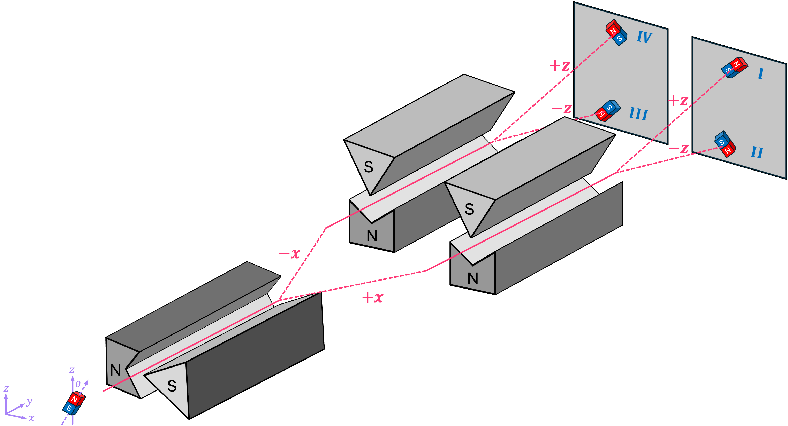
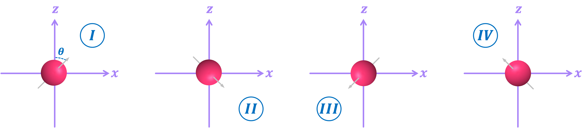
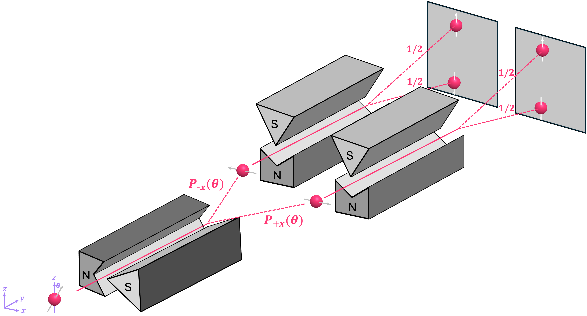
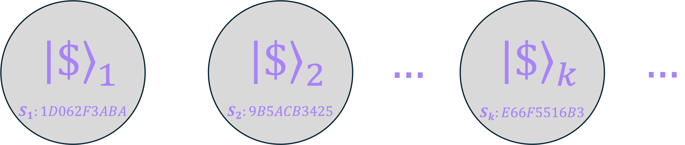
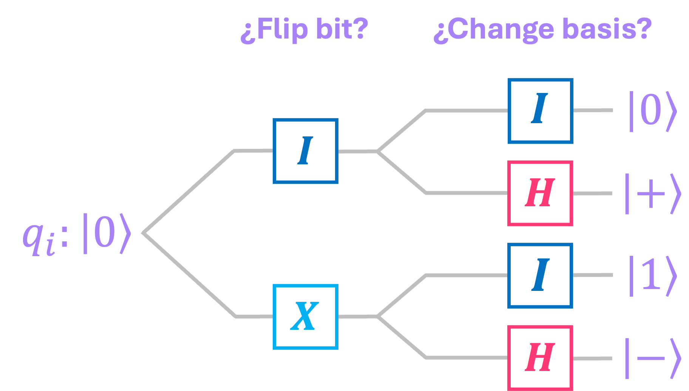
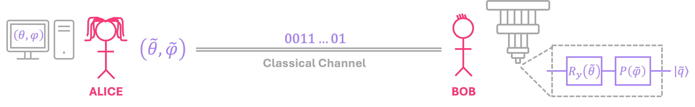
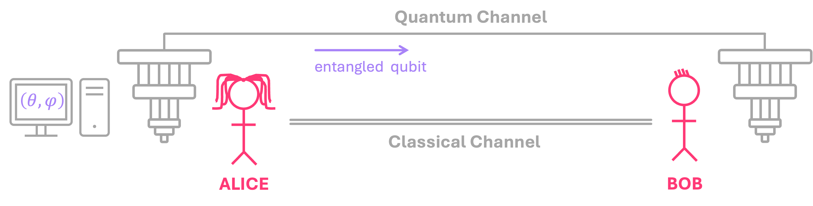
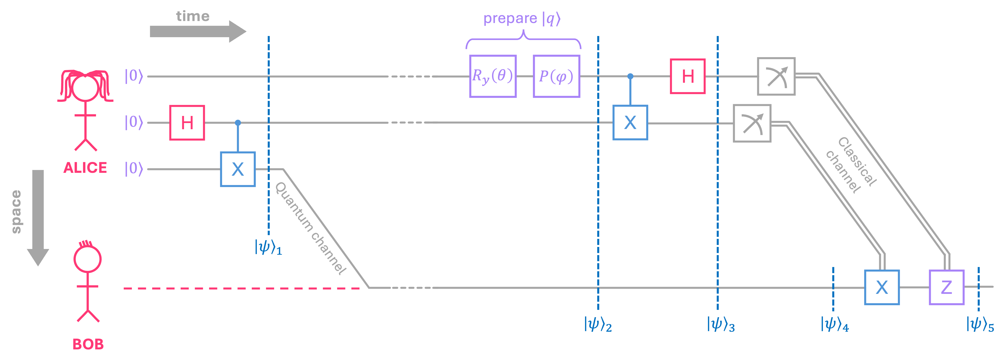
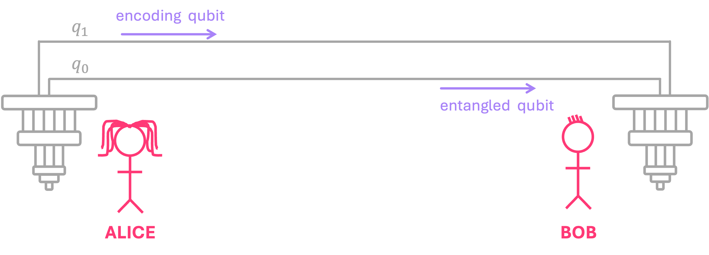
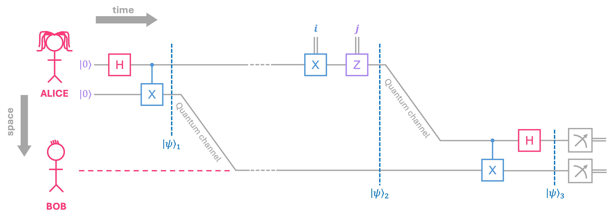

# 03 · Quantum protocols (Giao thức lượng tử)

Phần này dùng các khái niệm đã học (chồng chập (superposition), phép đo (measurement), vướng víu (entanglement), trạng thái Bell (Bell state)) để xây dựng ba giao thức lượng tử kinh điển: tiền lượng tử (quantum money) chống làm giả, teleportation (dịch chuyển trạng thái lượng tử) và superdense coding (mã hóa siêu đặc). Mỗi bài vừa giải thích bằng toán, vừa kiểm chứng bằng mạch Qiskit chạy trên simulator.

> Nguồn: [03_01](https://learnquantum.io/chapters/03_quantum_protocols/03_01_quantum_money.html), [03_02](https://learnquantum.io/chapters/03_quantum_protocols/03_02_teleportation.html), [03_03](https://learnquantum.io/chapters/03_quantum_protocols/03_03_superdense_coding.html) — Diego Emilio Serrano, learnquantum.io, MIT License.

## Mục lục

| Bài | Notebook | Web | Ý chính |
|---|---|---|---|
| 03_01 | [03_01_quantum_money.ipynb](03_01_quantum_money.ipynb) | [link](https://learnquantum.io/chapters/03_quantum_protocols/03_01_quantum_money.html) | Nguyên lý bất định giữa cơ sở bit/sign khiến đồng xu lượng tử không thể sao chép hoàn hảo; xác suất làm giả giảm theo hàm mũ với số qubit |
| 03_02 | [03_02_teleportation.ipynb](03_02_teleportation.ipynb) | [link](https://learnquantum.io/chapters/03_quantum_protocols/03_02_teleportation.html) | 1 cặp Bell + 2 bit cổ điển = chuyển được trọn vẹn trạng thái của 1 qubit |
| 03_03 | [03_03_superdense_coding.ipynb](03_03_superdense_coding.ipynb) | [link](https://learnquantum.io/chapters/03_quantum_protocols/03_03_superdense_coding.html) | 1 cặp Bell + gửi 1 qubit = truyền được 2 bit cổ điển |

Trang web còn liệt kê "Bell Inequalities" (03_04) và "Quantum Key Distribution" (03_05), nhưng ở repo gốc hai chương này chỉ có tiêu đề (chưa có nội dung) nên không được sao chép vào đây.

> Các đoạn code trong README này là **trích** từ notebook: các dòng giữ nguyên văn (kể cả comment gốc tiếng Anh), chỗ lược bớt được đánh dấu `...`, comment tiếng Việt là phần thêm vào. Code dùng biến đã định nghĩa ở các cell trước. Muốn chạy được, hãy chạy cả notebook từ trên xuống.

---

## 03_01 · Uncertainty & Quantum Money (Nguyên lý bất định và tiền lượng tử)

**Mục tiêu** — Hiểu nguyên lý bất định (uncertainty principle) qua hai observable không tương thích $X$, $Z$, rồi dùng nó để xây giao thức quantum money của Wiesner (bài báo "Conjugate Coding", 1983).

### Kiến thức chính

**1. Bất định với spin (mục 1.1).** Với nam châm cổ điển, hai máy Stern-Gerlach (SG) nối tiếp (trục $x$ rồi trục $z$) xác định được 1 trong 4 hướng I–IV.

<p align="center"></p>

*Hình: Nam châm cổ điển: máy SG đầu tách theo $\pm x$, hai máy SG sau tách theo $\pm z$, nên mỗi hướng I–IV rơi vào một chỗ riêng trên màn.*

Với electron thì không. Spin cũng có thể nghiêng theo 4 hướng I–IV, với $\theta$ là góc giữa spin và trục $+z$:

<p align="center"></p>

*Hình: Bốn hướng spin I–IV trong mặt phẳng $xz$; góc $\theta$ đo từ trục $+z$ (I: $\pi/4$, II: $3\pi/4$, III: $5\pi/4$, IV: $7\pi/4$).*

<p align="center"></p>

*Hình: Cùng thí nghiệm với electron: máy SG đầu cho $\pm x$ theo xác suất $P_{\pm x}(\theta)$, sau đó máy SG theo $z$ cho lên hoặc xuống, mỗi bên $1/2$.*

- Máy SG theo $x$ làm lệch hạt một cách xác suất: $P_{+x}(\theta) = \frac{1}{2}(1+\sin\theta)$, $P_{-x}(\theta) = \frac{1}{2}(1-\sin\theta)$. Với hướng I, II: $P_{+x} \approx 0.854$, $P_{-x} \approx 0.146$ (notebook ghi $0.853$ vì cắt bớt chữ số thay vì làm tròn); với hướng III, IV thì ngược lại.
- Sau phép đo theo $x$, spin bị chiếu về $\pm x$, nên máy SG theo $z$ luôn cho lên/xuống với xác suất $1/2$: thông tin về hướng $z$ ban đầu bị "xóa".
- Spin theo $x$ và spin theo $z$ là **không tương thích** (incompatible) hay **liên hợp** (conjugate): đo cái này làm tăng độ bất định của cái kia.

**2. Bất định với qubit (mục 1.2, có thể bỏ qua khi chỉ cần hiểu quantum money).** Với qubit trong mặt phẳng $xz$: $|q\rangle = \cos\frac{\theta}{2}|0\rangle + \sin\frac{\theta}{2}|1\rangle$:

$$\langle Z\rangle = \cos\theta,\quad \langle X\rangle = \sin\theta,\quad \Delta O^2 = \langle O^2\rangle - \langle O\rangle^2 \;\Rightarrow\; \Delta Z = |\sin\theta|,\quad \Delta X = |\cos\theta|$$

Khi $\Delta Z$ nhỏ nhất thì $\Delta X$ lớn nhất và ngược lại. Tổng quát hơn, với pha tương đối $e^{i\varphi}$ và hệ thức bất định $\Delta A\,\Delta B \geq \frac{1}{2}|\langle [A,B]\rangle|$, dùng $[Z,X] = 2iY$:

$$\Delta Z\,\Delta X \geq |\langle iY\rangle| \quad\Longleftrightarrow\quad |\sin\theta|\sqrt{1-\sin^2\theta\cos^2\varphi} \geq |\sin\theta\sin\varphi|$$

Notebook vẽ hai vế theo $\theta$ với vài giá trị $\varphi$, sau đó kiểm chứng bằng Estimator.

> Lưu ý: (1) câu "In the above, we only consider qubits in the $xy$-plane" phải là mặt phẳng $xz$ (trạng thái $\cos\frac{\theta}{2}|0\rangle + \sin\frac{\theta}{2}|1\rangle$ có biên độ thực). (2) Sau khi chia hai vế cho $|\sin\theta|$, notebook lập luận rằng $\sqrt{1-\sin^2\theta\cos^2\varphi} \geq |\sin\varphi|$ đúng vì "giá trị lớn nhất của vế trái là 1, không nhỏ hơn giá trị lớn nhất của vế phải (cũng là 1)". So sánh hai giá trị lớn nhất không chứng minh được bất đẳng thức tại từng điểm. Lập luận đúng: vì $\sin^2\theta \leq 1$ nên $1-\sin^2\theta\cos^2\varphi \geq 1-\cos^2\varphi = \sin^2\varphi$. (Khi $\sin\theta = 0$ thì không chia được, nhưng lúc đó hai vế đều bằng 0.) Kết luận của notebook vẫn đúng.

**3. Quantum money (mục 2).**

1. **Ngân hàng phát hành đồng xu**: mỗi đồng xu có số serial công khai $S$ và một trạng thái $n$ qubit. Về vật lý, mỗi qubit có thể là spin của một electron bị cô lập trong đồng xu; notebook nói rõ công nghệ này hiện chưa có, nên đây là giao thức lý thuyết.

   <p align="center"></p>

   *Hình: Mỗi đồng xu mang một trạng thái lượng tử riêng (đánh số $1, 2, \dots, k$) và một số serial công khai $S_k$, ví dụ `1D062F3ABA`.*

   Mỗi qubit chọn ngẫu nhiên trong $\{|0\rangle, |1\rangle, |+\rangle, |-\rangle\}$: bắt đầu từ $|0\rangle$, lật bit bằng $X$ và/hoặc đổi cơ sở bằng $H$.

   <p align="center"></p>

   *Hình: Hai lựa chọn cho mỗi qubit $q_i$: có lật bit ($X$) hay không, rồi có đổi cơ sở ($H$) hay không, cho ra $|0\rangle$, $|+\rangle$, $|1\rangle$ hoặc $|-\rangle$.*

   Ví dụ $n=6$: $U = II \otimes II \otimes HI \otimes IX \otimes HX \otimes HI$ cho $|0\rangle|0\rangle|+\rangle|1\rangle|-\rangle|+\rangle$.

2. **Ngân hàng lưu cơ sở dữ liệu bí mật**: serial $S$ ↔ chuỗi cổng đã dùng. (Giao thức BBBW đề xuất sinh trạng thái từ $S$ bằng bộ sinh khóa giả ngẫu nhiên; notebook bỏ qua.)
3. **Kiểm tra**: ngân hàng áp mạch nghịch đảo $U^\dagger$ rồi đo; đồng xu thật **luôn** cho chuỗi toàn 0.
4. **Kẻ làm giả** không biết $U$:
   - Đo thẳng ở cơ sở bit: các qubit $|\pm\rangle$ cho kết quả ngẫu nhiên.
   - Đo ở cơ sở sign (áp $H$ lên mọi qubit trước): các qubit $|0\rangle, |1\rangle$ cho kết quả ngẫu nhiên.
   - Chỉ đo được một lần, vì phép đo làm sụp trạng thái. Đoán mò **chính xác** cả $n$ qubit có xác suất $(1/4)^n$; với $n=6$: $\approx 0.000244$.

   Nhưng $(1/4)^n$ chưa phải xác suất làm giả thành công: một qubit đoán sai cơ sở vẫn qua bước kiểm tra với xác suất $1/2$. Mục tiêu của kẻ gian là từ 1 đồng thật có được **hai** đồng cùng qua kiểm tra. Các qubit độc lập nên xác suất mỗi qubit được nhân lên theo $n$:

   | Chiến lược (từ 1 đồng thật) | Mỗi qubit | Cả hai đồng qua | $n=6$ |
   |---|---|---|---|
   | Giữ đồng thật, chuẩn bị đồng thứ hai theo đoán mù | $1/2$ | $(1/2)^n$ | $\approx 0.016$ |
   | Đo từng qubit ở một cơ sở chọn ngẫu nhiên, chuẩn bị hai bản theo kết quả | $5/8$ | $(5/8)^n$ | $\approx 0.060$ |
   | Phép sao chép tối ưu ([Molina, Vidick, Watrous 2012](https://arxiv.org/abs/1202.4010)) | $3/4$ | $(3/4)^n$ | $\approx 0.178$ |

   (Với cách đo rồi chuẩn bị, *từng* đồng riêng lẻ qua với xác suất $(3/4)^n$, nhưng cả hai cùng qua chỉ $(5/8)^n$.) Mọi cách đều giảm theo hàm mũ khi thêm qubit, nhưng $n=6$ trong ví dụ còn quá nhỏ để an toàn.

5. **Vì sao an toàn**: $\{|+\rangle, |-\rangle\}$ là cơ sở liên hợp với $\{|0\rangle, |1\rangle\}$ (bất định), và theo **định lý no-cloning** (no-cloning theorem) không thể sao chép hoàn hảo một trạng thái lượng tử chưa biết. Sách viết thêm: cùng lắm kẻ gian tạo được bản sao *vướng víu*, nhưng khi ngân hàng kiểm tra một đồng thì đồng kia sụp và trở nên vô dụng. Thực ra đồng kia không chắc bị loại: với bản sao vướng víu tạo bằng $CX$ (qubit đồng thật điều khiển, qubit đồng mới ở $|0\rangle$ là đích), cả hai đồng cùng qua với xác suất $(5/8)^n$, và kẻ gian tối ưu đạt $(3/4)^n$ (bảng trên). Giao thức cũng giả định kẻ gian không thể dò kết quả kiểm tra của ngân hàng nhiều lần.

Cuối bài nhắc tới hướng "tiền lượng tử ảo" và quantum lightning (Zhandry18) như cách kết hợp với blockchain.

> Lưu ý: ở mục 2, notebook có một chỗ viết nhầm và hai chỗ nói quá: (1) câu "the probability of the criminal successfully guessing the state grows with the number of qubits" thực ra là *giảm* theo $n$, đúng như công thức $(1/4)^n$; (2) $(1/4)^n$ là xác suất đoán **chính xác** cả trạng thái, không phải xác suất làm giả thành công: đồng giả đoán mù vẫn qua kiểm tra với xác suất $(1/2)^n$, và kẻ gian tối ưu có hai đồng cùng qua với xác suất $(3/4)^n \approx 0.178$ khi $n=6$ (bảng ở ý 4); (3) câu "the second coin's state will collapse making it unusable" không đúng hoàn toàn (xem ý 5).

### Code chính

```python
# Use the Paramater class to define arbitrary angles of θ and φ
θ = Parameter('θ')
φ = Parameter('φ')

# Circuit to prepare state cos(θ/2)|0⟩+exp(iφ)sin(θ/2)|1⟩
qc = QuantumCircuit(1)
qc.ry(θ,0)
qc.p(φ,0)
```

Mạch có tham số (`qiskit.circuit.Parameter`): `ry(θ)` đặt biên độ, `p(φ)` thêm pha tương đối. Giá trị cụ thể được gán lúc chạy Estimator.

```python
estimator = Estimator(mode=AerSimulator())
...
# Define list of observables:
obsv_lst = [[SparsePauliOp(["Z"],[1])],
            [SparsePauliOp(["X"],[1])],
            [SparsePauliOp(["Y"],[1])]]
...
# Run estimator simulation
job = estimator.run([(qc,obsv_lst,angles,0.01)])
exp_vals = job.result()[0].data.evs

# Extract standard deviations for X,Z and expectation values for Y
ΔZ_lst = np.sqrt(1-exp_vals[0]**2)  # ΔZ = √(1-⟨Z⟩²)
ΔX_lst = np.sqrt(1-exp_vals[1]**2)  # ΔX = √(1-⟨X⟩²)
ΔZΔX_lst = ΔZ_lst * ΔX_lst          # ΔZΔX
Ys_lst = np.abs(exp_vals[2])        # |⟨Y⟩|
```

`qiskit_ibm_runtime.Estimator` (kiểu V2) chạy trên `AerSimulator`. Một PUB `(circuit, observables, parameter_values, precision)`: 3 observable dạng `SparsePauliOp` × 21 giá trị $\theta$ (với $\varphi = 9\pi/10$ cố định), độ chính xác 0.01; `.data.evs` trả mảng giá trị kỳ vọng. Notebook ghi chú: hệ số của $Y$ lẽ ra là $i$, nhưng vì chỉ lấy trị tuyệt đối nên dùng 1.

```python
def gen_coin(n):
    ...
    # n-qubit circuit
    qc = QuantumCircuit(n)

    # Iterate over each qubit
    for i in range(n-1,-1,-1):
        state = np.random.choice(['0','1','+','-'])

        # select if bit should be flipped
        if state in ['1', '-']: qc.x(i)
        else: qc.id(i)

        # select if basis should be change
        if state in ['+','-']: qc.h(i)
        else: qc.id(i)
    ...
```

Hàm của "ngân hàng": chọn ngẫu nhiên trạng thái cho từng qubit rồi áp $X$ và/hoặc $H$ (`qc.id` chỉ để giữ chỗ). Hàm còn trả về chuỗi LaTeX của trạng thái để hiển thị bằng `IPython.display.Math` (phần này được lược trong trích đoạn). Vòng lặp đi từ qubit $n-1$ về 0 nên chuỗi đó viết qubit cao nhất bên trái, đúng thứ tự little-endian của Qiskit.

```python
# Generate inverse of circuit
qc_inv = qc.inverse()
...
# Apply inverse circuit to coin statevector
sv_check = sv_coin.evolve(qc_inv)

# Display probability of measuring all-zeros string
result_probs = sv_check.probabilities_dict(decimals=5)
plot_distribution(result_probs)
```

Kiểm tra đồng xu: `QuantumCircuit.inverse()` tạo $U^\dagger$, `Statevector.evolve` áp mạch lên statevector, `probabilities_dict` và `plot_distribution` hiển thị phân bố. Kẻ làm giả được mô phỏng bằng `sv_coin.probabilities_dict()` (đo cơ sở bit) và `sv_coin.evolve(qc_h)` với `qc_h.h(range(n))` (đo cơ sở sign).

### Kết quả

- Đồ thị bất định (4 giá trị $\varphi$): đường $\Delta Z\Delta X$ luôn nằm trên hoặc chạm đường $|\langle iY\rangle|$. Đồ thị Estimator ($\varphi = 9\pi/10 \approx 2.8274$): 21 điểm của mỗi đại lượng nằm sát đường lý thuyết.
- Lần chạy đã lưu sinh ra đồng xu $n=6$: $|+\rangle \otimes |1\rangle \otimes |0\rangle \otimes |0\rangle \otimes |1\rangle \otimes |0\rangle$ (từ $q_5$ đến $q_0$; mạch chỉ có $H$ trên $q_5$, $X$ trên $q_4$ và $q_1$).
- Kiểm tra bằng $U^\dagger$: phân bố chỉ có `000000` với xác suất 1.0.
- Kẻ làm giả đo ở cơ sở bit: hai kết quả `010010` và `110010`, mỗi cái 0.5. Đo ở cơ sở sign: 32 kết quả, mỗi cái $\approx 0.031$ ($1/32$), bit trái cùng luôn là 0. Ở lần chạy này chỉ 1 trong 6 qubit thuộc cơ sở sign (notebook nói "roughly half" là trường hợp trung bình), nên phân bố thứ nhất hẹp còn phân bố thứ hai rộng.

### Ghi nhớ nhanh

- $X$ và $Z$ là cặp observable liên hợp: $\Delta Z = |\sin\theta|$, $\Delta X = |\cos\theta|$, không thể cùng nhỏ.
- Đồng xu = serial công khai + $n$ qubit ngẫu nhiên trong $\{|0\rangle,|1\rangle,|+\rangle,|-\rangle\}$; chỉ ngân hàng biết cơ sở (phải lưu danh sách bí mật). Đây là giao thức lý thuyết, chưa có công nghệ để làm.
- Kiểm tra = áp $U^\dagger$ rồi đo, đồng xu thật cho toàn 0.
- Hai lớp bảo vệ: phép đo phá hủy trạng thái (bất định) và no-cloning. Đoán đúng chính xác: $(1/4)^n$; có hai đồng cùng qua kiểm tra: từ $(1/2)^n$ (đoán mù) đến $(3/4)^n$ (tối ưu), đều giảm theo hàm mũ.
- Estimator V2: `estimator.run([(qc, observables, params, precision)])` rồi đọc `result()[0].data.evs`.

---

## 03_02 · Quantum Teleportation (Dịch chuyển trạng thái lượng tử)

**Mục tiêu** — Gửi *toàn bộ* trạng thái của một qubit bất kỳ từ Alice sang Bob chỉ bằng **2 bit cổ điển**, với điều kiện hai người đã chia sẻ trước một cặp qubit vướng víu (Bennett và cộng sự, 1993).

### Kiến thức chính

**So sánh với cách cổ điển.** Muốn Bob tạo $|q\rangle = \cos\frac{\theta}{2}|0\rangle + e^{i\varphi}\sin\frac{\theta}{2}|1\rangle$, Alice phải gửi hai góc $(\theta,\varphi)$, ví dụ dạng FP16 (16 bit mỗi góc), và vẫn chỉ được giá trị xấp xỉ.

<p align="center"></p>

*Hình: Cách cổ điển: Alice gửi hai góc đã làm tròn $(\tilde\theta, \tilde\varphi)$ dưới dạng chuỗi bit qua kênh cổ điển; Bob dùng chúng cho cổng $R_y$ và $P$ để tạo trạng thái xấp xỉ $|\tilde q\rangle$.*

Teleportation chỉ cần gửi 2 bit cổ điển (cộng một cặp vướng víu đã chia sẻ từ trước), và Bob nhận đúng trạng thái Alice đang có, không xấp xỉ. Đổi lại, Bob chỉ có một *qubit* ở trạng thái $|q\rangle$, không đọc ra được hai góc $(\theta,\varphi)$: đo một qubit chỉ cho 1 bit.

> Lưu ý: trong ví dụ FP16 của notebook, hai chuỗi bit bị đảo thứ tự. `0011101001001000` là $\pi/4 \approx 0.785$ và `0011111001001000` là $\pi/2 \approx 1.570$, nên với $(\theta,\varphi) = (\pi/2, \pi/4)$ phải gửi `(0011111001001000, 0011101001001000)`. Cặp giá trị xấp xỉ $(1.570, 0.785)$ trong notebook thì đúng.

Để teleport, Alice và Bob cần chia sẻ trước một cặp vướng víu: Alice tạo cặp Bell rồi gửi một qubit cho Bob qua kênh lượng tử. Về sau chỉ cần kênh cổ điển.

<p align="center"></p>

*Hình: Hai kênh giữa Alice và Bob: kênh lượng tử (gửi trước một qubit của cặp vướng víu) và kênh cổ điển (dùng để gửi 2 bit kết quả đo).*

**Các bước (theo sơ đồ mạch của notebook):**

<p align="center"></p>

*Hình: Mạch teleportation, thời gian chạy sang phải, khoảng cách theo chiều dọc. Kết quả đo qubit giữa (nửa cặp Bell của Alice) điều khiển $X$, kết quả đo qubit trên cùng ($|q\rangle$) điều khiển $Z$; các đường nét đứt đánh dấu $|\psi\rangle_1$ đến $|\psi\rangle_5$.*

0. Alice khởi tạo 3 qubit $|000\rangle_A$.
1. Alice tạo Bell state $|\Phi^+\rangle = \frac{1}{\sqrt{2}}(|00\rangle + |11\rangle)$ trên hai qubit rồi gửi một qubit cho Bob:
   $|\psi\rangle_1 = \frac{1}{\sqrt{2}}|0\rangle_A(|0\rangle_A|0\rangle_B + |1\rangle_A|1\rangle_B)$.
2. Khi cần, Alice chuẩn bị trạng thái muốn gửi $|q\rangle = \alpha|0\rangle + \beta|1\rangle$ (bằng cổng xoay với $\alpha = \cos\frac{\theta}{2}$, $\beta = e^{i\varphi}\sin\frac{\theta}{2}$). Viết lại toàn hệ theo 4 Bell state của hai qubit Alice:

$$|\psi\rangle_2 = \tfrac{1}{2}\Big[|\Phi^+\rangle_A(\alpha|0\rangle+\beta|1\rangle)_B + |\Psi^+\rangle_A(\alpha|1\rangle+\beta|0\rangle)_B + |\Phi^-\rangle_A(\alpha|0\rangle-\beta|1\rangle)_B + |\Psi^-\rangle_A(\alpha|1\rangle-\beta|0\rangle)_B\Big]$$

   Nếu Alice đo hai qubit của mình trong cơ sở Bell, qubit của Bob sẽ ở một trong 4 biến thể của $|q\rangle$, chỉ khác nhau bởi bit-flip, phase-flip hoặc cả hai. Đây chỉ là cùng một trạng thái viết theo cơ sở khác: trước khi Bob nhận 2 bit, trạng thái riêng của qubit Bob (ma trận mật độ (density matrix) rút gọn) luôn là $I/2$, không phụ thuộc $|q\rangle$. (Notebook bàn ngắn về tính "phi định xứ" gây tranh cãi của cách mô tả này và các cách diễn giải khác, rồi làm việc trong formalism chuẩn.)
3. Alice áp $CX$ rồi $H$ để chuyển từ cơ sở Bell sang cơ sở tính toán:

$$|\psi\rangle_3 = \tfrac{1}{2}\Big[|00\rangle(\alpha|0\rangle+\beta|1\rangle) + |01\rangle(\alpha|1\rangle+\beta|0\rangle) + |10\rangle(\alpha|0\rangle-\beta|1\rangle) + |11\rangle(\alpha|1\rangle-\beta|0\rangle)\Big]$$

4. Alice đo hai qubit: mỗi kết quả `00`, `01`, `10`, `11` (bit đầu $j$ từ qubit $|q\rangle$, bit sau $i$ từ nửa cặp Bell) có xác suất $1/4$ và để lại cho Bob trạng thái tương ứng ở trên.
5. Alice gửi 2 bit $(j,i)$ cho Bob qua kênh cổ điển. Bob sửa lỗi: $|\psi\rangle_5 = Z^j X^i|\psi\rangle_4 = \alpha|0\rangle + \beta|1\rangle = |q\rangle$ (với $X^0 = Z^0 = I$).

**Vì sao không nhanh hơn ánh sáng:** Bob chưa biết phải sửa gì cho tới khi nhận 2 bit cổ điển. Trước đó, kể cả khi Alice đã đo, với những gì Bob biết thì qubit của anh vẫn ở trạng thái $I/2$ (hỗn hợp đều của 4 khả năng, mỗi khả năng $1/4$), nên Bob chưa có thông tin gì; 2 bit đi qua kênh cổ điển, không nhanh hơn ánh sáng. Giao thức chỉ chuyển *trạng thái*, không gửi vật chất hay năng lượng; qubit gốc của Alice bị đo nên mất trạng thái $|q\rangle$, đúng với no-cloning. **Vì sao cặp Bell đáng giá:** nó được thiết lập *trước*, nên khi $|q\rangle$ sẵn sàng thì chỉ cần gửi 2 bit.

**Nhiều qubit (mục 2.2):** mỗi qubit cần gửi dùng một cặp Bell riêng và một cặp bit riêng. Ví dụ trong notebook gửi $|q\rangle = \frac{1}{\sqrt{3}}(|001\rangle - |010\rangle + |100\rangle)$ bằng 3 cặp Bell (6 qubit của Alice, 3 của Bob).

### Code chính

```python
qra = QuantumRegister(2,name="Alice q")
qrb = QuantumRegister(1,name="Bob q")
cra = ClassicalRegister(2, name="Alice c")

qc = QuantumCircuit(qrb,qra,cra)   # qubit 0 = Bob, qubit 1 = qra[0], qubit 2 = qra[1]

# Alice and Bob share entangled Bell state
qc.h(qra[0])
qc.cx(qra[0],qrb[0])
qc.barrier()

# Alice prepares state |q⟩ = 1/√2|0⟩ - i/√2|1⟩
qc.ry(np.pi/2,qra[1])
qc.p(-np.pi/2,qra[1])
qc.barrier()

# Alice changes from Bell to Computational basis
qc.cx(qra[1],qra[0])
qc.h(qra[1])
qc.barrier()

# Alice measures her qubits
qc.measure(qra,cra)                # cra[0] <- qra[0] (nửa cặp Bell), cra[1] <- qra[1] (|q⟩)
```

Dùng `QuantumRegister`/`ClassicalRegister` có tên để tách qubit của Alice và Bob. Vì `qrb` được truyền vào trước, qubit 0 là của Bob; `qra[0]` là nửa cặp Bell của Alice, `qra[1]` chứa trạng thái cần gửi.

```python
# Bob applies X, Z gates conditioned on Alice's results
with qc.if_test((cra[0], 1)): qc.x(0)
with qc.if_test((cra[1], 1)): qc.z(0)

qc.save_statevector('ψout')
```

Điều khiển cổ điển động bằng `QuantumCircuit.if_test` (API hiện đại, thay cho `c_if` đã deprecated): áp $X$ nếu bit `cra[0]` (kết quả đo nửa cặp Bell, tức bit $i$) bằng 1, áp $Z$ nếu `cra[1]` (kết quả đo qubit $|q\rangle$, tức bit $j$) bằng 1. `save_statevector` là lệnh của Qiskit Aer để lưu statevector cuối mạch.

```python
result = simulator.run(qc, shots=1, memory=True).result()
alices_bits = result.get_memory()[0]
ψout = result.data().get('ψout')

ρout = partial_trace(ψout,[1,2])
bobs_state = DensityMatrix(np.round(ρout, 8)).to_statevector()
```

Chạy 1 shot trên `AerSimulator` với `memory=True` để lấy chuỗi bit Alice đo được. `partial_trace` loại bỏ qubit 1, 2 (của Alice), còn lại density matrix của Bob. Vì trạng thái đó thuần (pure) nên `DensityMatrix(...).to_statevector()` chuyển được về statevector; `np.round` để khử sai số số học.

```python
# Alice and Bob share two entangled Bell states
qc.h([qra[i] for i in range(3)])
qc.cx([qra[i] for i in reversed(range(3))],[qrb[i] for i in reversed(range(3))])
...
for i in range(3):
    with qc.if_test((cra[i], 1)): qc.x(i)
    with qc.if_test((cra[i+3], 1)): qc.z(i)
    if i <2: qc.barrier()
```

Bản nhiều qubit: `h`/`cx` nhận danh sách qubit để tạo 3 cặp Bell cùng lúc; trạng thái 3 qubit được chuẩn bị trên `qra[3..5]` bằng `x`, `cry`, `cx`, `z`; Bob sửa từng qubit bằng cặp bit `(cra[i], cra[i+3])`. Khi mô phỏng, `partial_trace(ψout, [3..8])` giữ lại 3 qubit của Bob.

> Lưu ý: các comment trong cell nhiều qubit không khớp code: "two entangled Bell states" (thực tế tạo 3 cặp) và "Alice prepares state |w⟩ = 1/2|01⟩ - √3/2|10⟩" (thực tế mạch chuẩn bị $\frac{1}{\sqrt{3}}(|001\rangle - |010\rangle + |100\rangle)$, đúng như output). Ngoài ra, ở bài 1 qubit, dòng in `(j,i) = ({alices_bits[1]},{alices_bits[0]})` bị đảo nhãn: chuỗi memory của Qiskit viết bit cao trước (chạy thử với chỉ `cra[0] = 1` cho chuỗi `01`), nên `alices_bits[0]` là `cra[1]` (bit $j$) và `alices_bits[1]` là `cra[0]` (bit $i$, điều khiển $X$). Dòng in thực ra in $(i,j)$; bản thân chuỗi `alices_bits` đã có đúng thứ tự $ji$. Điều này không ảnh hưởng tới trạng thái cuối của Bob.

### Kết quả

- **1 qubit**, 5 lần chạy: Alice đo được lần lượt (theo nhãn in ra) `(0,1)`, `(0,0)`, `(1,1)`, `(0,1)`, `(0,0)`, tức $(j,i)$ thật là $(1,0)$, $(0,0)$, $(1,1)$, $(1,0)$, $(0,0)$ (xem Lưu ý ở trên). Lần nào Bob cũng nhận $\frac{\sqrt{2}}{2}|0\rangle - \frac{\sqrt{2}\,i}{2}|1\rangle$, đúng bằng $|q\rangle$ Alice đã chuẩn bị.
- **3 qubit**, 5 lần chạy: Alice đo `011100`, `111100`, `011001`, `001110`, `100001`. Lần nào Bob cũng nhận $\frac{\sqrt{3}}{3}|001\rangle - \frac{\sqrt{3}}{3}|010\rangle + \frac{\sqrt{3}}{3}|100\rangle$.

### Ghi nhớ nhanh

- Tài nguyên: 1 cặp Bell dùng chung + 2 bit cổ điển → chuyển được trạng thái của 1 qubit (cặp Bell bị tiêu hao, qubit gốc của Alice mất trạng thái $|q\rangle$).
- Mạch của Alice: $CX$ (qubit $|q\rangle$ điều khiển) → $H$ trên qubit $|q\rangle$ → đo 2 qubit.
- Bob sửa: $Z^j X^i$; $X$ theo bit của qubit thuộc cặp Bell, $Z$ theo bit của qubit $|q\rangle$.
- Kết quả đo của Alice ngẫu nhiên (mỗi khả năng $1/4$) nhưng trạng thái cuối của Bob luôn là $|q\rangle$.
- Qiskit: `if_test` cho điều khiển cổ điển, `save_statevector` + `partial_trace` để xem trạng thái của Bob.

---

## 03_03 · Superdense Coding (Mã hóa siêu đặc)

**Mục tiêu** — Gửi **2 bit cổ điển** bằng cách truyền **1 qubit**, nhờ một cặp Bell đã chia sẻ trước. Đây là "chiều ngược" của teleportation (Bennett và Wiesner; công bố năm 1992).

### Kiến thức chính

Khác teleportation: không cần kênh cổ điển, nhưng kênh lượng tử phải truyền được thêm một qubit nữa. Tính cả qubit dùng để chia sẻ cặp Bell thì vẫn phải gửi 2 qubit cho 2 bit; lợi thế là qubit thứ nhất được gửi trước, khi chưa có thông điệp. Không có cặp vướng víu dùng chung, 1 qubit chỉ mang được tối đa 1 bit cổ điển (định lý Holevo; notebook không nhắc tới).

<p align="center"></p>

*Hình: Chỉ có kênh lượng tử: $q_0$ là qubit vướng víu, $q_1$ là qubit mang 2 bit đã mã hóa; không có kênh cổ điển.*

<p align="center"></p>

*Hình: Mạch superdense coding: Alice áp $X$ theo bit $i$ và $Z$ theo bit $j$ lên qubit của mình rồi gửi nó qua kênh lượng tử; Bob áp $CX$ (qubit vừa nhận điều khiển), $H$ rồi đo; các đường nét đứt đánh dấu $|\psi\rangle_1$ đến $|\psi\rangle_3$.*

0. Alice khởi tạo $|00\rangle_A$.
1. Alice tạo $|\Phi^+\rangle = \frac{1}{\sqrt{2}}(|0\rangle_A|0\rangle_B + |1\rangle_A|1\rangle_B)$ và gửi một qubit cho Bob.
2. Alice mã hóa 2 bit $(j,i)$ lên qubit của mình: áp $X$ nếu $i=1$, rồi $Z$ nếu $j=1$:
   $|\psi\rangle_2 = (Z^j \otimes I)(X^i \otimes I)|\psi\rangle_1$. Kết quả là một trong 4 Bell state:

| $(j,i)$ | Cổng Alice áp | $\vert\psi\rangle_2$ | Bob đo được (sau bước 3) |
|---|---|---|---|
| (0,0) | $I$ | $\vert\Phi^+\rangle = \frac{1}{\sqrt{2}}(\vert 00\rangle + \vert 11\rangle)$ | `00` |
| (0,1) | $X$ | $\vert\Psi^+\rangle = \frac{1}{\sqrt{2}}(\vert 10\rangle + \vert 01\rangle)$ | `01` |
| (1,0) | $Z$ | $\vert\Phi^-\rangle = \frac{1}{\sqrt{2}}(\vert 00\rangle - \vert 11\rangle)$ | `10` |
| (1,1) | $ZX$ | $\vert\Psi^-\rangle$ (notebook ghi $\frac{-1}{\sqrt{2}}(\vert 10\rangle - \vert 01\rangle)$) | `11` |

   (Trong ket, qubit của Alice viết trước, qubit của Bob viết sau. Chuỗi Bob đo được cũng theo thứ tự đó, trùng với chuỗi `memory` của Qiskit trong code, vì `cr[1]` lấy từ qubit của Alice.)
3. Alice gửi qubit của mình cho Bob. Bob áp $CX$ (qubit nhận từ Alice điều khiển, qubit của Bob là đích) rồi $H$ lên qubit nhận từ Alice: $|\psi\rangle_3 = (H\otimes I)\,CX\,|\psi\rangle_2$, đưa 4 Bell state về $|00\rangle, |01\rangle, |10\rangle, |11\rangle$. Bob đo và thu đúng $(j,i)$ với xác suất 100%.

**Vì sao được:** 4 Bell state trực giao với nhau, nên phân biệt được hoàn toàn bằng một phép đo trong cơ sở Bell. Alice chỉ cần tác động cục bộ lên qubit của mình là chọn được 1 trong 4 trạng thái đó.

**Mở rộng:** với $n$ cặp Bell, Alice gửi được $2n$ bit (notebook dùng $n=3$, tức 6 bit).

> Lưu ý: bảng kết quả cuối (sau bước 3) trong notebook vẫn ghi nhãn là $|\psi\rangle_2$, lẽ ra là $|\psi\rangle_3$.

### Code chính

```python
# Alice selects qubits to encode (picked at random for demo purposes)
alice_bits = np.random.randint(2,size=2)

qr = QuantumRegister(2,name="q")
cr = ClassicalRegister(2, name="Bob c")

qc = QuantumCircuit(qr,cr)

# Alice and Bob share entangled Bell state
qc.h(qr[1])
qc.cx(qr[1],qr[0])
qc.barrier()

# Alice encodes classical bits on her qubit
if alice_bits[1] == 1: qc.x(1)       # alice_bits[1] là bit i
if alice_bits[0] == 1: qc.z(1)       # alice_bits[0] là bit j
qc.barrier()

# Bob changes from Bell to Computational basis
qc.cx(qr[1],qr[0])
qc.h(qr[1])
qc.barrier()

# Bob measures all qubits
qc.measure(qr,cr)
```

Qubit 1 (`qr[1]`) là của Alice, qubit 0 của Bob. Cổng mã hóa được thêm bằng `if` của Python lúc *dựng* mạch (không phải điều khiển cổ điển trong mạch như `if_test`), vì Alice biết trước bit của mình.

```python
# run simulation
simulator = AerSimulator()
qc_t = transpile(qc, simulator)

bob_bits = simulator.run(qc_t, shots=1, memory=True).result().get_memory()[0]
```

`transpile` biên dịch mạch cho backend, sau đó chạy 1 shot và đọc chuỗi bit Bob đo được bằng `get_memory()`.

```python
for qbit, bit_pair in enumerate(reversed(alice_bit_pairs)):
    if bit_pair[1] == 1: qc.x(qr_encode[qbit])
    if bit_pair[0] == 1: qc.z(qr_encode[qbit])
...
for qbit in range(n):
    qc.measure(qr_entangle[qbit],cr[2*qbit])
    qc.measure(qr_encode[qbit],cr[2*qbit+1])
```

Bản $n$ cặp: hai thanh ghi `entangle`/`encode`, mỗi cặp bit mã hóa lên một qubit `encode`. Thứ tự `reversed` cùng cách gán classical bit giúp chuỗi Bob đọc ra có cùng thứ tự với chuỗi Alice (Qiskit in bit cao trước).

### Kết quả

- 1 cặp: `Alice enconded bits (1,1)`, `Bob recovered bits (1,1)` (mạch đã lưu có cả $X$ và $Z$). Hai dòng in theo thứ tự `(alice_bits[1], alice_bits[0])` và `(bob_bits[1], bob_bits[0])`, tức $(i,j)$, ngược với quy ước $(j,i)$ ở trên; hai bên in cùng một thứ tự nên vẫn so sánh được, và với `(1,1)` thì không khác.
- 3 cặp: `Alice encoded bits 000100`, `Bob recovered bits 000100` (mạch đã lưu chỉ có một cổng $X$, trên `encode[1]`).

Bit được chọn ngẫu nhiên nên mỗi lần chạy lại sẽ khác, nhưng bit của Bob luôn trùng bit của Alice.

### Ghi nhớ nhanh

- Tài nguyên: 1 cặp Bell dùng chung + gửi 1 qubit → truyền được 2 bit.
- Alice mã hóa: $X^i$ rồi $Z^j$ lên qubit của mình, tạo ra 1 trong 4 Bell state.
- Bob giải mã: $CX$ → $H$ → đo, chính là mạch "Bell → cơ sở tính toán" giống bước của Alice trong teleportation.
- Teleportation và superdense coding đối ngẫu: teleportation gửi 2 bit cổ điển để chuyển trạng thái 1 qubit; superdense coding gửi 1 qubit để chuyển 2 bit cổ điển. Cả hai đều cần cặp vướng víu chia sẻ trước.

---

## Tổng hợp API Qiskit dùng trong phần này

| API / hàm | Dùng để | Bài |
|---|---|---|
| `QuantumCircuit`, `.h`, `.x`, `.z`, `.id`, `.cx`, `.ry`, `.p`, `.cry` | Dựng mạch, cổng một và hai qubit | 03_01, 03_02, 03_03 |
| `QuantumRegister`, `ClassicalRegister` | Thanh ghi có tên (Alice/Bob) | 03_02, 03_03 |
| `qiskit.circuit.Parameter` | Mạch có tham số $\theta$, $\varphi$ | 03_01 |
| `SparsePauliOp` | Định nghĩa observable $Z$, $X$, $Y$ | 03_01 |
| `qiskit_ibm_runtime.Estimator(mode=AerSimulator())` | Tính giá trị kỳ vọng (primitive V2, PUB có precision) | 03_01 |
| `Statevector`, `.evolve`, `.probabilities_dict` | Mô phỏng statevector và xác suất đo | 03_01 |
| `QuantumCircuit.inverse()` | Mạch nghịch đảo $U^\dagger$ để kiểm tra đồng xu | 03_01 |
| `plot_distribution` | Vẽ phân bố xác suất | 03_01 |
| `.measure`, `.barrier` | Đo, phân tách các bước trong hình vẽ | 03_02, 03_03 |
| `QuantumCircuit.if_test` | Áp cổng theo giá trị bit cổ điển (dynamic circuit) | 03_02 |
| `.save_statevector` (Aer) | Lưu statevector bên trong mô phỏng | 03_02 |
| `AerSimulator().run(..., shots=1, memory=True)`, `get_memory()` | Chạy một shot và lấy chuỗi bit | 03_02, 03_03 |
| `partial_trace`, `DensityMatrix.to_statevector()` | Tách trạng thái riêng của Bob | 03_02 |
| `transpile` | Biên dịch mạch cho simulator | 03_03 |
| `qc.draw(cregbundle=False, fold=-1, idle_wires=True)` | Vẽ mạch | 03_01, 03_02, 03_03 |

## Cách chạy

- Mở notebook bằng Jupyter hoặc VS Code, chọn kernel `.venv` của repo, chạy lần lượt từ trên xuống dưới.
- Thư viện cần thiết nằm trong [`requirements.txt`](../../requirements.txt) (cài từ gốc repo: `pip install -r requirements.txt`).
- Mọi thứ chạy trên simulator cục bộ (`AerSimulator`, `Statevector`). `qiskit_ibm_runtime.Estimator(mode=AerSimulator())` ở bài 03_01 cần cài gói `qiskit-ibm-runtime` nhưng không cần tài khoản IBM.
- Các bài dùng số ngẫu nhiên (đồng xu, bit của Alice, kết quả đo) nên output mỗi lần chạy sẽ khác bản đã lưu, nhưng kết luận vẫn giữ nguyên.

---

<!-- nav -->
[← 02 · Quantum computing](../02_quantum_computing/README.md) · [Mục lục](../../README.md#mục-lục) · [04 · Quantum algorithms →](../04_quantum_algorithms/README.md)
