# 04 · Foundational quantum algorithms（基础量子算法）

[Tiếng Việt](README.md) · [English](README.en.md) · **简体中文**

下面四个久负盛名的算法——**Deutsch–Jozsa**、**Bernstein–Vazirani**、**西蒙**（Simon）和**格罗弗**（Grover）——展示了在黑盒模型中，量子计算机所需的调用次数如何少于经典计算机。四者采用同一个框架：先用哈达玛门（H 门）把输入制备成叠加态（superposition），再调用**预言机**（oracle）$U_f$，即装有待解问题的黑盒，最后利用**干涉**（interference）让要找的结果在测量时凸显出来。比较的标准是**预言机查询次数**，即查询复杂度（query complexity）。这些都是为演示而专门构造的问题：预言机调用次数更少，并不意味着量子计算机能更快地解决实际问题。

> 来源：[04_01](https://learnquantum.io/chapters/04_quantum_algorithms/04_01_deutsch-jozsa.html) ·
> [04_02](https://learnquantum.io/chapters/04_quantum_algorithms/04_02_bernstein-vazirani.html) ·
> [04_03](https://learnquantum.io/chapters/04_quantum_algorithms/04_03_simons.html) ·
> [04_04](https://learnquantum.io/chapters/04_quantum_algorithms/04_04_grover.html)
> — Diego Emilio Serrano, learnquantum.io, MIT License.

**预备知识**（第 [02_05](../02_quantum_computing/README.zh-CN.md#02_05--quantum-building-blocks量子构建模块) 课）：预言机 $U_f|x\rangle|y\rangle = |x\rangle|y \oplus f(x)\rangle$、相位反冲（phase kickback）
$|x\rangle|-\rangle \to (-1)^{f(x)}|x\rangle|-\rangle$，以及哈达玛变换
$H^{\otimes n}|x\rangle = \frac{1}{\sqrt N}\sum_z (-1)^{x\cdot z}|z\rangle$。

## 目录

| 课 | Notebook | 网页 | 问题 | 预言机调用次数（经典 → 量子） |
|---|---|---|---|---|
| 04_01 · Deutsch–Jozsa | [04_01_deutsch-jozsa.ipynb](04_01_deutsch-jozsa.ipynb) | [链接](https://learnquantum.io/chapters/04_quantum_algorithms/04_01_deutsch-jozsa.html) | $f$ 是常数函数还是平衡函数？ | $2^{n-1} + 1$（确保正确）→ **1** |
| 04_02 · Bernstein–Vazirani | [04_02_bernstein-vazirani.ipynb](04_02_bernstein-vazirani.ipynb) | [链接](https://learnquantum.io/chapters/04_quantum_algorithms/04_02_bernstein-vazirani.html) | 求满足 $f(x) = s\cdot x$ 的 $s$ | $n$ → **1** |
| 04_03 · Simon | [04_03_simons.ipynb](04_03_simons.ipynb) | [链接](https://learnquantum.io/chapters/04_quantum_algorithms/04_03_simons.html) | 求满足 $f(x) = f(x \oplus s)$ 的 $s$ | $\sim 2^{n/2}$ → $\sim n$（**指数级**加速） |
| 04_04 · Grover | [04_04_grover.ipynb](04_04_grover.ipynb) | [链接](https://learnquantum.io/chapters/04_quantum_algorithms/04_04_grover.html) | 求满足 $f(x) = 1$ 的 $x$（无结构搜索） | $\sim N$ → $\sim\sqrt N$（**二次**加速） |

> 本 README 中的代码片段都是从 notebook 中**摘录**的（保留了原有的英文注释），并且会用到前面单元格中定义的变量。要运行它们，请把整个 notebook 从头到尾运行一遍。

---

## 04_01 · Deutsch–Jozsa algorithm（Deutsch–Jozsa 算法）

**问题**：给定函数 $f:\{0,1\}^n \to \{0,1\}$ 的预言机 $U_f$，并且已**承诺**（promise）$f$ 要么是**常数函数**（恒为 0 或恒为 1），要么是**平衡函数**（一半输入给出 0，另一半给出 1）。判断 $f$ 属于哪一类。

### 核心知识

**$n = 1$ 的情形（Deutsch 算法）**：共有 4 个函数，即 $f = 0$、$f = 1$（常数函数）以及 $f = x$、$f = \bar x$（平衡函数）。

<p align="center">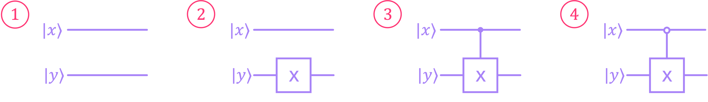</p>

*图：黑盒中可能装有的四种电路；电路 1 和 2 是常数函数（$f = 0$、$f = 1$），电路 3 和 4 是平衡函数（$f = x$、$f = \bar x$）。*

经典方法问一次只有 50% 的把握猜对，因为无论输入是什么，其输出总会与一个常数函数和一个平衡函数的输出相同；要问 2 次才能确定。量子方法：用 H 门把黑盒包起来。对于常数函数，两层 H 门相互抵消；对于受控非门（CX），H–CX–H 会**反转**控制方向（相位反冲），因此上方的量子比特（qubit）被翻转。

<p align="center">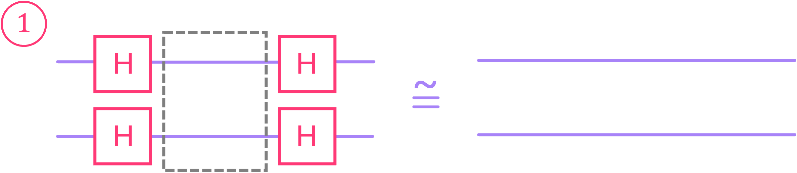</p>

*图：电路 1（空盒）夹在两层 H 门之间仍然只是两条直线，因为 $HH = I$。*

<p align="center">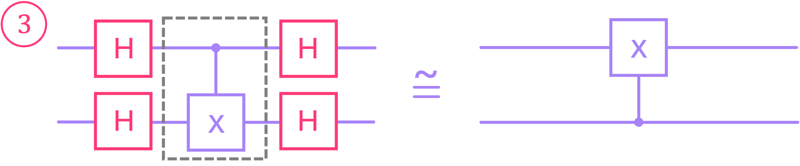</p>

*图：电路 3（从 $x$ 到 $y$ 的 CX）夹在两层 H 门之间，等价于一个方向反转的 CX：$y$ 为控制位，$x$ 为目标位。*

<p align="center">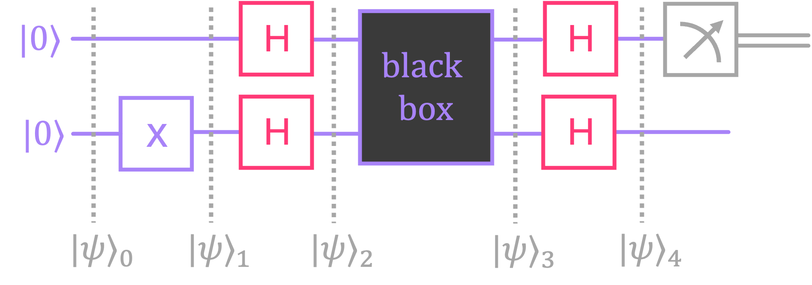</p>

*图：Deutsch 电路，标出了 $|\psi\rangle_0$ 到 $|\psi\rangle_4$ 各阶段；只测量上方的量子比特。*

各步骤如下（$q_1$ 为 $x$，$q_0$ 为 $y$）：

$$|0\rangle|0\rangle \xrightarrow{X \text{ 作用于 } y} |0\rangle|1\rangle \xrightarrow{H\otimes H} |+\rangle|-\rangle
\xrightarrow{U_f} \tfrac{(-1)^{f(0)}}{\sqrt2}\big(|0\rangle + (-1)^{f(0)\oplus f(1)}|1\rangle\big)|-\rangle
\xrightarrow{H\otimes H} \pm|f(0)\oplus f(1)\rangle|1\rangle$$

测量上方的量子比特：得到 0 则 $f$ 为常数函数，得到 1 则 $f$ 为平衡函数。只需**调用 1 次**，结果是确定的。

**推广到 $n$ 比特**
- **经典**：若要确保正确，最坏情况下必须尝试 $2^n/2 + 1 = 2^{n-1} + 1$ 个输入，因为即使 $2^{n-1}$ 个输出都相同，也还不能排除平衡函数。若接受按概率猜测（随机尝试 $r$ 个输入；输出全部相同就猜常数函数），notebook 给出 $\mathbb{P}_\text{success} = 1 - 1/2^r$，但这终究只是猜测。

<p align="center">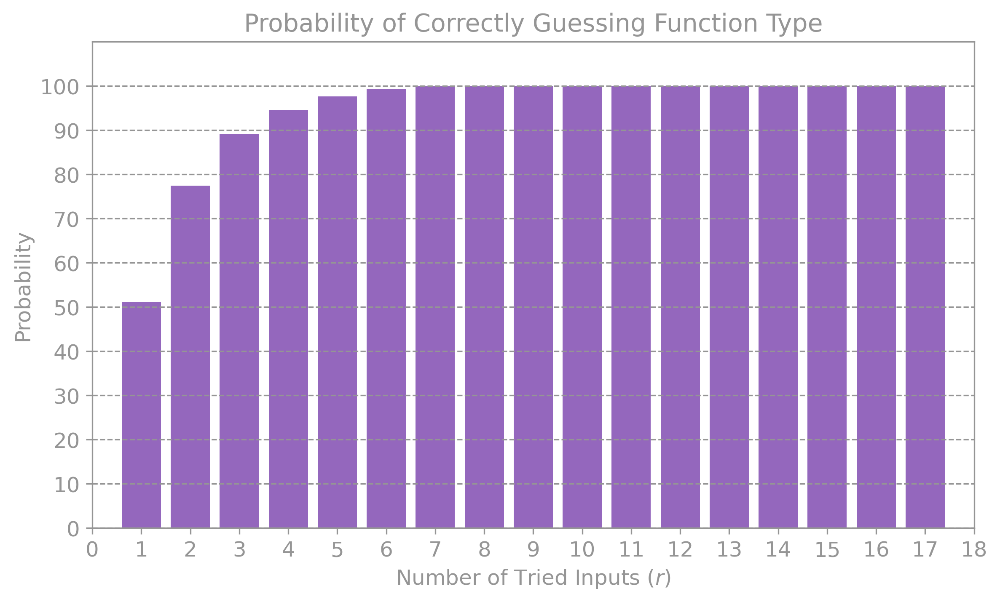</p>

*图：$N = 32$ 时按概率猜测（模拟结果）：$r = 6$ 时已达约 99%，无需像要求确定答案时那样尝试 17 次。*

> 注意：公式 $1 - 1/2^r$ 隐含的假设是：黑盒为常数函数或平衡函数的概率各为 50%，且各次尝试独立选取（可能重复）。如果像模拟中那样选取 $r$ 个**互不相同**的输入，概率还会略高一些（$N = 32$、$r = 6$ 时为 99.1%，而不是 98.4%）。如果黑盒是平衡函数，猜错的概率为 $1/2^{r-1}$（独立尝试）。无论如何，误差随 $r$ 呈指数下降，且与 $n$ 无关：尝试 11 次，出错概率就低于 0.1%。因此，DJ“1 次对 $2^{n-1} + 1$ 次”的优势，只有在与**确定性**（不允许出错）经典算法相比时才成立。

- **量子**：电路相同，只是把 H 换成 $H^{\otimes n}$：

<p align="center">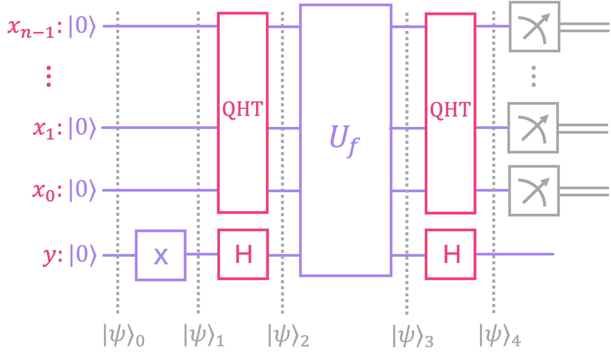</p>

*图：Deutsch–Jozsa 电路；QHT 即作用在寄存器 $x$ 上的 $H^{\otimes n}$，并且只测量寄存器 $x$。*

$$|\psi\rangle_3 = \Big(\frac{1}{\sqrt N}\sum_x (-1)^{f(x)}|x\rangle\Big)|-\rangle$$

  - $f$ **为常数函数**：$(-1)^{f(x)}$ 是全局相位（global phase）；第二次 $H^{\otimes n}$ 把状态变回 $|0\rangle^{\otimes n}$。
  - $f$ **为平衡函数**：$|0\rangle^{\otimes n}$ 的概率幅（amplitude）为 $\frac1N\sum_x(-1)^{f(x)} = 0$，因为正项与负项相互抵消，所以**永远不会**测得全 0。

**读取结果的规则**：测得全 0，则 $f$ 为常数函数；得到其他结果，则 $f$ 为平衡函数。

**构造预言机**：

| 函数类型 | 电路 |
|---|---|
| 常数 $f = 1$ | 在量子比特 $y$ 上加一个 X 门（常数 $f = 0$：什么也不做） |
| 平衡，奇偶校验（parity） | 从每个量子比特 $x_i$ 到 $y$ 各加一个 CX；DJ 总是给出结果 $11\dots1$ |
| 平衡，对半划分 | 对前一半（或后一半）的 $x$ 值使用 MCX |
| 随机平衡 | 使用 MCX，`ctrl_state` 取随机选出的 $N/2$ 个 $x$ 值 |

### 核心代码

```python
def deutsch_quantum():
    bb, bb_num = black_box()  # generate random black-box
    
    qc_dq = QuantumCircuit(2,1)
    qc_dq.x(0)                   # Initialize bottom qubit to |1〉
    qc_dq.barrier()
    qc_dq.h([1,0])               # Hadamard before black box
    qc_dq.append(bb,[0,1])       # append black box to circuit
    qc_dq.h([1,0])               # Hadamard after black box
    qc_dq.measure(1,0)           # measure top qubit
    
    return qc_dq, bb_num
```
Deutsch 算法。`qc.append(sub_circuit, qubits)` 把黑盒接入电路。

> 注意：`black_box()` 函数使用 `np.random.randint(1,3)`，而 `randint` 不包含上界，因此只会生成电路 1 或 2（**只有常数函数**）。要像注释所写的那样涵盖全部 4 个电路，应改为 `np.random.randint(1,5)`。因此，输出中第 1.1 节的两张正确/错误统计图并不能正确反映完整的问题。

```python
def black_box_n(n):
    bb_type = np.random.randint(2) # bb_type = 0 for constant, bb_type = 1 for balanced
    
    qc_bb = QuantumCircuit(n+1, name='Black Box')
    
    if bb_type:
        # Generate random list of x values that evaluate to f(x) = 1
        x_list = np.random.choice(2**n, size=2**n//2, replace=False)
        
        for x in x_list:
            qc_bb.mcx(list(range(1,n+1)),0, ctrl_state=np.binary_repr(x,n))
            
    return qc_bb, bb_type
```
$n$ 比特预言机：常数函数是空电路（$f = 0$）；平衡函数是 $N/2$ 个 MCX 门，每个门在某一个 $x$ 值处翻转 $y$。`qubit 0` 是 $y$，量子比特 $1..n$ 是 $x$。

```python
def deutsch_josza(n):
    bb, bb_type = black_box_n(n)              # generate random black-box of n input qubits
    
    qc_dj = QuantumCircuit(n+1,n)
    qc_dj.x(0)                                # Initialize bottom qubit to |1〉
    qc_dj.barrier()
    qc_dj.h(range(n+1))                       # Hadamard gates on all qubits
    qc_dj.append(bb,range(n+1))               # append black box to circuit
    qc_dj.h(range(n+1))                       # Hadamard gates on all qubits
    qc_dj.measure(range(1,n+1),range(n))      # measure top n qubits
    
    return qc_dj, bb_type
```
完整的 Deutsch–Jozsa 电路。经典模拟使用 `qc.prepare_state(k, qubits)` 载入输入 $|k\rangle$。

### 运行结果

| 检查项 | 输出 |
|---|---|
| $f = 0,\ 1,\ x,\ \bar x$ 的最终态矢量（statevector） | $\vert 01\rangle,\ -\vert 01\rangle,\ \vert 11\rangle,\ -\vert 11\rangle$：常数函数时上方量子比特为 0，平衡函数时为 1 |
| 常数预言机 $f = 1$（X 作用于 $y$） | 所有 $\vert x\rangle\vert 0\rangle \to \vert x\rangle\vert 1\rangle$ |
| 奇偶校验预言机，3 比特 | $f(x)$ = $x$ 的奇偶性（例如 $011 \to 0$，$111 \to 1$） |
| 对奇偶校验函数运行 DJ | 总是得到 $111$ |
| 对其他平衡函数运行 DJ | 永远不会得到 $000$ |
| 模拟 $n = 4$，100 次 | 经典方法约有 50% 的情况需要尝试 $2^n/2 + 1 = 9$ 次；DJ 总是只需 1 次（见图表） |

### 速记要点

- 电路：X 作用于 $y$ → 对所有量子比特作用 H → $U_f$ → 对所有量子比特作用 H → 测量 $x$。
- 全 0 则为常数函数，非全 0 则为平衡函数；调用 1 次，结果确定。
- 机制：相位反冲把 $(-1)^{f(x)}$ 写进概率幅；$H^{\otimes n}$ 把这些符号加在一起，因此在平衡函数的情况下，$|0\dots0\rangle$ 的概率幅为 0。
- 经典方法要确保正确，需要 $2^{n-1} + 1$ 次调用（最坏情况）。如果接受极小的出错概率，随机调用几次就够了，所以 DJ 的优势只是相对于确定性经典算法而言的。

---

## 04_02 · Bernstein–Vazirani algorithm（Bernstein–Vazirani 算法）

**问题**：给定 $f(x) = s \cdot x = s_0x_0 \oplus s_1x_1 \oplus \dots \oplus s_{n-1}x_{n-1}$（二进制内积）的预言机，求出长度为 $n$ 比特的秘密字符串 $s$。

### 核心知识

**经典：恰好需要 $n$ 次调用**。使用只含一个 1 的输入 $x = 0\dots01,\ 0\dots10,\ \dots$。每次这样调用都得到 $f(x) = s_i$，相当于用“掩码”逐位取出 $s$。确定性经典算法不可能用更少的次数：每次调用只返回 1 比特，而 $s$ 有 $n$ 比特。

**量子：1 次调用**，电路**与 Deutsch–Jozsa 完全相同**，只是预言机不同：

<p align="center"></p>

*图：Bernstein–Vazirani 使用的正是 Deutsch–Jozsa 的电路；唯一的区别是 $U_f$ 计算的是 $f(x) = s\cdot x$，因此测量直接给出 $s$。*

$$|\psi\rangle_3 = \Big(\frac{1}{\sqrt N}\sum_x (-1)^{s\cdot x}|x\rangle\Big)|-\rangle = \big(H^{\otimes n}|s\rangle\big)|-\rangle$$

括号中的表达式正是 $H^{\otimes n}|s\rangle$。再作用一次 $H^{\otimes n}$（H 的逆就是它自身），就恰好得到 $|s\rangle$，测量会以 100% 的概率得到 $s$。

**构造预言机**：对每个满足 $s_i = 1$ 的量子比特 $x_i$，放置一个从它指向量子比特 $y$ 的 CX。这样就得到 $y \oplus \bigoplus_{i: s_i=1} x_i = y \oplus s\cdot x$。

### 核心代码

```python
def black_box(n):
    s_int = np.random.randint(2**n)
    s = np.binary_repr(s_int, n)
    controls = [i+1 for i, v in enumerate(reversed(s)) if v == '1']
    
    qc_bb = QuantumCircuit(n+1, name='Black Box')
    if controls:
        qc_bb.cx(controls,[0]*len(controls))
        
    return qc_bb, s
```
随机 $s$ 的预言机。之所以用 `reversed(s)`，是因为字符串最右边的一位是 $s_0$（对应量子比特 1）；`qc.cx(list_c, list_t)` 可以一次放置多个 CX。

```python
for i in range(n):
    
    x_int = 2**i
    x = np.binary_repr(x_int, n)
    input_ones = [i+1 for i, v in enumerate(reversed(x)) if v == '1']
    
    qc = QuantumCircuit(n+1,1)
    qc.x(input_ones)
    qc.append(bb,range(n+1))
    qc.measure(0,0)
```
经典方法：运行 $n$ 次，取 $x = 2^i$，每次得到 $s$ 的一位。

```python
qc, s = bernstein_vazirani(n)
qc_t = transpile(qc, simulator)
job = simulator.run(qc_t, shots=1, memory=True)  # Run simulation once
s_out = job.result().get_memory()[0]
```
量子方法：**1 个 shot**（单次运行与测量）就能读出 $s$。`bernstein_vazirani(n)` 与 `deutsch_josza(n)` 的结构相同。

### 运行结果

| 检查项 | 输出 |
|---|---|
| $s = 1101$ 时的 $f(x)$ 表 | 只含一个 1 的那些 $x$ 行（标有 ←）恰好给出 $s_i$ |
| 经典，$n = 3$ | `secret string: 011`，`extracted string: 011`（3 次调用） |
| 量子，$n = 4$ | `secret string: 1000`，`extracted string: 1000`（1 次调用） |
| $s = 1011$ 的预言机 | $f(x) = s\cdot x$ 对全部 16 个 $x$ 值都成立 |

### 速记要点

- 电路与 DJ 完全相同；预言机由若干 CX 组成，控制位是满足 $s_i = 1$ 的各个 $x_i$。
- $\sum_x (-1)^{s\cdot x}|x\rangle = H^{\otimes n}|s\rangle$，所以再作用一次 $H^{\otimes n}$ 就得到 $|s\rangle$。
- 经典 $n$ 次调用 → 量子 1 次调用：这只是线性加速，而不是指数级加速。

---

## 04_03 · Simon's algorithm（西蒙算法）

**问题**：给定 $f:\{0,1\}^n \to \{0,1\}^n$ 的预言机，并承诺对某个字符串 $s \neq 0$ 有 $f(x) = f(x \oplus s)$（即 $f$ 是**二对一**函数：每个输出值恰好来自一对 $\{x, x\oplus s\}$）。求 $s$。

<p align="center">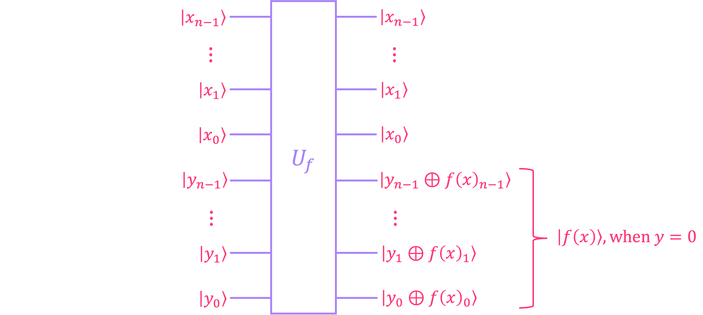</p>

*图：西蒙算法的预言机有 $2n$ 个量子比特；当 $y = 0\dots0$ 时，下方寄存器的输出恰好是 $|f(x)\rangle$。*

这是第一个相对于所有经典算法（包括随机化算法）实现**指数级**加速的算法，不过前提是在预言机模型中（统计 $U_f$ 的调用次数）。这个问题本身没有直接应用；它的思想是肖尔（Shor）算法的前身。

> 注意：notebook 的开头称肖尔算法在一个实际应用上具有**已被证明**的优势。实际上，还没有人证明整数分解（factoring）对经典计算机来说是困难的：肖尔算法比**已知最好的**经典算法快得多，但它相对于所有经典算法的优势仍未得到证明。

### 核心知识

**经典方法**：不断尝试各个 $x$，直到遇到两个满足 $f(a) = f(b)$ 的输入 $a, b$，此时 $s = a \oplus b$。这与生日悖论（birthday paradox）类似。随机选取 $r$ 个互不相同的输入时：

$$\mathbb{P}_\text{success} = 1 - \prod_{k=0}^{r-1}\frac{2^n - 2k}{2^n - k}$$

要使成功概率超过 50%，大约需要 $2^{n/2}$ 次（更精确地说，约 $1.18 \cdot 2^{n/2}$ 次），即随 $n$ 呈**指数**增长。这种尝试方法在最坏情况下需要 $2^{n-1} + 1$ 次。Simon 还证明了：所有经典算法，包括随机化算法，都需要 $2^{n/2}$ 量级的调用次数。

<p align="center">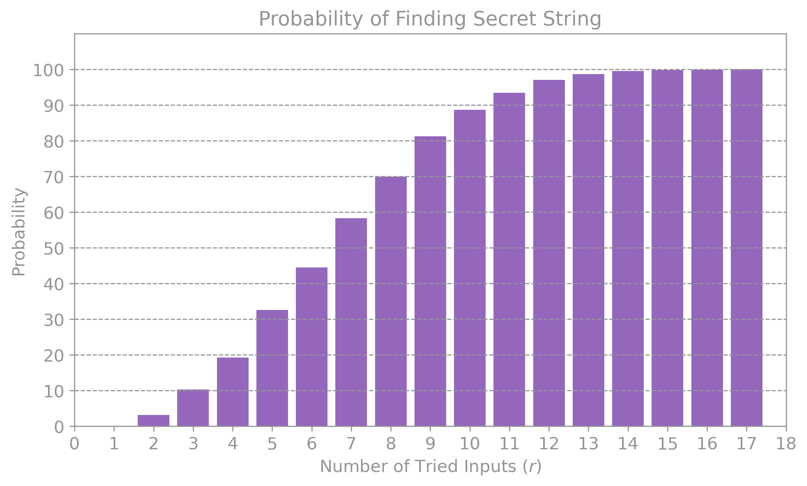</p>

*图：$n = 5$ 时的经典方法（模拟结果）：找到 $s$ 的概率要从 $r = 7$ 起才超过 50%。*

> 注意：notebook 写道，当 $n = 5$ 时，概率“after $r = 6$ tries”就超过了 50%。但无论是上面的公式（$r = 6$ 时为 43.4%，$r = 7$ 时为 56.5%）还是图表本身，都表明要到 $r = 7$ 才行。

**量子电路**（与 DJ/BV 不同：下方寄存器有 $n$ 个量子比特，初始化为 $|0\rangle^{\otimes n}$，并且**不**使用相位反冲）：

<p align="center">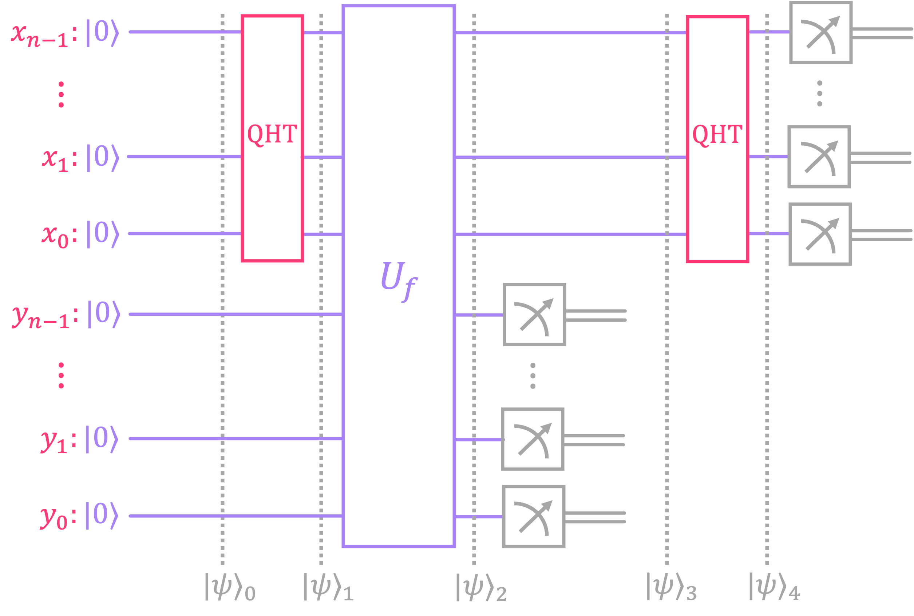</p>

*图：西蒙电路；下方寄存器从 $|0\rangle^{\otimes n}$ 开始，并在 $U_f$ 之后立即被测量。*

1. 对寄存器 $x$ 作用 $H^{\otimes n}$：$\frac{1}{\sqrt N}\sum_x |x\rangle|0\rangle$。
2. $U_f$：$\frac{1}{\sqrt N}\sum_x |x\rangle|f(x)\rangle = \frac{1}{\sqrt N}\sum_{x\in S}\big(|x\rangle + |x\oplus s\rangle\big)|f(x)\rangle$。
3. **测量下方寄存器**，得到某个值 $f(a)$。上方寄存器只剩下 $\frac{1}{\sqrt2}\big(|a\rangle + |a\oplus s\rangle\big)$。
4. 对上方寄存器作用 $H^{\otimes n}$：

$$\frac{1}{\sqrt{2N}}\sum_z (-1)^{a\cdot z}\big[1 + (-1)^{s\cdot z}\big]|z\rangle$$

   满足 $s\cdot z = 1$ 的 $z$ 全部抵消；无论 $a$ 是什么，都只剩下满足 **$s \cdot z = 0$** 的 $z$。
5. 测量上方寄存器，得到一个满足 $s\cdot z = 0$ 的 $z$。如果得到 $z = 0$（概率为 $2/N$），则没有用处，必须重新运行。

**经典后处理**：每个 $z$ 给出一个模 2 线性方程。需要 $n-1$ 个**线性无关**的方程：

$$Z\vec s = \vec 0 \pmod 2 \quad\Rightarrow\quad \vec s = \text{kernel}(Z)$$

量子–经典混合流程：

<p align="center">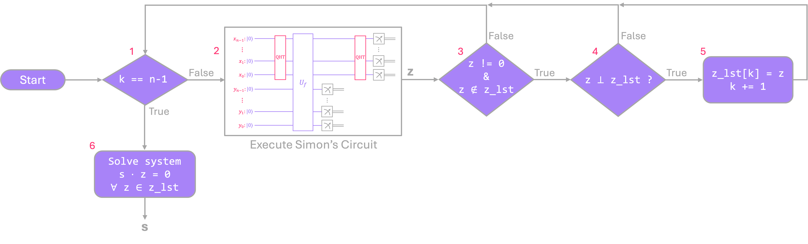</p>

*图：西蒙算法的流程图：运行电路，筛选 $z$，保存下来，直到凑齐 $n-1$ 个线性无关的值，然后求解方程组 $s\cdot z = 0$。*

1. 运行电路，得到 $z$。
2. 如果 $z = 0$，或者 $z$ 与已有的 $z$ 线性相关（模 2 高斯消元），就丢弃它。
3. 重复，直到得到 $n-1$ 个基向量。
4. 求核空间（kernel；先化为简化行阶梯形 RREF，再回代），得到 $s$。

平均运行次数只随 $n$ **线性**增长：每次运行得到一个随机的 $z$，它在 $s\cdot z = 0$ 的 $2^{n-1}$ 个解上均匀分布，因此平均不到 $n + 1$ 次运行就能凑齐 $n-1$ 个线性无关的向量。高斯消元部分只需要关于 $n$ 的多项式时间。也就是说，量子一方需要 $O(n)$ 次预言机调用**加上**经典后处理，而经典方法需要 $2^{n/2}$ 量级的调用次数。

<p align="center">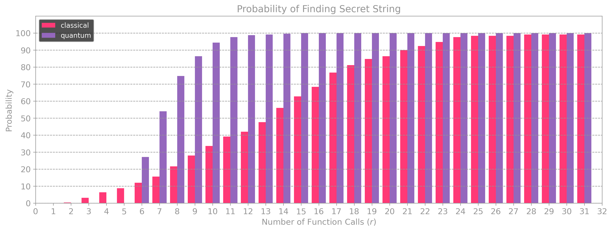</p>

*图：$n = 7$，经典方法（粉色）与量子方法（紫色）：量子方法在 $r = 7$ 时超过 50%，经典方法要到 $r = 14$。*

**notebook 中的示例（$s = 1010$）**：可能的 $z$ 为 $\{0000, 0001, 0100, 0101, 1010, 1011, 1110, 1111\}$。
- $z = 0001$ 给出 $s_0 = 0$。
- $z = 1010$ 给出 $s_3 \oplus s_1 = 0$。
- $z = 1011$ 与前两个 $z$ 线性相关，因此丢弃。
- $z = 1110$ 给出 $s_3 \oplus s_2 \oplus s_1 = 0$；与 $s_3 \oplus s_1 = 0$ 联立得到 $s_2 = 0$。

由于 $s \neq 0$，所以 $s = 1010$。

**由真值表构造预言机**
- 朴素做法：把每一位 $f(x)_i$ 写成积之和形式（DNF），每个乘积项对应一个 MCX。电路会非常长。
- 精简做法：用 `sympy.logic.boolalg.SOPform` 化简表达式，例如 $(\bar x_2 x_1 x_0) \lor (x_2 x_1 x_0) = x_1 \land x_0$，再用 `BitFlipOracleGate` 构造电路。据原书所述，Qiskit 的转译器（transpiler）无法自动完成这种化简。

### 核心代码

```python
def fx_simon(s_int, n):
    fx_lst = [0]*2**n
    x_used = []
    fx_avail = list(range(2**n))
    
    for x_int in range(2**n):
        if x_int in x_used: continue

        x_pair = s_int ^ x_int
        x_used.extend((x_int, x_pair))
        
        # pick random f(x) value and remove from available list
        fx_int = np.random.choice(fx_avail)
        fx_avail.remove(fx_int)
        
        # assign f(x) value to x and s⊕x
        fx_lst[x_int] = fx_int
        fx_lst[x_pair] = fx_int
        
    return fx_lst
```
随机生成一个合法的西蒙函数：每一对 $\{x, x\oplus s\}$ 共享同一个输出值。

```python
def simons_cir(n):
    bb, s = black_box(n)                     # generate random black-box of n input qubits
    
    qc_s = QuantumCircuit(2*n,2*n)
    qc_s.h(range(n,2*n))                     # Hadamard gates top n qubits
    qc_s.append(bb,range(2*n))               # append black box to circuit
    qc_s.measure(range(n),range(n))          # measure bottom n qubits
    qc_s.barrier()
    qc_s.h(range(n,2*n))                     # Hadamard gates on top n qubits
    qc_s.measure(range(n,2*n),range(n,2*n))  # measure top n qubits
    
    return qc_s, s
```
寄存器 $x$ 是量子比特 $n..2n-1$，寄存器 $f(x)$ 是量子比特 $0..n-1$。`memory` 字符串先打印高位，所以
`z_and_fx[0:n]` 就是 $z$。

```python
def generate_basis(basis: list[int], z: int):
    # Returns updated list of binary basis vectors by reducing a new entry `z` through
    # Gaussian elimination (mod 2). For convenience, we treat each "vector" as an integer,
    # where the bits of its binary representation correspond to the elements of the vector.
    
    basis = basis.copy()
    
    # Reduce z using existing pivots
    for b in basis:
        p = (b & -b).bit_length() - 1   # finds index of the lsb that's equal to 1 (pivot)
        if (z >> p) & 1:                # checks if the p^th bit of z is 1
            z ^= b                      # reduce z by XOR with basis vector b
            
    if z == 0: return basis             # If reduced z is zero, it was dependent
    p = (z & -z).bit_length() - 1       # finds index of the lsb that's equal to 1 (pivot)
    
    
    # Eliminate pivot from existing basis vectors (now z contains it)
    for i, b in enumerate(basis):
        if (b >> p) & 1:
            basis[i] ^= z
    
    basis.append(z)
    return basis
```
在整数上做模 2 高斯消元：每个向量是一个 `int`，加法是 `^`（XOR），而 `b & -b` 取出最低位的 1（主元，pivot）。函数 `kernel_from_basis(basis, n)` 令各自由变量为 1，再解出主元变量，从而得到 $s$。

```python
while k < n - 1:
    
    # transpile and run quantum circuit
    qc_t = transpile(qc_s_cir, simulator)
    job = simulator.run(qc_t, shots=1, memory=True)
    z_and_fx = job.result().get_memory()[0]   # returns results for both top and bottom registers
    z = int(z_and_fx[0:n], 2)                 # extract z only (as integer)
    
    if z != 0:
        basis_vects = generate_basis(basis_vects, z)
        k = len(basis_vects)
        
    tries += 1

s_out = np.binary_repr(kernel_from_basis(basis_vects, n)[0],n)
```
混合循环：运行电路，筛选 $z$，更新基，直到凑齐 $n-1$ 个向量，然后求核空间。

```python
expr = SOPform(x_symbs, fx_0)
...
qc_bool.append(BitFlipOracleGate(fx_expr, x_vars), x_qubits)
```
用 SymPy 化简布尔表达式，再由 `BitFlipOracleGate`（位于 `qiskit.circuit.library`）根据表达式字符串构造预言机。用 `qc.decompose()` 可以查看内部电路。

> 小注：notebook 末尾的注释把一般函数写成 $f:\{0,1\}^n \to \{0,1\}^n$ 且 $m \ge n$；正确的写法应是
> $\{0,1\}^n \to \{0,1\}^m$。第 2.1 节说第 2.3 节会给出“使用 3 个量子比特的示例”，但那个示例是 $s = 1010$（4 比特，8 个量子比特）。有几处引用的“section 1.2.1”“1.2.2”“1.1”，实际上分别是第 2.1 节、第 2.2 节和第 1 节。

### 运行结果

| 检查项 | 输出 |
|---|---|
| `fx_simon`，$s = 1101$ | 例如 $f(0000) = f(1101) = 1011$ |
| 预言机，$n = 3$，$s = 100$ | 对所有 $x$ 都有 $f(x) = f(x \oplus 100)$ |
| 经典，$n = 7$ | `secret 1101000`，尝试 `22` 次后找到 |
| 量子，$n = 7$ | `secret 0111110`，运行电路 `6` 次后找到 |
| notebook 中的图表，$n = 7$ | 量子方法在 $r = 7$ 时超过 50%；经典方法需要 $r = 14$ |
| $f(x)_0$ 的 `SOPform` | $x_0 \land x_1$ |

### 速记要点

- 承诺：$f(x) = f(x\oplus s)$，二对一函数；求 $s$。
- 电路：H 作用于 $x$ → $U_f$ → 测量 $f(x)$ → H 作用于 $x$ → 测量 $x$，得到一个满足 $s\cdot z = 0$ 的 $z$。
- 需要 $n-1$ 个线性无关的 $z$ 值，然后求模 2 的核空间（用 XOR 做高斯消元）。
- 经典方法需要 $\sim 2^{n/2}$ 次调用（包括随机化算法），量子方法需要 $\sim n$ 次调用再加上高斯消元：在预言机模型中实现**指数级**加速。
- 这是一个混合算法：量子部分负责采样，经典部分负责解方程组。

---

## 04_04 · Grover's algorithm（格罗弗算法）

**问题**：无结构搜索（unstructured search）。给定 $f:\{0,1\}^n \to \{0,1\}$ 的预言机，找出满足 $f(x) = 1$ 的输入
$x$（即**被标记元素**，marked element）。$N = 2^n$。

> “按电话号码查电话簿”这个例子只是为了便于说明。要为电话簿构造预言机，就得先把整本电话簿遍历一遍，所以格罗弗算法只有在 $f$ 能**高效地构造**成电路时才有用，例如电路可满足性问题（circuit satisfiability）。即便如此，其优势也只是相对于穷举搜索的二次加速，而不是相对于针对该问题专门设计的所有经典算法。

### 核心知识

**经典方法**：逐个尝试每个元素，$\mathbb{P}_\text{success} = r/2^n$，所以需要 $2^{n-1}$ 次才能达到 50%，要确保找到则需要 $N$ 量级的次数。也就是说，次数随 $N$ 线性增长。

**量子思路：振幅放大**（amplitude amplification）。

<p align="center">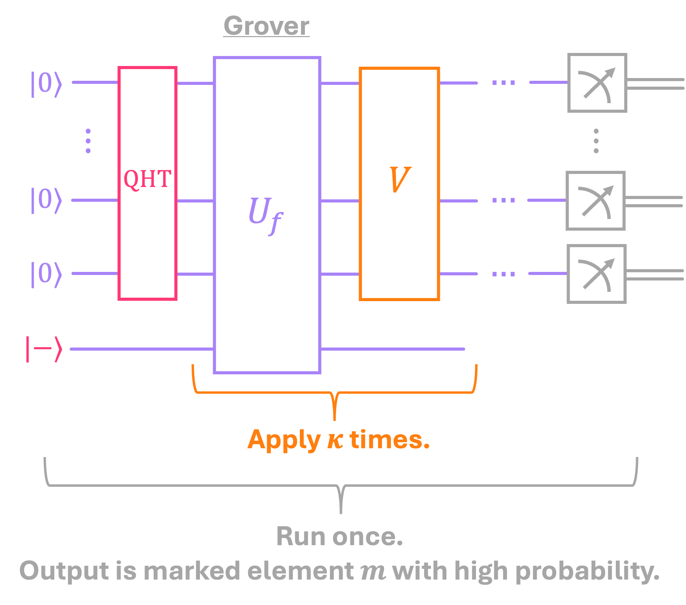</p>

*图：格罗弗电路；$U_f$ 与 $V$（扩散算子，diffuser）这一对在测量前重复 $\kappa$ 次。*

把（预言机，扩散算子）这一对重复 $\kappa$ 次：
1. $H^{\otimes n}$：所有概率幅都等于 $1/\sqrt N$（状态 $|s\rangle$）。
2. **预言机** $U_f$，取 $y = |-\rangle$：**翻转**被标记元素概率幅的符号。
3. **扩散算子** $V$：**以平均值 $\mu$ 为中心翻转所有概率幅**，即 $\alpha_x \to 2\mu - \alpha_x$。被标记的概率幅（此时为负，远低于 $\mu$）被抬升到很高；其他概率幅则减小。

以 $n = 3$、$m = 101$ 为例：

<p align="center">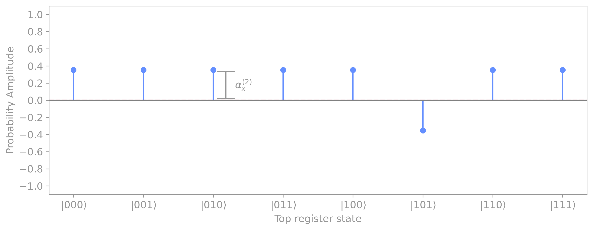</p>

*图：经过预言机后，只有 $|101\rangle$ 的概率幅改变了符号。*

<p align="center">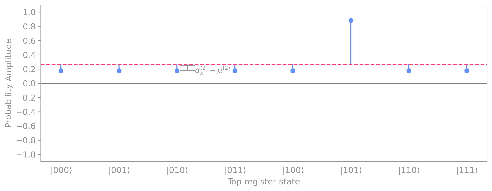</p>

*图：扩散算子把所有概率幅以平均值（虚线）为中心翻转：$|101\rangle$ 升至 0.884，其他状态降为 0.177。*

| 步骤 | $m$ 的概率幅 | 测得 $m$ 的概率 |
|---|---|---|
| H 之后 | 0.354 | 12.5% |
| 1 轮之后（预言机 + 扩散算子） | $\frac{1}{\sqrt8}\cdot\frac{3\cdot8-4}{8} \approx 0.884$ | ≈ 78% |
| 2 轮之后 | $\approx 0.972$ | ≈ 94.5% |
| 再加第 3 轮 | 降至 $\approx 0.574$ | ≈ 33%，因为概率是**周期性振荡**的，而不会一直增大 |

<p align="center">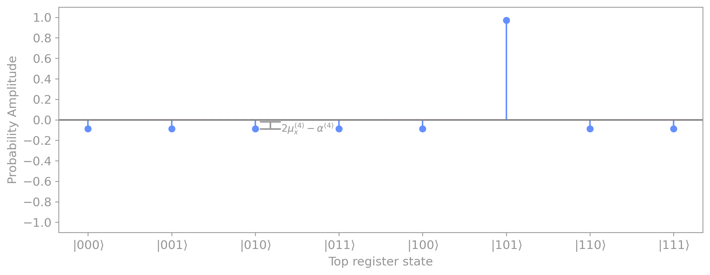</p>

*图：2 轮之后，$|101\rangle$ 的概率幅为 0.972（概率约 94.5%）；其他状态为 $-0.088$。*

**扩散算子的电路**

$$V = 2|s\rangle\langle s| - I = H^{\otimes n}\big(2|0\rangle\langle 0| - I\big)H^{\otimes n} = -\,H^{\otimes n}X^{\otimes n}\,\text{MCZ}\,X^{\otimes n}H^{\otimes n}$$

$2|0\rangle\langle0| - I$ 等于 $-1$ 乘以一个**只**翻转 $|0\dots0\rangle$ 符号的门，也就是夹在两层 X 门之间的 MCZ。因子 $-1$ 是全局相位，可以忽略：电路 `diffuser(n)` 实际构造的是 $-V$，测量结果相同。

**几何视角 → 迭代次数**：分解 $|s\rangle = \cos\frac\theta2|m^\perp\rangle + \sin\frac\theta2|m\rangle$，其中
$\sin\frac\theta2 = 1/\sqrt N$。预言机是关于 $|m^\perp\rangle$ 的反射；扩散算子是关于 $|s\rangle$ 的反射。两次反射合起来，就是朝 $|m\rangle$ 方向**旋转角度 $\theta$**。

<p align="center">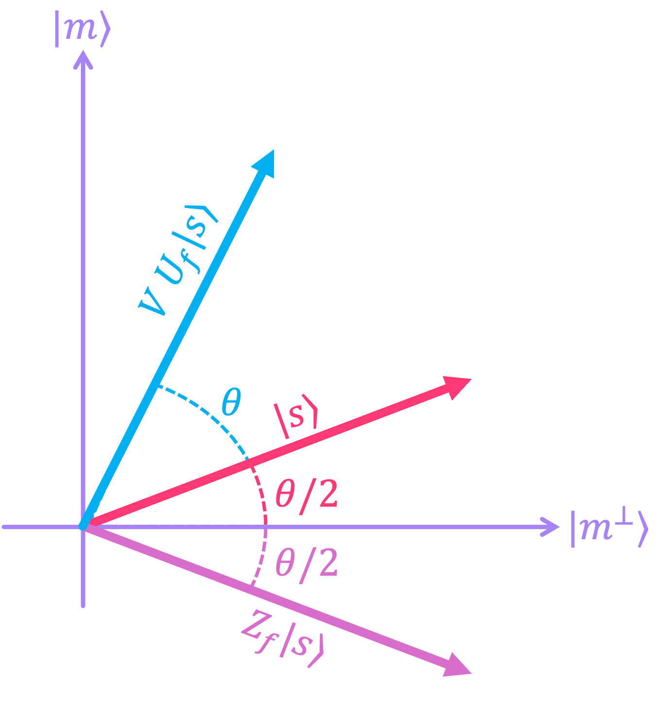</p>

*图：一轮格罗弗迭代：预言机（$Z_f$，即 $U_f$ 的相位形式）把 $|s\rangle$ 关于轴 $|m^\perp\rangle$ 反射，扩散算子再关于 $|s\rangle$ 反射回来；结果是再转过角度 $\theta$。*

经过 $\kappa$ 轮后，状态与 $|m^\perp\rangle$ 的夹角为 $(2\kappa + 1)\frac\theta2$，因此测得 $m$ 的概率为
$\sin^2\big((2\kappa + 1)\tfrac\theta2\big)$。要使夹角达到 $\pi/2$，需要 $\kappa\theta + \theta/2 = \pi/2$：

$$\kappa = \left\lfloor \frac{\pi}{4\arcsin(1/\sqrt N)} - \frac12 \right\rceil \;\approx\; \frac{\pi}{4}\sqrt N$$

迭代超过这个轮数，向量就会越过 $|m\rangle$（overshoot），概率随之下降，就像上面示例中的第 3 轮那样。

<p align="center">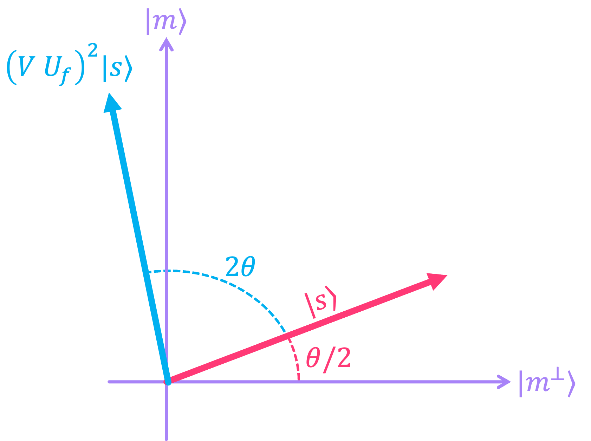</p>

*图：两轮把 $|s\rangle$ 再转过 $2\theta$；当 $\theta$ 像图中这样大时，向量已经越过了轴 $|m\rangle$。*

若有 $M$ 个被标记元素（需要事先知道 $M$），就把 $1/\sqrt N$ 换成 $\sqrt{M/N}$，于是当 $M \ll N$ 时 $\kappa \approx \frac\pi4\sqrt{N/M}$。

没有任何量子算法能做得更好：无结构搜索至少需要 $\sqrt N$ 量级的预言机调用次数（Bennett、Bernstein、Brassard、Vazirani，1997）。因此格罗弗算法的**二次**加速是最优的，而且它不是指数级加速。

**验证结果**：运行一次格罗弗算法得到 $x_\text{out}$，再调用 $f(x_\text{out})$ 进行验证；若不对就重新运行。总共至少需要 $\kappa + 1$ 次预言机调用。当 $N = 32$ 时：$\kappa + 1 = 5$ 次调用后成功率已接近 100%，而经典方法要尝试几乎全部 32 个元素才能确保找到。

<p align="center">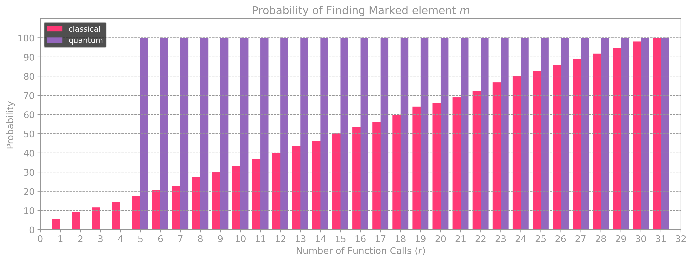</p>

*图：$N = 32$，经典方法（粉色）与附带一次验证的格罗弗算法（紫色）：格罗弗算法从 $r = \kappa + 1 = 5$ 起接近 100%，经典方法近似线性增长。*

### 核心代码

```python
def Uf_one_marked(n):
    N = 2**n
    m_int = np.random.randint(N)
    m = np.binary_repr(m_int,n)
    
    qc_bb = QuantumCircuit(n+1, name=' $U_f$ (Oracle)')
    qc_bb.mcx(list(range(1,n+1)),0, ctrl_state=m)
    
    return qc_bb, m
```
标记单个元素的预言机：一个只在 $x = m$ 时触发的 MCX。

```python
def diffuser(n):
    
    mcz = ZGate().control(n-1)
    
    qc_v = QuantumCircuit(n, name=' $V$ (Diffuser)')
    qc_v.h(range(n))
    qc_v.x(range(n))
    qc_v.append(mcz,range(n))
    qc_v.x(range(n))
    qc_v.h(range(n))
    
    return qc_v
```
扩散算子 $H\,X\,\text{MCZ}\,X\,H$，即与 $V$ 相差一个全局相位 $-1$。`ZGate().control(n-1)` 在 $n$ 个量子比特上构造 MCZ。

```python
def grover_one_marked(n, κ):
    
    bb, m = Uf_one_marked(n)
    
    qc_g = QuantumCircuit(n+1,n)
    qc_g.x(0)
    qc_g.h(0)
    qc_g.barrier()
    qc_g.h(range(1,n+1))
    
    for _ in range(κ):
        qc_g.append(bb,range(n+1))
        qc_g.append(diffuser(n),range(1,n+1))

    qc_g.barrier()
    qc_g.measure(range(1,n+1),range(n))
    
    return qc_g, m
```
完整的格罗弗电路：量子比特 0 处于 $|-\rangle$，用于相位反冲；把（预言机，扩散算子）重复 $\kappa$ 次，然后测量。

```python
κ = round(np.pi/(4*np.arcsin(1/np.sqrt(N)))-1/2)
```
最优迭代次数。notebook 中还有 `find_κ(N)`，它按公式 $2\mu - \alpha$ 迭代计算，得到相同的结果。

> 注意：`Uf_M_marked(n, M)` 用 `np.random.randint(N, size=M)` 选取元素，因此**可能重复**。保存的输出确实是
> `['001', '001']`：两个相同的 MCX 相互抵消，预言机什么也没有标记。应改用
> `np.random.choice(N, size=M, replace=False)`。

> 小注：第 2.2 节把 $|m^\perp\rangle$ 写成 $\sum_{x \neq 0}$，正确的应是 $\sum_{x \neq m}$（并且需要归一化）。第 3 节同样缺少归一化：正确的应是 $|\xi\rangle = \frac{1}{\sqrt M}\sum_{m \in \Xi}|m\rangle$ 和
> $|\xi^\perp\rangle = \frac{1}{\sqrt{N-M}}\sum_{x \notin \Xi}|x\rangle$。第 2.1 节第 5 步中，$\alpha_x^{(5)}$ 的一般公式把分母写成了 $N$，正确的应是 $N^2$；数值 0.972 和
> $-0.088$ 仍然正确。第 2.2 节写的是“$(U_f V)^2$”，正确的应是图中的 $(V U_f)^2$。第 1 节中，打印语句 `found after: {x_in} tries` 输出的是 $x$ 的**索引**，因此实际尝试次数是 `x_in + 1`。

### 运行结果

| 检查项 | 输出 |
|---|---|
| `find_κ(32)` 与闭式公式 | 都得到 $\kappa = 4$ |
| 经典搜索，$n = 5$ | `marked element: 01101`，在 32 个元素中于索引 13 处（第 14 次尝试）找到 |
| 格罗弗算法，$n = 3$，$\kappa = 2$，$2^{13}$ 个 shot | `m = 110` 是出现次数最多的结果（见图表） |
| 格罗弗算法，$M = 2$，$n = 5$ | `['00010', '11100']` 是两个突出的结果（见图表） |

### 速记要点

- 一轮格罗弗迭代 = 预言机（翻转被标记元素的符号）+ 扩散算子（以平均值为中心翻转）。
- $H^{\otimes n}X^{\otimes n}\,\text{MCZ}\,X^{\otimes n}H^{\otimes n} = -(2|s\rangle\langle s| - I)$，即与 $V$ 相差一个全局相位。
- 几何上：每轮旋转 $\theta = 2\arcsin\sqrt{M/N}$；$\kappa$ 轮后的成功概率为 $\sin^2\big((2\kappa+1)\tfrac\theta2\big)$；$\kappa \approx \frac\pi4\sqrt{N/M}$。迭代**超过** $\kappa$ 轮，概率反而下降。
- 经典 $\sim N$，格罗弗 $\sim\sqrt N$：**二次**加速，不是指数级加速，并且没有任何量子算法能做得更好。
- 只有在预言机能被高效构造时才有用。

---

## 四种算法对比

<p align="center">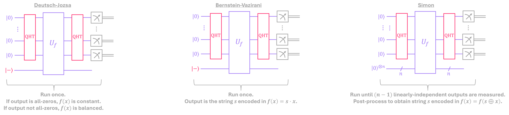</p>

*图：DJ、BV 和西蒙算法的共同框架：DJ 和 BV 只运行一次；西蒙算法要一直运行到得到 $n-1$ 个线性无关的结果，再进行后处理（格罗弗电路见第 04_04 课）。*

| | Deutsch–Jozsa | Bernstein–Vazirani | 西蒙 | 格罗弗 |
|---|---|---|---|---|
| $f$ 的输出 | 1 比特 | 1 比特 | $n$ 比特 | 1 比特 |
| 辅助量子比特 | 1 个，处于 $\vert -\rangle$ | 1 个，处于 $\vert -\rangle$ | $n$ 个，处于 $\vert 0\rangle^{\otimes n}$ | 1 个，处于 $\vert -\rangle$ |
| 核心机制 | 相位反冲 + $H^{\otimes n}$ | 相位反冲 + $H^{\otimes n}$ | 测量下方寄存器 + $H^{\otimes n}$ | 相位反冲 + 扩散算子，重复 $\kappa$ 次 |
| 每次运行的结果 | 确定 | 确定 | 随机：一个满足 $s\cdot z = 0$ 的 $z$ | 高概率 |
| 经典后处理 | 无 | 无 | 模 2 高斯消元 | 验证 $f(x_\text{out})$ |
| 预言机调用次数（经典） | $2^{n-1}+1$（确保正确） | $n$ | $\sim 2^{n/2}$ | $\sim N$ |
| 预言机调用次数（量子） | 1 | 1 | $\sim n$ | $\sim\sqrt N$ |
| 优势（预言机调用次数） | 指数级，但只是相对于确定性经典算法 | 线性 | 指数级，即使相对于随机化经典算法也成立 | 二次，并且是最优的 |

## 本部分用到的 API 汇总

| API / 函数 | 用途 | 课 |
|---|---|---|
| `QuantumCircuit(n, m, name=)`、`QuantumRegister` | 创建带名称的电路/黑盒 | 04_01–04_04 |
| `qc.append(sub_circuit_or_gate, qubits)` | 把黑盒、扩散算子接入电路 | 04_01–04_04 |
| `qc.mcx(controls, target, ctrl_state=)` | 预言机：在某个 $x$ 值处翻转 $y$ | 04_01、04_03、04_04 |
| `qc.cx(list_controls, list_targets)` | 一次放置多个 CX（BV 预言机） | 04_02 |
| `qc.prepare_state(k, qubits)` | 载入经典输入 $\vert k\rangle$ | 04_01、04_04 |
| `ZGate().control(k)` | 为扩散算子构造 MCZ | 04_04 |
| `BitFlipOracleGate(expr, vars)` | 由布尔表达式构造预言机 | 04_03 |
| `sympy.symbols`、`sympy.logic.boolalg.SOPform` | 化简布尔表达式 | 04_03 |
| `qc.decompose()` | 查看某个门内部的电路 | 04_03、04_04 |
| `transpile(qc, simulator)`、`AerSimulator().run(qc, shots=, memory=True)` | 运行电路 | 04_01–04_04 |
| `result.get_memory()`、`result.get_counts()` | 获取每个 shot 的比特串 / 计数（counts） | 04_01–04_04 |
| `Statevector(qc)`、`Statevector.from_label` | 检查精确的量子态 | 04_01–04_03 |
| `plot_histogram`、`plot_distribution` | 绘制结果 | 04_01、04_04 |
| `np.binary_repr`、`np.random.choice(..., replace=False)` | 二进制字符串、无重复的随机选取 | 04_01–04_04 |

## 运行方法

在 VS Code 或 Jupyter 中打开 notebook，选择本仓库的 `.venv` 内核，从上到下运行。所需的库都列在
[requirements.txt](../../requirements.txt) 中；04_03 还需要 `sympy`，该文件中已经包含。

- 所有内容都在本地的 `AerSimulator` 上运行，不需要 IBM 账号。
- 黑盒、秘密字符串和被标记元素都是**随机**生成的，所以每次运行的输出都会与保存的版本不同；但结论不变（上文指出的 04_01 中 `black_box()` 的错误和 04_04 中 `Uf_M_marked` 的错误除外）。
- 有些经典/量子对比图（概率随尝试次数的变化）在 notebook 中只是**静态图片**，并没有生成它们的代码。
- 各 notebook 会在不同小节之间复用函数（例如 `black_box_n`、`diffuser`、`fx_simon`），所以必须按顺序运行。

---

<!-- nav -->
[← 03 · Quantum protocols](../03_quantum_protocols/README.zh-CN.md) · [目录](../../README.zh-CN.md#目录) · [学完第 04 部分后继续学习 →](../../docs/learning-path.zh-CN.md#学完第-04-部分之后呢)
