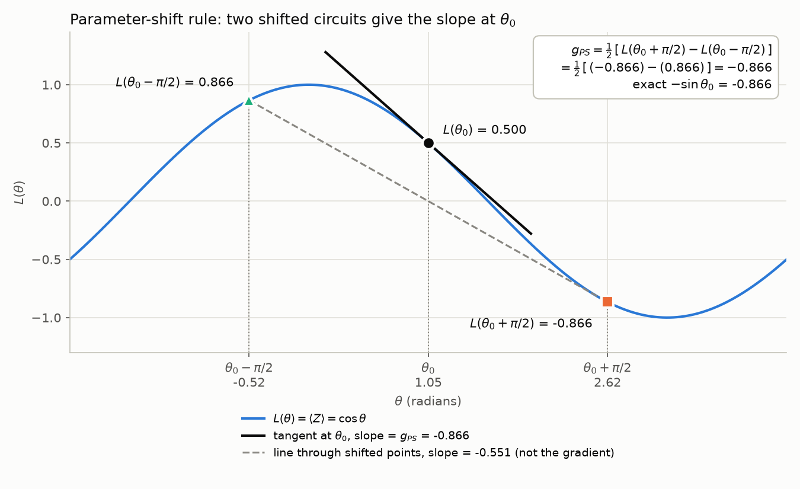
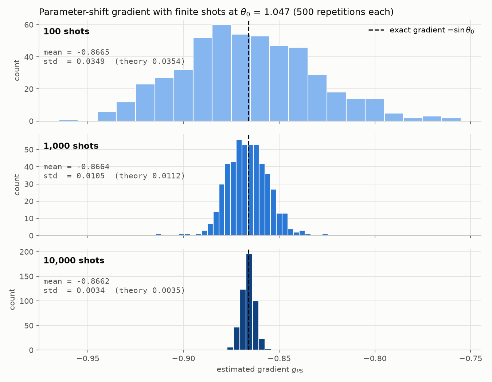

# 02 · Parameter-shift rule

## Mục tiêu

Hiểu và kiểm chứng bằng số cách **parameter-shift rule** tính gradient của một mạch lượng tử
có tham số: chạy **cùng một mạch** tại θ + π/2 và θ − π/2, rồi kết hợp hai giá trị kỳ vọng
thành ∂L/∂θ **chính xác**, không phải xấp xỉ.

Sau bài này cần nắm được:

- Vì sao huấn luyện mạch lượng tử cần một cách tính gradient riêng.
- Công thức parameter-shift, chứng minh cho cổng xoay RY, và điều kiện áp dụng.
- Vì sao nó khác sai phân hữu hạn, dù trông giống.
- Nhiễu do số shot hữu hạn ảnh hưởng đến gradient như thế nào, và công thức std lý thuyết.
- Gradient đi vào bước cập nhật của optimizer ra sao.

## Nội dung

### 1. Bài toán: gradient của mạch lượng tử

Trong các thuật toán biến phân (VQE, QAOA, quantum neural network), một mạch có tham số θ
tạo ra trạng thái |ψ(θ)⟩, rồi ta đo một observable để được hàm mất mát L(θ) = ⟨ψ(θ)|O|ψ(θ)⟩.
Optimizer cổ điển cần ∂L/∂θ để cập nhật θ.

Trên simulator có thể dùng backpropagation qua state vector. Trên phần cứng thật thì không:
ta không đọc được state vector, chỉ lấy được **kết quả đo**. Parameter-shift rule giải quyết
việc này: gradient được tính chỉ từ các giá trị kỳ vọng của **chính mạch đó** tại các góc khác.

### 2. Mạch dùng trong bài

```text
|0> ── RY(θ) ── đo Z
```

Cổng xoay quanh trục Y của Bloch sphere:

$$
R_Y(\theta) = e^{-i\theta Y/2} =
\begin{pmatrix} \cos\frac{\theta}{2} & -\sin\frac{\theta}{2} \\
\sin\frac{\theta}{2} & \cos\frac{\theta}{2} \end{pmatrix},
\qquad
R_Y(\theta)|0\rangle = \cos\tfrac{\theta}{2}|0\rangle + \sin\tfrac{\theta}{2}|1\rangle
$$

Đo Z cho +1 với xác suất P(0) và −1 với xác suất P(1), nên

$$
L(\theta) = \langle Z \rangle = P(0) - P(1) = \cos^2\tfrac{\theta}{2} - \sin^2\tfrac{\theta}{2}
= \cos\theta,
\qquad
\frac{dL}{d\theta} = -\sin\theta .
$$

Đạo hàm −sin θ chỉ dùng làm **ground truth** để so sánh. Code tính gradient không dùng nó.

### 3. Parameter-shift rule

$$
\boxed{\;\frac{\partial L}{\partial \theta}
= \frac{1}{2}\Big[L\big(\theta + \tfrac{\pi}{2}\big) - L\big(\theta - \tfrac{\pi}{2}\big)\Big]\;}
$$

**Chứng minh.** Cổng có dạng e^{−iθG} với generator G = Y/2, trị riêng ±1/2. Khi đó giá trị
kỳ vọng luôn là một hàm sin thuần tuý theo θ:

$$
L(\theta) = A\cos\theta + B\sin\theta + C .
$$

Thay θ ± π/2, dùng cos(θ ± π/2) = ∓sin θ và sin(θ ± π/2) = ±cos θ:

$$
L\big(\theta + \tfrac{\pi}{2}\big) - L\big(\theta - \tfrac{\pi}{2}\big)
= -2A\sin\theta + 2B\cos\theta = 2L'(\theta).
$$

Đẳng thức đúng **với mọi θ**, không có số hạng bậc cao bị bỏ đi.
Với mạch của bài, A = 1, B = C = 0.

**Dạng tổng quát.** Nếu generator có đúng hai trị riêng ±r, thì

$$
\frac{\partial L}{\partial \theta}
= r\Big[L\big(\theta + \tfrac{\pi}{4r}\big) - L\big(\theta - \tfrac{\pi}{4r}\big)\Big].
$$

Các cổng RX, RY, RZ có r = 1/2, nên shift là π/2 và hệ số là 1/2. Cổng có nhiều hơn hai
trị riêng cần quy tắc nhiều điểm hơn (xem Wierichs et al., 2022).

**Chi phí.** Mỗi tham số cần 2 lần chạy mạch. Mạch có P tham số cần 2P lần chạy cho một
vector gradient. Trên phần cứng, mỗi lần chạy lại cần nhiều shot.

### 4. Không phải sai phân hữu hạn

Sai phân trung tâm là (L(θ+h) − L(θ−h)) / (2h). Nếu lấy h = π/2 thì mẫu số là π, và kết quả
chính là **độ dốc của đường thẳng nối hai điểm shift**: tại θ0 = π/3 nó bằng −0.551, sai
so với gradient thật −0.866. Parameter-shift chia cho **2** chứ không phải π, và nhờ L(θ) là
hàm sin nên kết quả đúng tuyệt đối.

Khi có shot noise, khác biệt này quan trọng. Sai phân cần h nhỏ để giảm sai số, nhưng
variance tỉ lệ với 1/h², nên h càng nhỏ thì nhiễu càng lớn. Tại θ0 = π/3 với N = 1,000 shot:

| Phương pháp | Bias (sai lệch kỳ vọng) | Std |
|---|---|---|
| Sai phân, h = 0.01 | ≈ 0 | 1.94 |
| Sai phân, h = 0.1 | 0.0014 | 0.193 |
| Sai phân, h = π/2 | 0.315 (ra −0.551) | 0.0071 |
| **Parameter-shift** | **0** | **0.0112** |

Parameter-shift vừa không bias, vừa có shift lớn nên chịu nhiễu tốt.

### 5. Gradient với số shot hữu hạn

Phần cứng thật không trả về ⟨Z⟩ chính xác. Mỗi shot đo qubit một lần và cho +1 hoặc −1;
⟨Z⟩ được ước lượng bằng trung bình của N shot. Vì mỗi shot là biến ±1 nên

$$
\mathrm{Var}[\text{1 shot}] = 1 - \langle Z\rangle^2,
\qquad
\mathrm{Var}[\hat{L}] = \frac{1 - \langle Z\rangle^2}{N}.
$$

Hai mạch shift chạy độc lập, và hệ số 1/2 bình phương thành 1/4:

$$
\mathrm{Var}[\hat{g}] = \frac{(1 - L_+^2) + (1 - L_-^2)}{4N},
\qquad
\mathrm{std}[\hat{g}] \propto \frac{1}{\sqrt{N}} .
$$

Tăng số shot 10 lần thì variance giảm 10 lần và std giảm √10 ≈ 3.16 lần.

Với N shot, ⟨Z⟩ ước lượng có dạng (n₀ − n₁)/N, nên gradient chỉ nhận các giá trị rời rạc
k/N. Histogram trong code đặt bin theo đúng các bước k/N để không bị khoảng trống giả.

### 6. Gradient dùng để làm gì

Hai điểm shift **không phải** hai lựa chọn để chọn một. Chúng là hai phép đo dùng để ước
lượng đạo hàm **tại chính điểm θ**. Optimizer dùng gradient đó để cập nhật tham số:

$$
\theta_{\text{new}} = \theta - \eta \cdot \frac{\partial L}{\partial \theta}
$$

```text
chạy mạch tại θ + π/2 và θ − π/2  →  hai giá trị kỳ vọng  →  lấy hiệu × 1/2
    →  gradient tại θ  →  optimizer  →  θ mới  →  lặp lại
```

### 7. Script làm gì, theo từng bước

| Bước | In ra console | Hình |
|---|---|---|
| 1. Quantum circuit | Mạch mẫu và mạch tại θ0 (vẽ bằng `qml.draw`) | |
| 2. Parameter-shift gradient | L(θ0), L₊, L₋, gradient, so với −sin θ0; kiểm tra thêm 13 góc trong [−π, π] | |
| 3. Cùng một mạch, chạy hai lần | Circuit A (θ + π/2) và Circuit B (θ − π/2) với giá trị đo | `parameter_shift_tangent.png` |
| 4. Shot-based | Bảng mean / variance / std / std lý thuyết cho 100, 1,000, 10,000 shot, mỗi mức lặp 500 lần | `shot_gradient_distributions.png` |
| 5. Ý chính | Luồng từ gradient đến optimizer, ví dụ một bước với η = 0.1 | |

## Cách chạy

### Cài đặt

Từ thư mục gốc của repo (đã kiểm tra với Python 3.11 và PennyLane 0.45; `qml.set_shots` cần PennyLane ≥ 0.42):

```bash
python -m venv .venv
# Windows: .venv\Scripts\activate    |    macOS/Linux: source .venv/bin/activate
pip install -r requirements.txt
```

### Chạy demo

```bash
cd learn/02_parameter_shift_rule
python parameter_shift_demo.py               # θ0 = π/3 (mặc định)
python parameter_shift_demo.py --theta 0.5   # góc khác, đơn vị radian
python parameter_shift_demo.py --no-show     # chỉ lưu hình, không mở cửa sổ
```

Cũng có thể chạy từ thư mục gốc: `python learn/02_parameter_shift_rule/parameter_shift_demo.py`.

| Tuỳ chọn | Mặc định | Ý nghĩa |
|---|---|---|
| `--theta` | π/3 ≈ 1.0472 | Góc θ0 cần tính gradient (radian) |
| `--no-show` | tắt | Lưu hình vào `figures/` mà không mở cửa sổ matplotlib |

Script chạy mất khoảng 10–15 giây, phần lớn thời gian là bước 4 (3 × 500 × 2 lần chạy mạch
có shot). Hình được lưu vào `figures/` và ghi đè hình cũ.

### Thay đổi thiết lập thí nghiệm

Mọi hằng số nằm trong [config.py](config.py):

| Hằng số | Mặc định | Ý nghĩa |
|---|---|---|
| `SHIFT` | π/2 | Độ lệch góc của parameter-shift |
| `SHOT_COUNTS` | (100, 1000, 10000) | Các mức số shot ở bước 4 |
| `REPETITIONS` | 500 | Số lần ước lượng gradient cho mỗi mức shot |
| `LEARNING_RATE` | 0.1 | η trong ví dụ cập nhật ở bước 5 |
| `SEED` | 42 | Seed của simulator, giữ kết quả shot lặp lại được |
| `FIGURE_DPI` | 150 | Độ phân giải hình |

Nếu đổi `SHOT_COUNTS` sang số mức khác 3, cần thêm màu vào `SHOT_COLORS` trong
[style.py](style.py).

### Cấu trúc code

`parameter_shift_demo.py` chỉ ghép các bước lại; mỗi việc nằm trong một module riêng:

| File | Vai trò |
|---|---|
| [parameter_shift_demo.py](parameter_shift_demo.py) | Điểm chạy: đọc tham số dòng lệnh, gọi lần lượt 5 bước |
| [config.py](config.py) | Hằng số thí nghiệm |
| [circuit.py](circuit.py) | Mạch `RY(θ)` → ⟨Z⟩, `quantum_expectation`, `exact_gradient` |
| [gradients.py](gradients.py) | `parameter_shift_gradient`, `shot_based_parameter_shift`, `theoretical_std` |
| [plotting.py](plotting.py) | Vẽ 2 hình: tangent tại θ0 và phân bố gradient theo số shot |
| [style.py](style.py) | Bảng màu, theme cho trục, `save_figure` |
| [report.py](report.py) | In kết quả ra console, mỗi bước một hàm |

Chiều phụ thuộc chỉ đi một hướng, từ trên xuống, không có import vòng:

```text
parameter_shift_demo.py
        │
        ├── report.py    ──> gradients.py, circuit.py, config.py
        ├── plotting.py  ──> gradients.py, circuit.py, style.py, config.py
        └── style.py     ──> config.py

gradients.py ──> circuit.py ──> config.py
```

### Dùng lại trong code khác

Chạy trong thư mục `learn/02_parameter_shift_rule`:

```python
from gradients import parameter_shift_gradient, shot_based_parameter_shift

result = parameter_shift_gradient(0.5)
print(result.gradient)  # -0.479426, bằng -sin(0.5)
print(result.loss_plus, result.loss_minus)

estimates = shot_based_parameter_shift(0.5, shots=1000, repetitions=200)
print(estimates.mean(), estimates.std(ddof=1))  # ≈ -0.478, ≈ 0.0195
```

## Kết quả

Kết quả với cấu hình mặc định (θ0 = π/3, seed 42).

### Gradient chính xác

| Đại lượng | Giá trị |
|---|---|
| L(θ0) | 0.500000 |
| L(θ0 + π/2) | −0.866025 |
| L(θ0 − π/2) | +0.866025 |
| Gradient parameter-shift | −0.866025 |
| Gradient chính xác −sin θ0 | −0.866025 |
| Sai số tuyệt đối tại θ0 | 0 |
| Sai số lớn nhất trên 13 góc trong [−π, π] | 1.67 × 10⁻¹⁶ (sai số làm tròn số thực) |



Đường liền màu đen là tiếp tuyến tại θ0, có độ dốc bằng gradient parameter-shift.
Đường nét đứt nối hai điểm shift có độ dốc −0.551, **không phải** gradient: nó chia hiệu
cho π, còn parameter-shift chia cho 2.

### Gradient với số shot hữu hạn

500 lần lặp cho mỗi mức shot:

| shots | mean | variance | std | std lý thuyết |
|---|---|---|---|---|
| 100 | −0.8665 | 1.22 × 10⁻³ | 0.0349 | 0.0354 |
| 1,000 | −0.8664 | 1.11 × 10⁻⁴ | 0.0105 | 0.0112 |
| 10,000 | −0.8662 | 1.17 × 10⁻⁵ | 0.0034 | 0.0035 |



- Mean ở mọi mức shot đều quanh −0.866: ước lượng **không bias**.
- Tăng số shot 10 lần thì variance giảm khoảng 10 lần, std giảm khoảng 3.16 lần.
- Std đo được khớp với công thức lý thuyết. Tại θ0 = π/3, L₊² = L₋² = 0.75 nên
  std = √(0.125 / N) ≈ 0.354 / √N.

### Một bước tối ưu

Với η = 0.1: θ_new = 1.0472 − 0.1 × (−0.8660) = 1.1338.
Gradient âm nên θ tăng, đi theo hướng làm L(θ) = cos θ giảm.

## Tài liệu tham khảo

1. K. Mitarai, M. Negoro, M. Kitagawa, K. Fujii, "Quantum circuit learning",
   *Phys. Rev. A* **98**, 032309 (2018). Bài đầu tiên đưa ra công thức shift π/2.
2. M. Schuld, V. Bergholm, C. Gogolin, J. Izaac, N. Killoran, "Evaluating analytic gradients
   on quantum hardware", *Phys. Rev. A* **99**, 032331 (2019). Dạng tổng quát với trị riêng ±r.
3. G. E. Crooks, "Gradients of parameterized quantum gates using the parameter-shift rule and
   gate decomposition", arXiv:1905.13311 (2019).
4. D. Wierichs, J. Izaac, C. Wang, C. Y.-Y. Lin, "General parameter-shift rules for quantum
   gradients", *Quantum* **6**, 677 (2022). Quy tắc cho generator có nhiều trị riêng.
